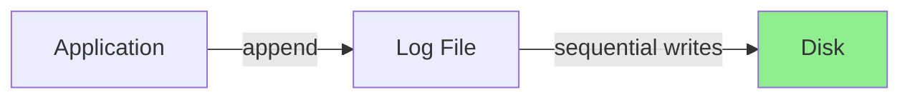

# Append-Only Architecture
{: .no_toc }

Why WALs are append-only, what that means for your application, and the trade-offs involved.
{: .fs-6 .fw-300 }

## Table of contents
{: .no_toc .text-delta }

1. TOC
{:toc}

---

## What Does "Append-Only" Mean?

An **append-only** data structure is one where you can only add new data at the end. You cannot:

- Modify existing data in place
- Delete data in place
- Insert data in the middle

You can only **append** to the end.

```
┌─────────────────────────────────────────┐
│ [Record 1][Record 2][Record 3]          │  ← Can only append here
└─────────────────────────────────────────┘
     ↑
   Cannot modify or delete these!
```

In nori-wal, this means:
- New records are always written at the end of the current segment
- Old records are never modified
- Deletions are represented as tombstone records (append a delete marker)
- Updates are represented as new versions (append a new PUT for the same key)

---

## Why Append-Only?

Append-only seems limiting at first. Why not just update records in place?

### Reason 1: Sequential I/O is Fast

Modern storage (SSDs, HDDs, NVMe) is **orders of magnitude faster** for sequential writes than random writes.

**Hard Disk Drives (HDD)**:
- Sequential write: ~100-200 MB/s
- Random write: ~1-5 MB/s (40x slower!)

**Solid State Drives (SSD)**:
- Sequential write: ~500-3000 MB/s
- Random write: ~50-300 MB/s (10x slower)
- Plus: Random writes cause write amplification, shortening SSD lifespan

**NVMe SSD**:
- Sequential write: ~3000-7000 MB/s
- Random write: ~500-2000 MB/s (still slower!)

By appending to a log, we only do sequential writes. This is the fastest possible I/O pattern.



---

### Reason 2: No Partial Write Corruption

When you write to a file in place, you can corrupt data if you crash mid-write:

**In-Place Update (BAD)**:
```
Before:  [Record A: "user:1=alice"]
Writing: [Record A: "user:1=bob--"]  ← CRASH!
After:   [Record A: "user:1=bob--"]  ← Corrupted!
```

You now have a partially written record. Is the user "bob" or "alice"? You don't know.

**Append-Only (GOOD)**:
```
Before:  [Record 1: "user:1=alice"][empty space]
Writing: [Record 1: "user:1=alice"][Record 2: "user:1=bob--"]  ← CRASH!
After:   [Record 1: "user:1=alice"][partial garbage]

Recovery: Scan log, validate CRCs
  - Record 1: ✓ Valid CRC → Keep
  - Record 2: ✗ Invalid CRC → Truncate

Final:   [Record 1: "user:1=alice"]
```

With append-only, you can never corrupt old data. The worst that can happen is you have a partial record at the tail, which you detect with CRC32C and truncate.

---

### Reason 3: Simple and Correct

Append-only is conceptually simple. There's no complex logic for:

- Managing free space within a file
- Defragmenting after deletes
- Handling variable-length records
- Ensuring atomic in-place updates

The code is straightforward:

```rust
// Append-only: Simple!
async fn append(&mut self, record: &Record) -> Result<Position> {
    let position = self.current_offset;
    let bytes = serialize(record)?;

    self.file.write_all(&bytes).await?;
    self.current_offset += bytes.len() as u64;

    Ok(position)
}
```

Compare this to the complexity of in-place updates:

```rust
// In-place update: Complex!
async fn update_in_place(&mut self, position: u64, new_record: &Record) -> Result<()> {
    let new_bytes = serialize(new_record)?;
    let old_bytes = self.read_at(position).await?;

    // What if new record is larger than old?
    if new_bytes.len() > old_bytes.len() {
        // Need to relocate! But where?
        // Need to update all pointers to this record!
        // What if we crash during relocation?
        // ...this is getting complicated
    }

    // What if new record is smaller?
    if new_bytes.len() < old_bytes.len() {
        // Fragmentation! Need a free list? Compaction?
    }

    // Atomic update: need double-buffering or copy-on-write?
    // Error handling is now much harder...
}
```

Simple code is correct code.

---

### Reason 4: Crash Recovery is Easier

With append-only, recovery is a simple scan:

```rust
async fn recover(&mut self) -> Result<RecoveryInfo> {
    let mut position = 0;
    let mut valid_records = 0;

    loop {
        // Try to read a record at this position
        match self.read_record_at(position).await {
            Ok((record, size)) => {
                // Valid record, keep it
                valid_records += 1;
                position += size;
            }
            Err(_) => {
                // Invalid record (partial write or corruption)
                // Truncate everything after this point
                self.truncate(position).await?;
                break;
            }
        }
    }

    Ok(RecoveryInfo {
        valid_records,
        bytes_truncated: self.file_size - position,
    })
}
```

This is called "prefix-valid" recovery: keep all valid records from the beginning until we hit corruption, then truncate the rest.

With in-place updates, recovery is much harder:
- Which version of a record is correct?
- How do you know if an update completed?
- Do you need a transaction log? (Isn't that just... a WAL?)

---

## How Append-Only Affects Your Application

If nori-wal is append-only, how do you handle updates and deletes?

### Updates: Write a New Version

When you update a key, you **append a new record** with the same key:

```rust
// Initial write
let record = Record::put(b"user:1", b"alice@example.com");
wal.append(&record).await?;

// Update: append a new version
let record = Record::put(b"user:1", b"bob@example.com");  // Same key!
wal.append(&record).await?;
```

On disk:
```
[Record 1: user:1=alice@example.com]
[Record 2: user:1=bob@example.com]    ← Newer version
```

During recovery, you keep the **latest** version:

```rust
let mut state = HashMap::new();

while let Some((record, _)) = reader.next_record().await? {
    // Later records shadow earlier ones
    state.insert(record.key, record.value);
}

// Result: user:1 → bob@example.com
```

---

### Deletes: Write a Tombstone

When you delete a key, you **append a tombstone record**:

```rust
let record = Record::delete(b"user:1");  // Tombstone
wal.append(&record).await?;
```

A tombstone is a record with the `tombstone` flag set and no value:

```
[Record 1: user:1=alice@example.com]
[Record 2: user:1=bob@example.com]
[Record 3: user:1=(tombstone)]         ← Deleted
```

During recovery:

```rust
while let Some((record, _)) = reader.next_record().await? {
    if record.tombstone {
        state.remove(&record.key);  // Delete from state
    } else {
        state.insert(record.key, record.value);
    }
}

// Result: user:1 does not exist
```

---

## The Cost: Garbage Collection

Append-only has a major downside: **the log grows forever**.

Every update and delete appends a new record, but the old records are still on disk:

```
[user:1=v1][user:1=v2][user:1=v3][user:2=v1][user:1=(deleted)]
     ↑         ↑         ↑                         ↑
   Old       Old       Old                    Tombstone

Actual state: user:2=v1
Wasted space: 80% of the log!
```

You need a **garbage collection** (GC) strategy to reclaim space.

### Strategy 1: Delete Old Segments

If you only care about recent data (e.g., event logs with a retention policy), you can delete entire old segments:

```rust
// Keep only last 7 days of data
let cutoff = Position {
    segment_id: old_segment_id,
    offset: 0,
};

let deleted = wal.delete_segments_before(cutoff).await?;
```

This is simple and works well for append-only workloads (logs, events, time-series).

---

### Strategy 2: Compaction

If you need to keep all keys but remove old versions, you need **compaction**:

```
Before compaction:
  Segment 0: [k1=v1][k2=v1][k1=v2][k3=v1]
  Segment 1: [k2=v2][k1=v3][k4=v1]

After compaction:
  Segment 2 (compacted): [k1=v3][k2=v2][k3=v1][k4=v1]
  Segments 0, 1: deleted
```

Compaction:
1. Reads multiple old segments
2. Merges records, keeping only the latest version of each key
3. Writes a new compacted segment
4. Deletes the old segments

This is what LSM-tree databases (RocksDB, Cassandra, nori-lsm) do.

**Important**: nori-wal itself does **not** implement compaction. It provides the primitives (`delete_segments_before()`) but **you** decide when and how to compact.

See [Recipes: Compaction](../recipes/compaction) for implementation examples.

---

### Strategy 3: Snapshotting

If your state is relatively small, you can:

1. Periodically write a **snapshot** of your entire state to a separate file
2. Delete all WAL segments before the snapshot
3. On recovery: Load snapshot, then replay WAL from the snapshot point

```
Snapshot at position 1000: {k1=v3, k2=v2, k3=v1}
WAL segments before position 1000: DELETE
WAL segments after position 1000: KEEP (replay these on recovery)
```

This is what databases like Redis and PostgreSQL do.

---

## Append-Only in Practice

Let's see how append-only affects a real application.

### Example: Building a Simple KV Store

```rust
use std::collections::HashMap;
use nori_wal::{Wal, WalConfig, Record, Position};

struct SimpleKV {
    wal: Wal,
    memtable: HashMap<Vec<u8>, Vec<u8>>,
}

impl SimpleKV {
    async fn open(config: WalConfig) -> Result<Self> {
        let (wal, recovery_info) = Wal::open(config).await?;

        // Replay WAL to build in-memory state
        let mut memtable = HashMap::new();
        let mut reader = wal.read_from(Position { segment_id: 0, offset: 0 }).await?;

        while let Some((record, _)) = reader.next_record().await? {
            if record.tombstone {
                memtable.remove(&record.key);
            } else {
                memtable.insert(record.key, record.value);
            }
        }

        Ok(Self { wal, memtable })
    }

    async fn put(&mut self, key: &[u8], value: &[u8]) -> Result<()> {
        // Write to WAL first (durability)
        let record = Record::put(key, value);
        self.wal.append(&record).await?;
        self.wal.sync().await?;

        // Update in-memory state
        self.memtable.insert(key.to_vec(), value.to_vec());

        Ok(())
    }

    async fn delete(&mut self, key: &[u8]) -> Result<()> {
        // Write tombstone to WAL
        let record = Record::delete(key);
        self.wal.append(&record).await?;
        self.wal.sync().await?;

        // Update in-memory state
        self.memtable.remove(key);

        Ok(())
    }

    fn get(&self, key: &[u8]) -> Option<&[u8]> {
        // Read from in-memory state (NOT the WAL!)
        self.memtable.get(key).map(|v| v.as_slice())
    }
}
```

**Key points**:
1. Writes append to the WAL, then update the memtable
2. Deletes append a tombstone, then remove from memtable
3. Reads come from the memtable, **not** the WAL
4. Recovery replays the WAL to reconstruct the memtable

This is essentially how LevelDB, RocksDB, and nori-lsm work!

---

### Growing Disk Usage

As you use this KV store, the WAL grows:

```
After 1000 writes:
  wal/000000.wal: 50 KB

After 10000 writes:
  wal/000000.wal: 500 KB

After 100000 writes:
  wal/000000.wal: 5 MB

After 1M writes (many updates to same keys):
  wal/000000.wal: 50 MB (but only 10K unique keys!)
```

At some point, you need to compact. For example:

```rust
impl SimpleKV {
    async fn compact(&mut self) -> Result<()> {
        // 1. Write a snapshot of current state
        let snapshot_file = File::create("snapshot.dat").await?;
        for (key, value) in &self.memtable {
            snapshot_file.write_all(key).await?;
            snapshot_file.write_all(value).await?;
        }
        snapshot_file.sync_all().await?;

        // 2. Create a new WAL, abandoning the old one
        let new_config = WalConfig {
            dir: PathBuf::from("wal-new"),
            ..Default::default()
        };
        let (new_wal, _) = Wal::open(new_config).await?;

        // 3. Swap to new WAL
        self.wal = new_wal;

        // 4. Delete old WAL directory
        std::fs::remove_dir_all("wal")?;
        std::fs::rename("wal-new", "wal")?;

        Ok(())
    }
}
```

This is a simple snapshot-based compaction strategy.

---

## Append-Only vs. In-Place Updates: The Trade-Off

Let's compare the two approaches:

| Aspect | Append-Only | In-Place Updates |
|--------|-------------|------------------|
| **Write performance** | ⭐⭐⭐⭐⭐ Fast (sequential I/O) | ⭐⭐⭐ Slower (random I/O) |
| **Read performance** | ⭐⭐⭐⭐ Fast (if indexed) | ⭐⭐⭐⭐ Fast |
| **Crash safety** | ⭐⭐⭐⭐⭐ Excellent (prefix-valid recovery) | ⭐⭐ Complex (need transactions) |
| **Disk usage** | ⭐⭐ Grows forever (need GC) | ⭐⭐⭐⭐ Stable |
| **Code complexity** | ⭐⭐⭐⭐⭐ Simple | ⭐⭐ Complex |
| **SSD wear** | ⭐⭐⭐⭐⭐ Minimal (sequential) | ⭐⭐ Higher (random writes) |

Append-only is better for:
- High write throughput
- Simplicity and correctness
- Crash recovery
- SSD longevity

In-place updates are better for:
- Stable disk usage
- Workloads with very few updates

For most modern applications, **append-only wins**.

---

## Common Misconceptions

### "Append-only wastes disk space"

**Response**: Only if you don't implement garbage collection. With compaction or snapshotting, disk usage is proportional to your actual data size, not write volume.

### "Append-only is slow because you have to scan the entire log"

**Response**: You don't read from the WAL during normal operation. You read from an in-memory index (memtable, B-tree, hash table). The WAL is only scanned during recovery.

### "Tombstones are leaked forever"

**Response**: No. During compaction, you can drop tombstones that shadow older versions. Once there are no older versions below a tombstone, it's safe to remove.

```
Before compaction:
  Level 0: [k1=(tombstone)]
  Level 1: [k1=v1]

After compaction to Level 2:
  Level 2: (k1 completely removed)
```

---

## Key Takeaways

1. **Append-only means you only add data at the end, never modify in place**
   - Updates → append a new version
   - Deletes → append a tombstone

2. **Append-only is fast and simple**
   - Sequential I/O is 10-40x faster than random I/O
   - No partial write corruption
   - Simple recovery: scan and validate CRCs

3. **The cost is growing disk usage**
   - You need a garbage collection strategy
   - Options: delete old segments, compaction, snapshotting

4. **Don't read from the WAL during normal operation**
   - Use an in-memory index (memtable, hash table, B-tree)
   - WAL is for durability and recovery, not queries

5. **Append-only is the foundation of modern storage systems**
   - LSM-trees (RocksDB, LevelDB, Cassandra, nori-lsm)
   - Event sourcing
   - Distributed logs (Kafka, Raft)

---

## What's Next?

Now that you understand append-only architecture, explore:

- **[Fsync Policies](fsync-policies)** - How to balance durability and performance
- **[Recovery Guarantees](recovery-guarantees)** - What happens after a crash
- **[When to Use a WAL](when-to-use)** - Scenarios where WALs shine

Or dive into implementation details in [How It Works](../how-it-works/).
