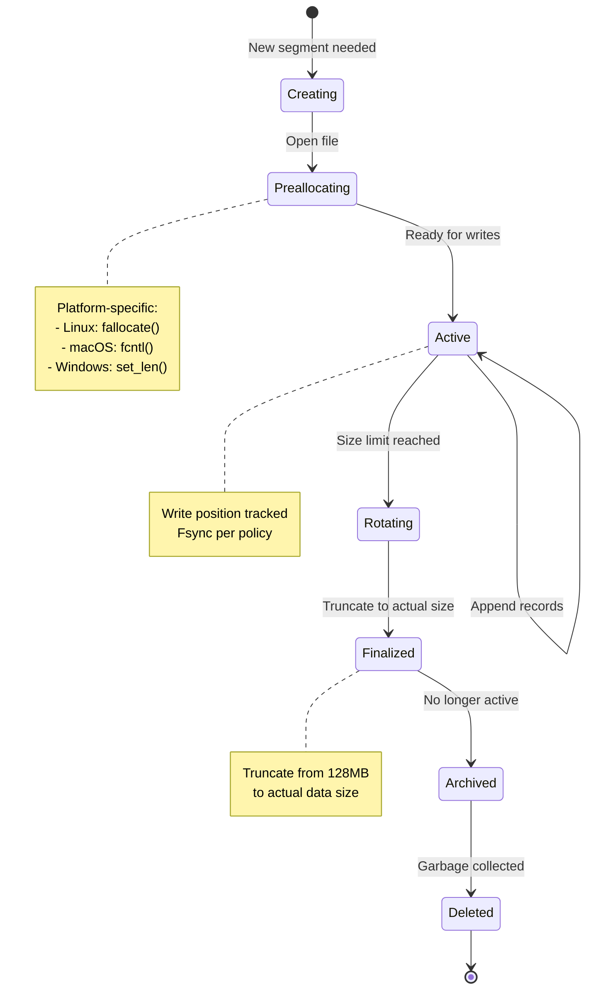
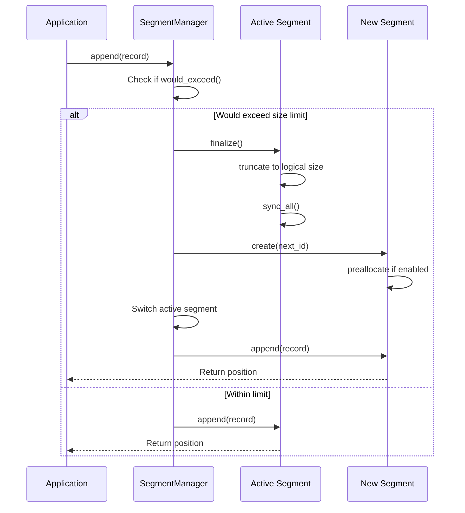

# Segment Lifecycle
{: .no_toc }

How segments are created, rotated, pre-allocated, and deleted. Platform-specific optimizations.
{: .fs-6 .fw-300 }

## Table of contents
{: .no_toc .text-delta }

1. TOC
{:toc}

---

## What is a Segment?

A **segment** is a single file on disk containing a sequence of WAL records. Segments are:

- **Numbered sequentially**: `000000.wal`, `000001.wal`, `000002.wal`, etc.
- **Append-only**: Records are always written at the end
- **Fixed maximum size**: Default 128 MiB (configurable)
- **Rotated automatically**: New segment created when current one fills up

```
wal/
  000000.wal  (128 MB, full)
  000001.wal  (128 MB, full)
  000002.wal  (64 MB, active - currently being written to)
```

---

## Segment Lifecycle States

A segment goes through several states during its lifetime:



---

## Creating a New Segment

### Step 1: Determine Segment ID

Segment IDs start at 0 and increment sequentially:

```rust
// First segment
segment_id = 0  → "000000.wal"

// Second segment (after rotation)
segment_id = 1  → "000001.wal"

// 100th segment
segment_id = 99 → "000099.wal"
```

Filename format: `{id:06}.wal` (6 digits, zero-padded)

---

### Step 2: Open File

Create or open the file with read+write permissions:

```rust
let path = dir.join(format!("{:06}.wal", segment_id));

let file = OpenOptions::new()
    .create(true)       // Create if doesn't exist
    .truncate(false)    // Don't truncate existing data
    .write(true)
    .read(true)
    .open(&path)
    .await?;
```

**Why `truncate(false)`?**
- If we crash during segment creation, we may have a partial file
- On restart, we want to append to it, not lose existing data
- Recovery will truncate any invalid tail data

---

### Step 3: Pre-allocate Space (Optional)

If `preallocate: true` in config, reserve disk space for the entire segment:

```rust
if preallocate && actual_file_size == 0 {
    preallocate(&file, max_segment_size).await?;
    file.sync_all().await?;
    file.seek(SeekFrom::Start(0)).await?; // Back to beginning
}
```

**Benefits**:
- Early error detection (know immediately if disk is full)
- Better filesystem locality (less fragmentation)
- Improved performance on some filesystems
- Prevents mid-write "no space left" errors

**Cost**:
- ~1-2ms latency when creating segment
- Disk space shows as "used" even if not written

---

## Platform-Specific Pre-allocation

nori-wal uses optimized pre-allocation for each platform:

### Linux: fallocate(2)

```rust
let fd = file.as_raw_fd();

unsafe {
    libc::fallocate(
        fd,
        0,              // mode: default allocation
        0,              // offset: start from beginning
        size as libc::off_t,
    )
}
```

**Characteristics**:
- Fastest method (~0.5ms for 128MB)
- Allocates actual disk blocks (not sparse)
- Zeros the allocated space
- Supported on ext4, XFS, Btrfs

---

### macOS: fcntl(2) with F_PREALLOCATE

```rust
let fd = file.as_raw_fd();

let mut fstore = FStore {
    fst_flags: F_ALLOCATECONTIG | F_ALLOCATEALL,
    fst_posmode: F_PEOFPOSMODE,
    fst_offset: 0,
    fst_length: size as libc::off_t,
    fst_bytesalloc: 0,
};

unsafe {
    libc::fcntl(fd, F_PREALLOCATE, &mut fstore)
}

file.set_len(size).await?;
```

**Characteristics**:
- Tries contiguous allocation first (F_ALLOCATECONTIG)
- Falls back to non-contiguous if needed
- Fast (~1ms for 128MB on APFS)
- Reduces fragmentation

---

### Windows: set_len()

```rust
file.set_len(size).await?;
```

**Characteristics**:
- Uses standard set_len() API
- NTFS may create sparse file initially
- Space allocated on first write
- Still provides early error detection

---

### Other Platforms: Fallback

```rust
file.set_len(size).await?;
```

Uses standard `set_len()` which works everywhere but may be less efficient.

---

## Writing to a Segment

### Append Operation

Records are always appended to the end of the current segment:

```rust
async fn append(&mut self, record: &Record) -> Result<u64, SegmentError> {
    let encoded = record.encode();
    let offset = self.size;  // Current write position

    self.file.write_all(&encoded).await?;
    self.size += encoded.len() as u64;

    Ok(offset)  // Return position of written record
}
```

**Key points**:
- `self.size` tracks logical size (actual data written)
- Physical file size may be larger (if pre-allocated)
- No seeking required (always append at end)

---

### Size Tracking

nori-wal tracks two sizes:

| Size Type | Meaning | When Equal? |
|-----------|---------|-------------|
| **Logical size** | Actual data written | Always tracked in `self.size` |
| **Physical size** | Disk space allocated | After pre-allocation |

```
Newly created segment with pre-allocation:
  Logical size:  0 bytes (no data yet)
  Physical size: 128 MB (pre-allocated)

After writing 1000 records (~50 KB):
  Logical size:  50 KB (actual data)
  Physical size: 128 MB (still pre-allocated)

After finalization:
  Logical size:  50 KB
  Physical size: 50 KB (truncated to match)
```

---

## Segment Rotation

Rotation happens when a segment reaches its size limit.

### Rotation Trigger

Before each write, check if it would exceed the limit:

```rust
fn would_exceed(&self, record_size: usize, max_size: u64) -> bool {
    self.size + record_size as u64 > max_size
}

// In SegmentManager:
let encoded = record.encode();

if active_segment.would_exceed(encoded.len(), config.max_segment_size) {
    rotate_segment().await?;
}
```

**Example**:
```
Current segment: 000000.wal
  - Logical size: 134,217,500 bytes (128 MB - 228 bytes)
  - Max size: 134,217,728 bytes (128 MB)

Next record size: 500 bytes

Check: 134,217,500 + 500 > 134,217,728? YES → Rotate!
```

---

### Rotation Process



### Finalization

When rotating away from a segment, **finalize** it:

```rust
async fn finalize(&mut self) -> Result<(), SegmentError> {
    // Truncate physical file to match logical size
    self.file.set_len(self.size).await?;

    // Force to disk
    self.file.sync_all().await?;

    Ok(())
}
```

**Why finalize?**
- Reclaim unused pre-allocated space
- Disk usage matches actual data
- Safe to archive/replicate the segment

**Example**:
```
Before finalization:
  000000.wal: 128 MB (pre-allocated), 65 MB actual data

After finalization:
  000000.wal: 65 MB (truncated to actual size)
```

---

## Fsync Behavior

Segments sync to disk according to the configured `FsyncPolicy`:

### FsyncPolicy::Always

Every write is immediately synced:

```rust
let offset = segment.append(&record).await?;
segment.sync().await?;  // fsync after every append
```

---

### FsyncPolicy::Batch(Duration)

Sync at most once per time window:

```rust
struct BatchedFsync {
    window: Duration,
    last_sync: Instant,
}

let offset = segment.append(&record).await?;

let now = Instant::now();
if now.duration_since(self.last_sync) >= self.window {
    segment.sync().await?;
    self.last_sync = now;
}
// Otherwise: no sync (fast path)
```

---

### FsyncPolicy::Os

No explicit sync:

```rust
let offset = segment.append(&record).await?;
// No sync! OS will eventually flush to disk
```

Manual sync still available:
```rust
wal.sync().await?;  // Explicit sync when needed
```

---

## Reading from Segments

### Sequential Reading

```rust
pub struct SegmentReader {
    file: File,
    buffer: Vec<u8>,
    position: u64,
}

impl SegmentReader {
    pub async fn next_record(&mut self) -> Result<Option<(Record, u64)>, SegmentError> {
        // Read enough bytes for header
        self.file.read_exact(&mut self.buffer[..header_size]).await?;

        // Decode header to determine total record size
        let total_size = decode_header(&self.buffer)?;

        // Read the rest of the record
        self.file.read_exact(&mut self.buffer[..total_size]).await?;

        // Decode and validate
        let (record, _) = Record::decode(&self.buffer)?;
        let position = self.position;
        self.position += total_size as u64;

        Ok(Some((record, position)))
    }
}
```

**Optimizations**:
- Reuses buffer between reads (no allocations)
- Reads in chunks (not byte-by-byte)
- Validates CRC before returning record

---

### Random Access

You can seek to a specific position:

```rust
let position = Position {
    segment_id: 1,
    offset: 1024,
};

let mut reader = wal.read_from(position).await?;
while let Some((record, pos)) = reader.next_record().await? {
    // Process records starting from position
}
```

**Use cases**:
- Replication: followers read from specific positions
- Recovery: skip already-processed records
- Debugging: inspect records at known positions

---

## File Descriptor Caching

Opening files is expensive (~100μs). nori-wal caches file descriptors:

```rust
struct FdCache {
    cache: HashMap<u64, Arc<Mutex<File>>>,
    max_size: usize,
    access_order: Vec<u64>,  // LRU tracking
}
```

### LRU Eviction

When cache is full, evict least recently used:

```rust
fn insert(&mut self, segment_id: u64, file: File) {
    if self.cache.len() >= self.max_size {
        // Evict LRU segment
        let lru_id = self.access_order.remove(0);
        self.cache.remove(&lru_id);
        // File drops here, closing FD
    }

    self.cache.insert(segment_id, Arc::new(Mutex::new(file)));
    self.access_order.push(segment_id);
}
```

**Benefits**:
- Reading from recently-read segments: ~1μs (cache hit)
- Reading from uncached segment: ~100μs (cache miss, need to open)

**Default cache size**: 16 file descriptors

---

## Deleting Segments

### Manual Deletion

Delete all segments before a position:

```rust
let cutoff = Position {
    segment_id: 10,
    offset: 0,
};

let deleted_count = wal.delete_segments_before(cutoff).await?;
```

**What gets deleted**:
```
Before:
  wal/000000.wal  ← Delete
  wal/000001.wal  ← Delete
  ...
  wal/000009.wal  ← Delete
  wal/000010.wal  ← Keep (cutoff segment)
  wal/000011.wal  ← Keep (after cutoff)

After:
  wal/000010.wal
  wal/000011.wal
```

**Safety**:
- Cannot delete active segment
- Cannot delete segments after cutoff
- Deletion is atomic per segment (all or nothing)

---

### Compaction-Driven Deletion

Typical workflow:

1. **Compact old segments** into a new segment
2. **Write snapshot** of current state
3. **Delete old segments** that are no longer needed

```rust
// 1. Compact segments 0-9 into segment 100
compact_segments(0..10, 100).await?;

// 2. All data from 0-9 is now in segment 100
// 3. Safe to delete old segments
wal.delete_segments_before(Position { segment_id: 10, offset: 0 }).await?;
```

See [Recipes: Compaction](../recipes/compaction) for details.

---

## Segment Naming and Discovery

### Naming Convention

```
Format: {id:06}.wal

Examples:
  000000.wal  (segment 0)
  000001.wal  (segment 1)
  000042.wal  (segment 42)
  012345.wal  (segment 12345)
```

**Why 6 digits?**
- Supports up to 999,999 segments
- At 128MB per segment, that's 128 PB of log data
- Sufficient for any realistic use case

---

### Discovery on Startup

When opening a WAL, nori-wal scans the directory:

```rust
async fn discover_segments(dir: &Path) -> Result<Vec<u64>, SegmentError> {
    let mut segment_ids = vec![];

    let mut entries = tokio::fs::read_dir(dir).await?;
    while let Some(entry) = entries.next_entry().await? {
        let filename = entry.file_name();

        // Parse "NNNNNN.wal" format
        if let Some(id) = parse_segment_id(&filename) {
            segment_ids.push(id);
        }
    }

    segment_ids.sort();  // Oldest to newest
    Ok(segment_ids)
}
```

**Recovery then proceeds**:
1. Discover all segments
2. Scan each segment in order (0, 1, 2, ...)
3. Validate records and truncate any corruption
4. Resume writing to the last segment (or create new if full)

---

## Configuration Examples

### Small Segments (Frequent Rotation)

```rust
let config = WalConfig {
    max_segment_size: 32 * 1024 * 1024,  // 32 MB
    ..Default::default()
};
```

**Use when**:
- Frequent compaction
- Limited disk space
- Want quick garbage collection

**Trade-offs**:
- More segments to manage
- More file descriptor churn
- Slightly higher overhead

---

### Large Segments (Infrequent Rotation)

```rust
let config = WalConfig {
    max_segment_size: 512 * 1024 * 1024,  // 512 MB
    ..Default::default()
};
```

**Use when**:
- High write throughput
- Infrequent compaction
- Want to minimize rotation overhead

**Trade-offs**:
- Slower recovery (larger files to scan)
- Larger files to manage/replicate
- More disk space needed

---

### Disable Pre-allocation (Testing)

```rust
let config = WalConfig {
    preallocate: false,  // No pre-allocation
    ..Default::default()
};
```

**Use when**:
- Testing (faster test execution)
- Environments with tight disk quotas
- Segment size >> actual usage

**Trade-offs**:
- No early error detection for disk full
- Potential mid-write failures
- More filesystem fragmentation

---

## Performance Characteristics

### Segment Creation

| Operation | With Prealloc | Without Prealloc |
|-----------|---------------|------------------|
| **Open file** | ~100μs | ~100μs |
| **Preallocate 128MB** | ~1-2ms | 0 |
| **First write** | ~50μs | ~50μs |
| **Total** | ~1.2ms | ~0.15ms |

**Amortized cost**: Negligible (happens once per 128MB of data)

---

### Write Performance

| Fsync Policy | Throughput | Latency (p50) | Latency (p99) |
|--------------|------------|---------------|---------------|
| Always | ~420 writes/sec | 2.1ms | 9.8ms |
| Batch(5ms) | ~86K writes/sec | 38μs | 5.3ms |
| Os | ~110K writes/sec | 28μs | 95μs |

---

### Read Performance

| Scenario | Throughput | Notes |
|----------|------------|-------|
| Sequential read (cached FD) | ~200K records/sec | No disk seeks |
| Sequential read (uncached FD) | ~180K records/sec | Open overhead |
| Random access | ~50K records/sec | Seek penalty |

---

## Observability

nori-wal emits events for segment operations:

```rust
// Segment created
VizEvent::Wal(WalEvt {
    kind: WalKind::SegmentCreated,
    segment_id: 42,
    ..
})

// Segment rotated
VizEvent::Wal(WalEvt {
    kind: WalKind::SegmentRotated,
    segment_id: 43,
    ..
})

// Segment deleted
VizEvent::Wal(WalEvt {
    kind: WalKind::SegmentDeleted,
    segment_id: 10,
    ..
})
```

See [Observability](../observability/) for how to consume these events.

---

### Garbage Collection Metrics

Segment deletion emits observability metrics via `nori-observe::Meter`:

```rust
// Histogram: Time to delete segments (milliseconds)
meter.histo("wal_gc_latency_ms", &[/* standard buckets */], &[])
    .observe(elapsed_ms);

// Counter: Total segments deleted
meter.counter("wal_segments_deleted_total", &[("node", "0")])
    .inc(1);

// Gauge: Current number of segments
meter.gauge("wal_segment_count", &[("node", "0")])
    .set(remaining_segments as i64);
```

**Metrics usage**:
- **`wal_gc_latency_ms`** - Monitor GC performance, set alerts for high p99
- **`wal_segments_deleted_total`** - Track GC activity over time
- **`wal_segment_count`** - Monitor disk space growth, detect GC failures

**Expected values**:
- Latency: 1-3ms for 5 segments, 5-10ms for 20 segments, 15-25ms for 50 segments
- Deletion rate depends on memtable flush frequency and WAL age policy
- Segment count should stabilize based on write throughput and GC interval

See [Performance Benchmarks](../performance/benchmarks#garbage-collection) for detailed measurements.

---

## Key Takeaways

1. **Segments are fixed-size files** (default 128 MB)
   - Numbered sequentially, rotated automatically
   - Pre-allocated for early error detection and performance

2. **Platform-specific pre-allocation**
   - Linux: `fallocate()` (~0.5ms)
   - macOS: `fcntl()` with F_PREALLOCATE (~1ms)
   - Windows/others: `set_len()` fallback

3. **Rotation is automatic and seamless**
   - Triggered when next write would exceed size limit
   - Old segment finalized (truncated to actual size)
   - New segment created and pre-allocated

4. **File descriptor caching**
   - LRU cache (default 16 FDs)
   - Cache hit: ~1μs access
   - Cache miss: ~100μs (open overhead)

5. **Deletion is controlled by the application**
   - WAL provides `delete_segments_before()` API
   - Can be manual (explicit calls) or automated (periodic background task)
   - LSM engines typically automate GC after memtable flush
   - Cannot delete active segment (safety guarantee)

---

## What's Next?

Now that you understand segments, explore:

- **[Recovery Process](recovery)** - How segments are scanned and validated
- **[Concurrency Model](concurrency)** - How concurrent access to segments works
- **[Record Format](record-format)** - What's inside each segment

Or see real-world usage in [Recipes](../recipes/).
