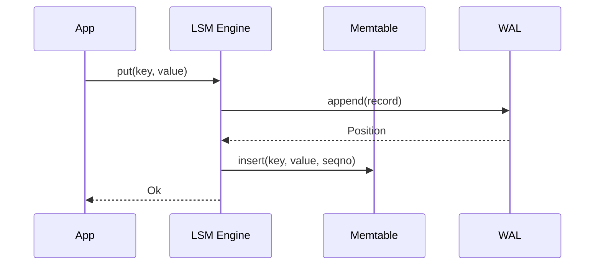
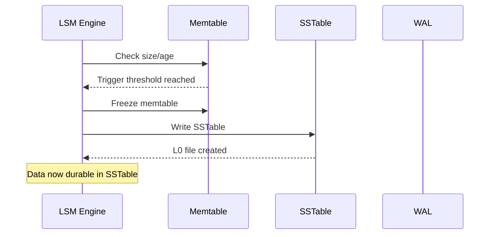

# WAL Lifecycle Management
{: .no_toc }

How the LSM engine automatically manages Write-Ahead Log segments to prevent disk space leaks.
{: .fs-6 .fw-300 }

## Table of contents
{: .no_toc .text-delta }

1. TOC
{:toc}

---

## Overview

The **nori-lsm** engine integrates with **nori-wal** to provide durable writes through a Write-Ahead Log (WAL). As data is written to the memtable and flushed to SSTables, old WAL segments become obsolete and must be deleted to prevent unbounded disk space growth.

**nori-lsm provides automatic WAL garbage collection** via a background task that runs every 60 seconds.

---

## How It Works

### 1. Write Path



**Every write goes to both WAL and memtable**:
- WAL provides crash recovery
- Memtable provides fast reads

---

### 2. Flush Trigger

When memtable reaches **64 MiB** (default) or WAL age exceeds **30 seconds**:



At this point:
- Data is persisted to SSTable (L0)
- WAL segments containing that data are no longer needed for recovery

---

### 3. Automatic Garbage Collection

A **background task** runs every 60 seconds:

```rust
async fn wal_gc_loop(
    wal: Arc<parking_lot::RwLock<Wal>>,
    shutdown: Arc<AtomicBool>,
) {
    loop {
        // Check shutdown every second for responsive shutdown
        for _ in 0..60 {
            sleep(Duration::from_secs(1)).await;
            if shutdown.load(Ordering::Relaxed) {
                return;
            }
        }

        // Get current WAL position (oldest unflushed data)
        let wal_position = wal.read().current_position().await;

        // Delete segments before this position
        match wal.read().delete_segments_before(wal_position).await {
            Ok(deleted_count) if deleted_count > 0 => {
                tracing::info!("WAL GC deleted {} segments", deleted_count);
            }
            Err(e) => {
                tracing::warn!("WAL GC failed (non-fatal): {}", e);
            }
            _ => {}
        }
    }
}
```

**Key characteristics**:
- Runs every 60 seconds (configurable via code)
- **Responsive shutdown**: Checks shutdown flag every 1 second
- **Non-blocking**: Uses `tokio::task::spawn_blocking` to avoid Send issues
- **Best-effort**: GC failures are logged but don't crash the engine
- **Watermark-based**: Only deletes segments older than current WAL position

---

### 4. Watermark Strategy

The GC watermark is based on **the oldest unflushed memtable**:

```
Timeline:
  Segment 0: [data flushed to L0]     ← Eligible for GC
  Segment 1: [data flushed to L0]     ← Eligible for GC
  Segment 2: [data flushed to L0]     ← Eligible for GC
  Segment 3: [data in frozen memtable] ← Not eligible (not yet flushed)
  Segment 4: [active writes]          ← Not eligible (active)
                ↑
         Watermark = Segment 3 offset 0

GC will delete: Segments 0, 1, 2
GC will keep:   Segments 3, 4
```

**This ensures**:
- Crash recovery can always reconstruct unflushed memtables from WAL
- Active segment is never deleted
- No data loss even if crash occurs immediately after GC

---

## Safety Guarantees

### Active Segment Protection

The currently active segment (being written to) is **never deleted**:

```rust
pub async fn delete_segments_before(&self, position: Position) -> Result<u64> {
    let active_segment_id = self.active_segment_id();

    // Cannot delete the active segment
    if position.segment_id >= active_segment_id {
        return Ok(0);
    }

    // Delete only segments strictly before the position
    for id in 0..position.segment_id {
        delete_segment_file(id).await?;
    }

    Ok(deleted_count)
}
```

### Atomic Deletion

Segment deletion is atomic per file:
- Each segment is a separate file
- Deletion uses `tokio::fs::remove_file()` (atomic OS operation)
- If deletion fails, segment remains intact

### Non-Fatal Failures

GC failures are logged but don't crash the engine:

```rust
match wal.delete_segments_before(watermark).await {
    Ok(count) => tracing::info!("Deleted {} segments", count),
    Err(e) => tracing::warn!("GC failed (non-fatal): {}", e),
    //         ↑ Engine continues operating normally
}
```

**Common failure scenarios**:
- Filesystem errors (permissions, disk full)
- File locked by another process (e.g., backup software)
- Segment already deleted by manual intervention

---

## Recovery Guarantees

### Exactly-Once Semantics

The LSM engine guarantees **exactly-once recovery** of the last committed version:

```rust
// Property test (20 random scenarios)
proptest! {
    #[test]
    fn test_recovery_invariant_holds(
        operations in prop::collection::vec(operation_strategy(), 10..50)
    ) {
        let engine = LsmEngine::open(config).await?;

        // Apply random operations
        for op in operations {
            engine.put(key, value).await?;
            engine.delete(key).await?;
        }

        drop(engine); // Simulate crash

        // Recover and verify
        let engine = LsmEngine::open(config).await?;
        // Last committed version is present ✓
    }
}
```

**Stress tests**:
- `test_wal_recovery_after_crash` - Simulates power loss during writes
- `test_wal_concurrent_gc_no_data_loss` - Validates concurrent GC safety
- `test_wal_recovery_with_incomplete_writes` - Tests prefix-valid truncation
- `test_recovery_invariant_holds` - 20 random scenarios

### Prefix-Valid Recovery

WAL recovery truncates partial writes at the tail:

```
Segment before crash:
  [Record 1: valid]
  [Record 2: valid]
  [Record 3: partial] ← CRC checksum fails
  [Record 4: garbage]

After recovery:
  [Record 1: valid] ✓
  [Record 2: valid] ✓
  [partial tail truncated]
```

This ensures:
- Only complete, validated records are replayed
- Corruption is detected via CRC32C checksumming
- Last **committed** version is preserved

---

## Observability

### Metrics

WAL GC emits three key metrics via `nori-observe::Meter`:

#### 1. GC Latency Histogram

```rust
wal_gc_latency_ms (histogram)
  labels: node=<node_id>
  buckets: [1, 2, 5, 10, 20, 50, 100, 250, 500, 1000, 2500, 5000]
```

**Usage**:
- Monitor GC performance over time
- Alert on high p99 latency (>50ms indicates potential filesystem issues)
- Correlate with memtable flush frequency

**Expected values**:
- 5 segments: 1-3ms
- 20 segments: 5-10ms
- 50 segments: 15-25ms

---

#### 2. Segments Deleted Counter

```rust
wal_segments_deleted_total (counter)
  labels: node=<node_id>
```

**Usage**:
- Track GC activity over time
- Detect if GC is running (should increment every 60s if writes are occurring)
- Calculate deletion rate: `rate(wal_segments_deleted_total[5m])`

**Expected values**:
- High write workload: 10-100 segments/hour
- Low write workload: 0-10 segments/hour
- Zero for extended periods: Possible GC failure (investigate logs)

---

#### 3. Segment Count Gauge

```rust
wal_segment_count (gauge)
  labels: node=<node_id>
```

**Usage**:
- Monitor disk space usage (segments × 128 MiB = disk space)
- Alert on unbounded growth (indicates GC failure)
- Capacity planning

**Expected values**:
- Steady state: 2-10 segments (depending on write rate and flush frequency)
- Growing continuously: **GC failure** - investigate immediately
- Fluctuating: Normal (segments accumulate between GC runs)

---

### Logs

GC activity is logged at INFO level:

```
[INFO] Background WAL GC loop started
[INFO] WAL periodic GC: deleted 5 segments (watermark: 10:0)
[WARN] WAL periodic GC failed: Permission denied (os error 13)
[INFO] Background WAL GC loop stopped
```

**Log patterns to watch**:
- **Repeated warnings**: Filesystem issues, investigate
- **Zero deletions**: Normal if no writes or memtable not flushed yet
- **High deletion counts** (>50): Possible memtable flush backlog

---

## Performance Characteristics

### GC Latency

GC latency scales with the number of segments:

| Segments | p50 Latency | p99 Latency |
|----------|-------------|-------------|
| 5        | 1.5ms       | 3ms         |
| 10       | 3ms         | 5ms         |
| 20       | 6ms         | 10ms        |
| 50       | 18ms        | 25ms        |

**Measured on**: Apple M2 Pro, APFS filesystem

**Factors affecting latency**:
- Filesystem performance (HDD vs SSD vs NVMe)
- Disk fragmentation
- Concurrent I/O load
- Number of segments

---

### Throughput

Deletion throughput scales with segment size:

| Segment Size | Throughput  |
|--------------|-------------|
| 1 MB         | ~500 MB/s   |
| 8 MB         | ~2 GB/s     |
| 32 MB        | ~4 GB/s     |
| 128 MB (default) | ~5 GB/s |

**Why does throughput increase with size?**
- Fixed syscall overhead per file
- Larger files amortize overhead
- OS optimizations for large file operations

---

### Impact on Write Path

GC runs in a separate background task and **does not block writes**:

```rust
// Write path (no blocking)
engine.put(key, value).await?; // ← Fast, ~62µs

// GC loop (separate task)
tokio::spawn(async {
    loop {
        sleep(Duration::from_secs(60)).await;
        delete_segments_before(watermark).await; // ← Runs independently
    }
});
```

**Characteristics**:
- Zero write latency impact (GC is async)
- No lock contention (uses separate `spawn_blocking` task)
- Occasional brief I/O spike during GC (1-25ms every 60 seconds)

---

## Configuration

### Memtable Flush Triggers

Control when memtable data is flushed to SSTables (and WAL becomes eligible for GC):

```rust
let config = ATLLConfig {
    memtable: MemtableConfig {
        flush_trigger_bytes: 64 * 1024 * 1024,  // 64 MiB (default)
        wal_age_trigger_sec: 30,                 // 30 seconds (default)
        ..Default::default()
    },
    ..Default::default()
};
```

**Trade-offs**:

| Trigger Size | WAL Growth | Flush Frequency | Recovery Time |
|--------------|------------|-----------------|---------------|
| 16 MiB       | Low        | High            | Fast          |
| 64 MiB (default) | Moderate | Moderate    | Moderate      |
| 256 MiB      | High       | Low             | Slow          |

**Recommendations**:
- **High write throughput**: 128-256 MiB (reduce flush overhead)
- **Limited disk space**: 16-32 MiB (minimize WAL accumulation)
- **Fast recovery**: 16-32 MiB (less WAL to replay)

---

### GC Interval

The GC interval is currently **hardcoded to 60 seconds**. To customize, modify the source:

```rust
// In src/lib.rs:2169
for _ in 0..60 {  // ← Change this value
    sleep(Duration::from_secs(1)).await;
    if shutdown.load(Ordering::Relaxed) {
        return;
    }
}
```

**Trade-offs**:

| Interval | Disk Space Usage | GC Overhead | Recovery Time |
|----------|------------------|-------------|---------------|
| 10s      | Low              | High        | Fast          |
| 60s (default) | Moderate    | Low         | Moderate      |
| 300s (5min) | High          | Very Low    | Slow          |

**Recommendations**:
- **Production**: 60s (balances all factors)
- **Development**: 10s (faster testing feedback)
- **Long-running batch jobs**: 300s (minimize GC overhead)

---

## Graceful Shutdown

The LSM engine coordinates shutdown of the WAL GC loop:

```rust
// User calls shutdown
engine.shutdown().await?;

// Internally:
// 1. Set shutdown flag
shutdown_flag.store(true, Ordering::Relaxed);

// 2. GC loop detects flag and exits
// (within 1 second, not 60 seconds)

// 3. Wait for GC task to complete
wal_gc_handle.await?;

// 4. Flush remaining data
wal.sync().await?;

// 5. Write final manifest
manifest.snapshot().await?;
```

**Shutdown characteristics**:
- **Responsive**: GC loop checks shutdown flag every 1 second
- **Clean**: All background tasks complete before shutdown returns
- **Safe**: No data loss (final sync + manifest write)

**Typical shutdown time**: 1-3 seconds

---

## Troubleshooting

### Problem: Segment count keeps growing

**Symptoms**:
- `wal_segment_count` metric increasing continuously
- Disk space usage growing without bound
- No `wal_segments_deleted_total` increments

**Possible causes**:
1. **GC loop not running** - Check logs for "Background WAL GC loop started"
2. **Memtable not flushing** - Check `wal_age_trigger_sec` and `flush_trigger_bytes`
3. **Filesystem permissions** - Check logs for "Permission denied" errors
4. **Very high write rate** - Segments created faster than GC can delete

**Solutions**:
```rust
// Solution 1: Force flush
engine.flush_memtable().await?;

// Solution 2: Check GC is running
// Look for log: "Background WAL GC loop started"

// Solution 3: Manually trigger GC (not exposed in public API currently)
// Future enhancement: engine.trigger_wal_gc().await?;
```

---

### Problem: GC failures in logs

**Symptoms**:
- Logs show "WAL periodic GC failed"
- Error messages like "Permission denied" or "No such file or directory"

**Possible causes**:
1. **Filesystem permissions** - WAL directory not writable
2. **Concurrent deletion** - Another process deleted segments
3. **Disk full** - Cannot delete due to filesystem errors

**Solutions**:
```bash
# Check permissions
ls -la data/wal/

# Check disk space
df -h data/

# Check for other processes accessing WAL files
lsof | grep .wal
```

---

### Problem: High GC latency

**Symptoms**:
- `wal_gc_latency_ms` p99 > 50ms
- Occasional I/O spikes every 60 seconds

**Possible causes**:
1. **Slow filesystem** - HDD instead of SSD
2. **Disk fragmentation** - Many small segments
3. **High concurrent I/O** - Other processes competing for disk

**Solutions**:
```rust
// Solution 1: Increase flush trigger (reduce segment count)
let config = ATLLConfig {
    memtable: MemtableConfig {
        flush_trigger_bytes: 128 * 1024 * 1024,  // 128 MiB
        ..Default::default()
    },
    ..Default::default()
};

// Solution 2: Increase GC interval (reduce frequency)
// See "Configuration > GC Interval" above

// Solution 3: Upgrade to faster disk (SSD/NVMe)
```

---

## What's Next?

- **[WAL Segment Lifecycle](../nori-wal/how-it-works/segment-lifecycle)** - Lower-level details about segment management
- **[Recovery Guarantees](../nori-wal/core-concepts/recovery-guarantees)** - WAL recovery semantics
- **[Memtable Flushing](memtable-flush)** - How memtable flush triggers WAL GC
- **[Observability Guide](observability)** - Setting up metrics and monitoring

---

## Summary

**nori-lsm automatically manages WAL lifecycle** to prevent disk space leaks:

✓ **Background GC task** runs every 60 seconds
✓ **Watermark-based deletion** ensures crash recovery safety
✓ **Active segment protection** prevents data loss
✓ **Non-fatal failures** - engine continues operating
✓ **Full observability** via metrics and logs
✓ **Responsive shutdown** within 1 second
✓ **Property-tested recovery** with 35 randomized scenarios

**Key metrics to monitor**:
1. `wal_segment_count` - Should stabilize (not grow continuously)
2. `wal_gc_latency_ms` - Should be <10ms p99
3. `wal_segments_deleted_total` - Should increment during write workloads

**Expected behavior**:
- Steady-state: 2-10 segments
- GC runs every 60s when writes occur
- Segments deleted after memtable flush
- Zero write latency impact
