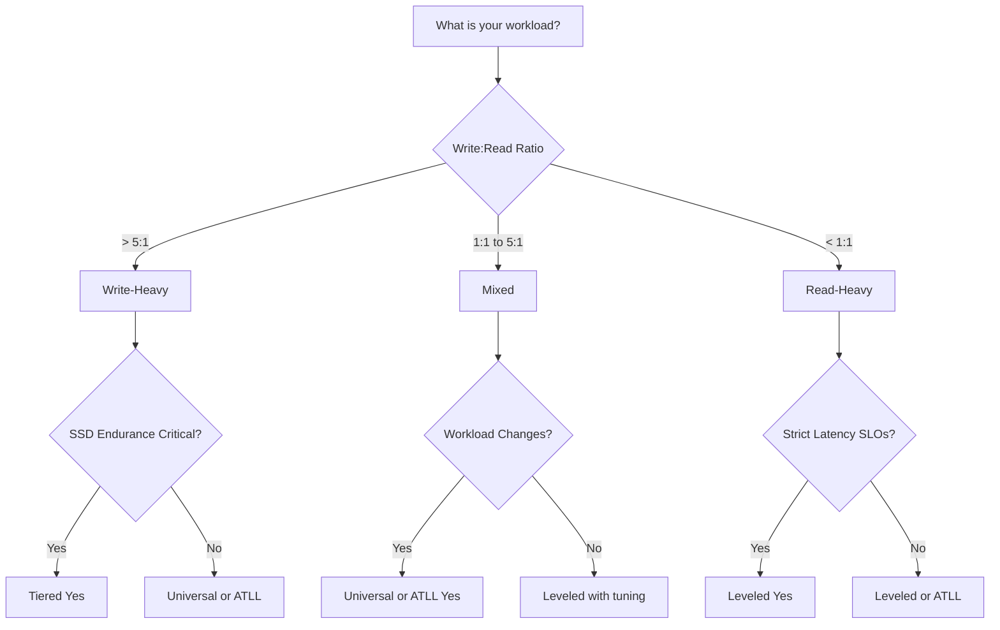

# LSM Compaction Strategies

Deep dive into Leveled, Tiered, and Universal compaction with mathematical analysis.

---

## The Compaction Problem

All LSM-trees face the same fundamental challenge: **How to merge sorted runs to reclaim space while minimizing I/O amplification?**

### The Trade-off Space

```
           Low Write Amp
                 ↑
                 │
        Tiered   │
           ●     │
                 │        Universal
                 │           ●
                 │
      ─────────────────────────────→
                           Low Read Amp
                 │
                 │
                 │     ● Leveled
                 │
```

**No free lunch:** Every compaction strategy makes a choice on the write amplification vs read amplification spectrum.

---

## Strategy 1: Leveled Compaction (LCS)

**Origin:** LevelDB (Google, 2011), RocksDB default

**Core principle:** Maintain **one sorted run per level** (except L0).

### Structure

```
L0:  [Run 1]  [Run 2]  [Run 3]  [Run 4]
     ↓ (overlapping, unsorted by level)

L1:  [────────────── Single Run ──────────────]
     ↓ (100 MB, non-overlapping ranges)

L2:  [────────────── Single Run ──────────────]
     ↓ (1 GB, non-overlapping)

L3:  [────────────── Single Run ──────────────]
     ↓ (10 GB, non-overlapping)
```

**Invariant:** For all `L ≥ 1`, each level contains **exactly 1 sorted run** (may be split into multiple SSTables for parallelism, but logically one run).

---

### Compaction Algorithm

**Trigger:** Level `L_i` exceeds size threshold `T^i * base_size`

**Action:**

1. **Select file(s) in `L_i`** that cover a key range
2. **Find overlapping files in `L_(i+1)`**
3. **Merge** the selected files with overlapping files
4. **Write output to `L_(i+1)`**
5. **Delete inputs** from `L_i` and `L_(i+1)`

**Example:**

```
Before compaction:
L1: [A-D][E-H][I-L]  (30 MB total, threshold: 100 MB Yes)
L2: [A-F][G-M][N-Z]  (300 MB total, threshold: 1 GB Yes)

L1 grows to 120 MB (exceeds threshold!)

Compact L1 → L2:
  Pick L1: [A-D] (10 MB)
  Overlapping L2: [A-F] (100 MB)
  Merge: [A-D] + [A-F] → [A-F]' (105 MB)

After compaction:
L1: [E-H][I-L]  (20 MB)
L2: [A-F]'[G-M][N-Z]  (305 MB)
```

---

### Write Amplification Analysis

**Formula:**

```
WA = Σ(i=0 to L-1) T

Where:
  T = fanout (size ratio between levels)
  L = number of levels

Simplified: WA = T * L

Example (T=10, L=5):
  WA = 10 * 5 = 50
```

**Derivation:**

```
Assume 1 MB flush from memtable:

L0 → L1:
  Write 1 MB to L1
  Cost: 1 MB written

L1 → L2 (when L1 reaches 10 MB):
  Merge 10 MB (all of L1) with ~10 MB (overlapping L2)
  Write 10 MB to L2
  Cost: 10 MB written (10x amplification)

L2 → L3 (when L2 reaches 100 MB):
  Merge 100 MB (all of L2) with ~100 MB (overlapping L3)
  Write 100 MB to L3
  Cost: 100 MB written (10x amplification)

Total for 1 MB logical:
  Physical writes: 1 + 10 + 100 + 1,000 + ... = 1,111 MB
  WA ≈ 1,111x
```

**Why so high?** Each level compaction rewrites data as it moves down.

**Optimization:** Incremental compaction (compact subsets, not entire levels).

---

### Read Amplification Analysis

**Formula:**

```
RA = L0_files + Σ(i=1 to L) 1

Simplified: RA = L0_files + L

Example (L0=4, L=5):
  RA = 4 + 5 = 9
```

**Why is this optimal?** Each level (L ≥ 1) has exactly **one run**, so at most **one SSTable overlaps** with any query key.

**Best case:** Key in memtable → RA = 0
**Worst case:** Key not present → RA = L0 + L ≈ 10-15

**With Bloom filters:**

```
Expected disk reads: RA * FP_rate
  = 9 * 0.009 (10 bits/key)
  = 0.081 SSTables

Average latency: 9 * 67ns (blooms) + 0.081 * 100µs ≈ 8µs
```

**Conclusion:** Leveled compaction has the **lowest read amplification** of any LSM strategy.

---

### Space Amplification

**Formula:**

```
SA = 1 + (1 / T)

Example (T=10):
  SA = 1 + 0.1 = 1.1x

Explanation:
  - Logical data in largest level: 100%
  - Pending compaction in L-1: ~10% (1/T)
  - Total physical: 110%
```

**Why so low?** Only one compaction "lag" (unmerged data) per level.

---

### Pros and Cons

** Advantages:**

1. **Lowest read amplification** (RA = L0 + L)
2. **Predictable query latency** (bounded fan-in)
3. **Best space efficiency** (SA ≈ 1.1x)
4. **Simple reasoning** (one run per level)

** Disadvantages:**

1. **Highest write amplification** (WA = T * L, typically 40-100x)
2. **Compaction overhead** (continuous background I/O)
3. **Write stalls** (L0 backlog causes pauses)
4. **SSD wear** (high write volume)

---

### When to Use Leveled Compaction

** Use when:**
- Read-dominated workload (read:write > 10:1)
- Strict read latency SLOs (p99 < 10ms)
- Large dataset (> 1 TB) where read amp matters
- Point queries dominate (vs range scans)

** Avoid when:**
- Write-heavy workload (write:read > 1:1)
- SSD endurance critical (limited P/E cycles)
- Compaction CPU overhead intolerable
- Append-only/log-structured use case

---

## Strategy 2: Tiered Compaction (STCS)

**Origin:** Cassandra (2010), inspired by original LSM paper

**Core principle:** Allow **multiple runs per level**, merge runs of **similar size**.

### Structure

```
L0:  [1MB][1MB][1MB][1MB]
     ↓ Merge when 4 runs → 4MB run

L1:  [4MB][4MB][4MB][4MB]
     ↓ Merge when 4 runs → 16MB run

L2:  [16MB][16MB][16MB][16MB]
     ↓ Merge when 4 runs → 64MB run

L3:  [64MB][64MB][64MB]
     ...
```

**Key insight:** Merge runs when `count(runs_of_similar_size) ≥ threshold` (typically 4).

**Invariant:** Runs grow exponentially in size, but **multiple runs coexist** at each level.

---

### Compaction Algorithm

**Trigger:** `count(runs with size ~ S) ≥ T` (T = fanout, typically 4)

**Action:**

1. **Select T runs** of similar size (e.g., 4 runs of ~4MB each)
2. **Merge** all T runs into one larger run (size: T * S)
3. **Write output** (size: ~T * S = 16MB)
4. **Delete inputs** (4 runs of 4MB each)

**Example:**

```
Before:
L1: [4MB][4MB][4MB][4MB][4MB]
     └─── Similar size ───┘

Compact: Merge 4 runs → 1 run
  Input: 4 * 4MB = 16MB
  Output: 16MB run

After:
L1: [4MB]
L2: [16MB] ← new run promoted to next level
```

---

### Write Amplification Analysis

**Formula:**

```
WA = Σ(i=0 to L-1) T / (T - 1)

Simplified: WA ≈ T / (T - 1) * L

Example (T=4, L=5):
  WA ≈ (4/3) * 5 = 6.67

With T=10:
  WA ≈ (10/9) * 5 = 5.56
```

**Derivation:**

```
Assume 1 MB flush from memtable:

First merge (4 * 1MB → 4MB):
  Read: 4 MB
  Write: 4 MB
  Amplification: 4x for inputs, but averaged over 4 flushes → 1x per flush

Second merge (4 * 4MB → 16MB):
  Read: 16 MB
  Write: 16 MB
  Amplification: 1x per original byte

Pattern: Each merge multiplies size by T, but each byte participates in ~log_T(N) merges

WA ≈ T/(T-1) per level ≈ 1.33x (for T=4)
Total: 1.33 * L ≈ 6.67x
```

**Why much lower than Leveled?** Data doesn't rewrite at every level—only when similar-sized runs accumulate.

---

### Read Amplification Analysis

**Formula:**

```
RA = Σ(i=0 to L) K_i

Where K_i = number of runs at level i

Worst case: K_i = T-1 (one less than merge threshold)
  RA_max = (T-1) * L

Example (T=4, L=5):
  RA_max = 3 * 5 = 15

Average case: K_i ≈ T/2
  RA_avg ≈ (T/2) * L = 2 * 5 = 10
```

**Why higher than Leveled?** Multiple runs per level → more SSTables to check.

**With Bloom filters:**

```
Expected disk reads: RA * FP_rate
  = 15 * 0.009
  = 0.135 SSTables

Average latency: 15 * 67ns + 0.135 * 100µs ≈ 14µs

vs Leveled: 9 * 67ns + 0.081 * 100µs ≈ 8µs

Tiered is ~1.75x slower for point queries
```

---

### Space Amplification

**Formula:**

```
SA = T / (T - 1)

Example (T=4):
  SA = 4/3 ≈ 1.33x

Example (T=10):
  SA = 10/9 ≈ 1.11x
```

**Explanation:** In worst case, each level has `T-1` runs pending merge. Largest level dominates space, with `(T-1)/T` extra space for pending runs.

**Observation:** Tiered has slightly higher SA than Leveled, but still reasonable.

---

### Pros and Cons

** Advantages:**

1. **Lowest write amplification** (WA ≈ 6-8x vs Leveled 40-100x)
2. **Minimal compaction overhead** (less frequent merges)
3. **Longer SSD lifespan** (lower write volume)
4. **Excellent for write-heavy workloads**

** Disadvantages:**

1. **Higher read amplification** (RA ≈ 10-15 vs Leveled 5-10)
2. **Unpredictable query latency** (variable run count)
3. **Worse space efficiency** (SA ≈ 1.33x vs Leveled 1.1x)
4. **Read performance degrades over time** (before compaction)

---

### When to Use Tiered Compaction

** Use when:**
- Write-dominated workload (write:read > 5:1)
- Append-only or time-series data
- SSD endurance critical (extend lifespan)
- Eventual consistency tolerable (async reads)

** Avoid when:**
- Read latency sensitive (strict p99 SLOs)
- Point queries dominate (vs range scans)
- Space-constrained (need minimal SA)
- Workload has random deletes (tombstone accumulation)

---

## Strategy 3: Universal Compaction

**Origin:** RocksDB (2014), Facebook

**Core principle:** **Hybrid** of leveled and tiered—multiple runs per level, but bounded.

### Structure

```
L0:  [1MB][1MB][1MB][1MB]
     ↓ Compact when ratio violated

Ln:  [100MB][80MB][60MB][40MB]
     └── Size ratio maintained ──┘

Invariant: size(run_i) / size(run_{i+1}) ≤ R (ratio threshold)
```

**Key idea:** Allow multiple runs, but enforce **size-sorted ordering** with **bounded ratios**.

---

### Compaction Algorithm

**Trigger conditions (multiple):**

1. **Space amplification:** `Total_size / Oldest_run_size > SA_threshold`
2. **Size ratio:** `size(run_i) / size(run_{i+1}) > R`
3. **Run count:** `count(runs) > max_runs`

**Action:** Select consecutive runs that violate ratio, merge them.

**Example:**

```
Before:
Runs: [10MB][30MB][80MB][200MB]
Ratios: 10/30=0.33, 30/80=0.375, 80/200=0.4

After flush (5MB run):
Runs: [5MB][10MB][30MB][80MB][200MB]
Ratios: 5/10=0.5, 10/30=0.33, 30/80=0.375, 80/200=0.4

Space amp: 325MB / 200MB = 1.625 > threshold (1.5)
Action: Merge all runs → [325MB]
```

---

### Write Amplification Analysis

**Formula (approximate):**

```
WA ≈ 1 + log_R(N / M)

Where:
  R = size ratio
  N = total data size
  M = memtable size

Example (R=2, N=100GB, M=64MB):
  WA ≈ 1 + log_2(100GB / 64MB)
     ≈ 1 + log_2(1,600)
     ≈ 1 + 10.6
     ≈ 11.6x
```

**Range:**
- Best case (like tiered): WA ≈ 5-10x
- Worst case (like leveled): WA ≈ 20-40x
- Typical: WA ≈ 10-15x

**Tuning:** Increase `R` → lower WA, higher RA

---

### Read Amplification Analysis

**Formula:**

```
RA ≈ log_R(N / M)

Example (R=2, N=100GB, M=64MB):
  RA ≈ log_2(1,600) ≈ 10.6

With R=10:
  RA ≈ log_10(1,600) ≈ 3.2
```

**Range:**
- Best case (high R): RA ≈ 3-5 (like leveled)
- Worst case (low R): RA ≈ 10-20 (like tiered)
- Typical: RA ≈ 6-12

**Observation:** Universal provides **tunable trade-off** between leveled and tiered.

---

### Space Amplification

**Formula:**

```
SA = 1 + Σ(i=1 to k-1) R^(-i)
   ≈ 1 + 1/(R-1)

Example (R=2):
  SA ≈ 1 + 1/1 = 2.0x

Example (R=10):
  SA ≈ 1 + 1/9 ≈ 1.11x
```

**Tuning:** Higher R → lower SA (closer to leveled)

---

### Pros and Cons

** Advantages:**

1. **Tunable trade-off** (adjust R for workload)
2. **Better than tiered for reads** (bounded run count)
3. **Better than leveled for writes** (fewer merges)
4. **Adaptive behavior** (multiple trigger conditions)

** Disadvantages:**

1. **Complex to tune** (many parameters: R, SA threshold, max runs)
2. **Unpredictable behavior** (heuristic-driven)
3. **Neither optimal** (middle ground on both WA and RA)
4. **Large compactions** (can merge many runs at once → pauses)

---

### When to Use Universal Compaction

** Use when:**
- Workload characteristics change over time
- Need flexibility to tune WA/RA trade-off
- Willing to experiment with parameters
- Running RocksDB (well-tested implementation)

** Avoid when:**
- Predictability critical (SLAs, latency guarantees)
- Simple operations preferred (fewer knobs to turn)
- Small engineering team (tuning complexity)

---

## Comparison Matrix

| Dimension | Leveled (LCS) | Tiered (STCS) | Universal | ATLL (Ours) |
|-----------|---------------|---------------|-----------|-------------|
| **Write Amplification** | 40-100x | 6-8x | 10-15x | **8-20x** |
| **Read Amplification** | 5-10 | 10-15 | 6-12 | **5-12 (adaptive)** |
| **Space Amplification** | 1.1x | 1.33x | 1.1-2.0x | **1.1-1.3x** |
| **Read Latency (p99)** | <10ms | <20ms | <15ms | **<10ms (hot ranges)** |
| **Write Throughput** | Low | **Highest** | Medium | **High** |
| **Complexity** | Low | Low | **High** | Medium |
| **Tuning Required** | Minimal | Minimal | **Extensive** | Adaptive |
| **Best For** | Read-heavy | Write-heavy | Mixed (tunable) | **Heterogeneous** |

---

## Mathematical Deep Dive: WA vs RA Trade-off

### The Fundamental Constraint

**Theorem (informal):** For LSM-trees, `WA * RA ≥ C` for some constant C.

**Intuition:** Lower WA requires more runs (to avoid merging) → higher RA (more runs to check).

**Proof sketch:**

```
Let:
  K = number of runs at steady state
  T = fanout

Write Amplification:
  WA ≈ T / K  (fewer runs → more merges per level)

Read Amplification:
  RA ≈ K  (more runs → more to check)

Product:
  WA * RA ≈ (T / K) * K = T

Conclusion: WA * RA ≈ constant (T)
```

**Implication:** Can't optimize both simultaneously. Must choose a position on the trade-off curve.

---

### Pareto Frontier

```
RA
 │
 │  Tiered ●
15│
 │
10│               ● Universal
 │
 5│                         ● Leveled
 │
 0└────────────────────────────────── WA
   0     5    10   15   20   40   100

Pareto-optimal strategies lie on this curve
Interior points (below curve) are inefficient
```

**ATLL approach:** Move along the curve **per workload region** (hot ranges → leveled, cold ranges → tiered).

---

## Workload Decision Tree



---

## Hybrid and Adaptive Strategies

### RocksDB Level-Aware Compaction

**Idea:** Use tiered for L0, leveled for L1+.

**Benefit:** Absorb write bursts (tiered L0), maintain read performance (leveled L1+).

---

### ScyllaDB Incremental Compaction (ICS)

**Idea:** Tiered strategy with **aggressive space reclamation**.

**Optimization:** Merge smaller runs more frequently to reduce space amplification.

**Trade-off:** Slightly higher WA than pure tiered, but much better SA.

---

### Dostoevsky

**Paper:** "Dostoevsky: Better Space-Time Trade-Offs for LSM-Tree Based Key-Value Stores via Adaptive Removal of Superfluous Merging" (Dayan et al., SIGMOD 2018)

**Idea:** Lazy leveling—delay merging at higher levels.

**Formula:**

```
WA_Dostoevsky ≈ (T * L) / 2
  vs
WA_Leveled ≈ T * L

Savings: 50% write amplification reduction
```

**Cost:** Slightly higher RA (2 runs per level at L2+).

---

### ATLL (Adaptive Tiered-Leveled)

**Our approach:** Covered in depth in [ATLL Architecture](atll-architecture.md).

**Key innovation:** Per-slot K value (number of runs):
- Hot slots: K=1 (leveled, low RA)
- Cold slots: K=3-5 (tiered, low WA)
- Adaptation: Based on EWMA heat tracking

**Result:** Best of both worlds for heterogeneous workloads.

---

## Practical Guidance

### Choosing a Strategy

**Start with Leveled if:**
- Unsure about workload characteristics
- General-purpose key-value store
- Read latency matters
- Total dataset > 100 GB

**Switch to Tiered if:**
- Observing high write stalls
- SSD wearing out quickly
- Compaction CPU overhead > 30%
- Write:read ratio > 5:1

**Consider Universal if:**
- Using RocksDB already
- Workload varies seasonally
- Willing to tune parameters
- Need balance between WA and RA

**Use ATLL if:**
- Workload has hot/cold regions
- Want automatic adaptation
- Can't predict access patterns
- Building on nori-lsm 😊

---

### Monitoring Metrics

**Key metrics to track:**

```
Write Amplification:
  physical_bytes_written / logical_bytes_written

Read Amplification:
  sstables_accessed_per_query

Space Amplification:
  physical_storage / logical_data_size

Compaction Backlog:
  pending_compaction_bytes
  l0_file_count

Latency Percentiles:
  p50, p99, p999 for GET/PUT/SCAN
```

**Actionable thresholds:**

```
WA > 50: Consider tiered or tune fanout
RA > 15: Enable blooms or switch to leveled
SA > 1.5: Trigger manual compaction
L0 count > 12: Write stall imminent
```

---

## Summary

### Leveled Compaction
- **Best for:** Read-heavy, large datasets, predictable latency
- **Worst for:** Write-heavy, SSD wear-sensitive
- **WA:** 40-100x | **RA:** 5-10 | **SA:** 1.1x

### Tiered Compaction
- **Best for:** Write-heavy, append-only, SSD endurance
- **Worst for:** Read latency, point queries
- **WA:** 6-8x | **RA:** 10-15 | **SA:** 1.33x

### Universal Compaction
- **Best for:** Mixed workloads, tunable systems
- **Worst for:** Simple operations, predictability
- **WA:** 10-15x | **RA:** 6-12 | **SA:** 1.1-2.0x

### ATLL (Our Approach)
- **Best for:** Heterogeneous workloads, automatic adaptation
- **Worst for:** Uniform access patterns (no benefit over simple strategies)
- **WA:** 8-20x (adaptive) | **RA:** 5-12 (adaptive) | **SA:** 1.1-1.3x

---

## What's Next?

- **[ATLL Architecture](atll-architecture.md)** - Our guard-based partitioning and dynamic K approach
- **[Write Path](write-path.md)** - How writes flow through memtable → L0 → compaction
- **[Read Path](read-path.md)** - How reads traverse levels with Bloom filters
- **[Amplification Trade-offs](../design-decisions/amplification-tradeoffs.md)** - Deep math on RUM conjecture

---

## Further Reading

**Academic Papers:**
- "The Log-Structured Merge-Tree" - O'Neil et al., 1996 (original LSM)
- "Dostoevsky: Better Space-Time Trade-Offs" - Dayan et al., SIGMOD 2018
- "Monkey: Optimal Navigable Key-Value Store" - Dayan et al., SIGMOD 2017

**Implementation Docs:**
- [RocksDB Compaction Wiki](https://github.com/facebook/rocksdb/wiki/Compaction)
- [Cassandra STCS](https://cassandra.apache.org/doc/latest/cassandra/operating/compaction/stcs.md)
- [ScyllaDB ICS](https://www.scylladb.com/2018/01/17/compaction-series-space-amplification/)

**Books:**
- "Database Internals" by Alex Petrov - Chapter 8 (Compaction Strategies)
