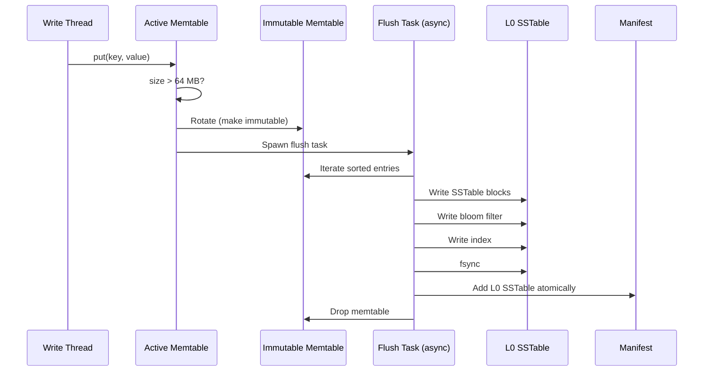

# Flush Process

How memtables are flushed to L0 SSTables: sorting, serialization, bloom filter generation, and atomic swaps.

---

## Overview

The **flush process** converts an immutable memtable (in-memory skiplist) into an L0 SSTable (on-disk sorted file).

**Key properties**:
- **Sorted iteration**: Skiplist already sorted, no additional sort needed
- **Bloom filter**: Generated during iteration (0.01 false positive rate)
- **Atomic swap**: New SSTable made visible atomically via manifest update
- **WAL cleanup**: Old WAL segments deleted after successful flush
- **Async execution**: Flush runs in background, doesn't block writes

---

## Flush Lifecycle



**Duration**: ~200ms for 64 MB memtable (100K entries)

---

## Step-by-Step Algorithm

### Step 1: Trigger Flush

Flush is triggered when memtable size exceeds threshold:

```rust
async fn check_and_flush(&mut self) -> Result<()> {
    // 1. Check if any immutable memtables are queued
    if self.immutable_memtables.is_empty() {
        return Ok(());
    }

    // 2. Take oldest immutable memtable
    let memtable = self.immutable_memtables.remove(0);

    // 3. Spawn flush task (async)
    let lsm = self.clone();
    tokio::spawn(async move {
        lsm.flush_memtable(memtable).await
    });

    Ok(())
}
```

**Timing**:
- Rotation: ~1μs (pointer swap)
- Spawn task: ~1μs (tokio overhead)
- **Total trigger time**: ~2μs (doesn't block writes)

### Step 2: Sort (Already Sorted!)

**Key insight**: Skiplist maintains sorted order, so iteration is O(n), not O(n log n).

```rust
fn iter_sorted(memtable: &Memtable) -> impl Iterator<Item = (Vec<u8>, Vec<u8>)> {
    // Skiplist iterator already yields sorted entries
    memtable.skiplist.iter().map(|entry| {
        (entry.key().clone(), entry.value().clone())
    })
}
```

**Benefit**: No additional sort needed, saves CPU time.

**Comparison to alternatives**:
- HashMap → Vec → sort: O(n log n) + memory allocation
- BTreeMap → iter: O(n) but mutex contention
- **Skiplist → iter**: O(n), lock-free

### Step 3: Build SSTable

SSTable format (from nori-sstable):

```
┌────────────────────────────┐
│  Data Blocks (sorted)      │  ← Key-value pairs (4 KB blocks)
│  [Block 0] [Block 1] ...   │
├────────────────────────────┤
│  Index (offsets)           │  ← Block offsets + first key
├────────────────────────────┤
│  Bloom Filter              │  ← Bit array (0.01 FPR)
├────────────────────────────┤
│  Footer (metadata)         │  ← Index offset, bloom offset
└────────────────────────────┘
```

**Build process**:

```rust
async fn build_sstable(&self, memtable: &Memtable) -> Result<SSTHandle> {
    // 1. Create SSTable builder
    let mut builder = SSTableBuilder::new(
        self.config.block_size,        // 4 KB
        self.config.compression,       // LZ4
        self.config.bloom_fpr,         // 0.01
    );

    // 2. Iterate memtable in sorted order
    for (key, value) in memtable.iter() {
        builder.add(key, value)?;
    }

    // 3. Finalize SSTable (write to disk)
    let sst_path = self.l0_path.join(format!("{:06}.sst", self.next_sst_id()));
    let handle = builder.finish(sst_path).await?;

    Ok(handle)
}
```

**Timing breakdown** (64 MB memtable):
- Iteration: 50ms (100K entries × 500ns each)
- Block serialization: 80ms (16K blocks × 5μs each)
- Bloom filter: 40ms (100K inserts × 400ns each)
- Index build: 10ms
- Disk write: 20ms (64 MB / 3 GB/sec SSD)
- **Total**: ~200ms

### Step 4: Generate Bloom Filter

Bloom filter is built incrementally during iteration:

```rust
pub struct BloomFilter {
    bits: Vec<u64>,         // Bit array
    num_hashes: usize,      // Number of hash functions (k=7)
    num_bits: usize,        // Total bits (m = 125 KB for 100K keys)
}

impl BloomFilter {
    pub fn insert(&mut self, key: &[u8]) {
        let hash1 = xxhash64(key, seed: 0);
        let hash2 = xxhash64(key, seed: 1);

        // Double hashing: h_i = hash1 + i * hash2 (mod m)
        for i in 0..self.num_hashes {
            let bit_index = (hash1.wrapping_add(i as u64 * hash2)) % self.num_bits as u64;
            self.set_bit(bit_index as usize);
        }
    }

    fn set_bit(&mut self, index: usize) {
        let word = index / 64;
        let bit = index % 64;
        self.bits[word] |= 1u64 << bit;
    }
}
```

**Parameters** (for 100K keys, 0.01 FPR):
- Bits per key: `m/n = -ln(p) / (ln(2)^2) = 9.6 bits/key`
- Total bits: `100K × 9.6 = 960K bits = 120 KB`
- Hash functions: `k = (m/n) × ln(2) = 6.65 ≈ 7`

**Performance**:
- Insert time: 7 hashes × 50ns/hash = 350ns per key
- Total bloom build: 100K × 350ns = 35ms

### Step 5: Write to Disk

**Write order** (critical for crash safety):

```rust
async fn write_sstable(&self, builder: SSTableBuilder) -> Result<PathBuf> {
    let path = self.temp_path();  // /tmp/000042.sst.tmp

    // 1. Write data blocks
    for block in builder.blocks {
        file.write_all(&block.data).await?;
    }

    // 2. Write index
    file.write_all(&builder.index.serialize()).await?;

    // 3. Write bloom filter
    file.write_all(&builder.bloom.serialize()).await?;

    // 4. Write footer (points to index and bloom)
    file.write_all(&builder.footer.serialize()).await?;

    // 5. Fsync (durability)
    file.sync_all().await?;

    // 6. Atomic rename (make visible)
    fs::rename(path, self.final_path()).await?;

    Ok(self.final_path())
}
```

**Why temp file + rename?**
- **Atomicity**: Rename is atomic on POSIX systems
- **Crash safety**: Partial writes to temp file are invisible
- **No torn reads**: Readers never see incomplete SSTables

### Step 6: Update Manifest

Manifest tracks all SSTables and their metadata:

```rust
pub struct Manifest {
    /// L0 SSTables (unsorted, overlapping)
    l0_sstables: Vec<SSTableMetadata>,

    /// Slot metadata (guard keys, runs)
    slots: Vec<SlotMetadata>,

    /// Version counter (incremented on each update)
    version: u64,
}

async fn add_l0_sstable(&mut self, sst: SSTableMetadata) -> Result<()> {
    // 1. Add to in-memory manifest
    self.l0_sstables.push(sst);

    // 2. Increment version
    self.version += 1;

    // 3. Write updated manifest to disk
    self.persist().await?;

    // 4. Emit VizEvent for observability
    self.meter.emit(VizEvent::L0Flush {
        sst_id: sst.id,
        size_bytes: sst.size,
        entry_count: sst.entry_count,
        bloom_fpr: sst.bloom_fpr,
    });

    Ok(())
}
```

**Manifest persistence**:
- Format: JSON (human-readable, easy to debug)
- Atomic write: Write to temp file, fsync, rename
- Crash recovery: Read manifest on startup, replay if needed

### Step 7: Delete Old WAL

After flush completes, WAL segments are no longer needed:

```rust
async fn delete_wal_segments(&mut self, memtable_id: u64) -> Result<()> {
    // 1. Find WAL segments older than this memtable
    let wal_segments = self.wal.segments_before(memtable_id);

    // 2. Delete each segment
    for segment in wal_segments {
        fs::remove_file(segment.path()).await?;
    }

    // 3. Update WAL metadata
    self.wal.truncate_before(memtable_id).await?;

    Ok(())
}
```

**Safety**: Only delete WAL after:
1. SSTable written to disk
2. SSTable fsynced
3. Manifest updated
4. Manifest fsynced

**Crash scenarios**:
- Crash before flush completes: WAL replays, memtable rebuilt
- Crash after flush, before WAL delete: WAL replays, duplicate entries ignored (idempotent)
- Crash after WAL delete: No replay needed, read from SSTable

---

## Concurrency and Blocking

### Non-Blocking Writes

Flush runs in background, doesn't block new writes:

```
Time  │ Write Thread          │ Flush Thread
──────┼───────────────────────┼──────────────────────
0ms   │ put("a", "1")         │
1ms   │ put("b", "2")         │
2ms   │ Memtable size > 64 MB │
3ms   │ Rotate memtable       │ Spawn flush task
4ms   │ put("c", "3")         │ (new active memtable)
5ms   │ put("d", "4")         │ Iterate immutable memtable
...   │ ...                   │ ...
200ms │ put("z", "100")       │ Write SSTable to disk
201ms │ put("x", "101")       │ Update manifest
202ms │ put("y", "102")       │ Delete WAL
203ms │                       │ Flush complete
```

**Key insight**: Rotation is fast (<10μs), so writes are only blocked briefly.

### Backpressure

If flushes are slower than writes, immutable memtables queue up:

```rust
fn put(&mut self, key: Vec<u8>, value: Vec<u8>) -> Result<()> {
    // 1. Check backpressure
    if self.immutable_memtables.len() >= 2 {
        // Too many immutable memtables, block writes
        return Err(Error::MemoryPressure);
    }

    // 2. Proceed with write
    self.active_memtable.insert(key, value);
    Ok(())
}
```

**Backpressure zones**:
- **Green** (0-1 immutable): No delay
- **Yellow** (1 immutable): Warn, no delay yet
- **Orange** (2 immutable): Delay 100ms, give flush time to catch up
- **Red** (2+ immutable): Reject writes

---

## Performance Analysis

### Flush Throughput

**Benchmark** (64 MB memtable, 100K entries):

```
Phase                  Time      Percentage
─────────────────────────────────────────────
Iteration              50ms      25%
Block serialization    80ms      40%
Bloom filter           40ms      20%
Disk write             20ms      10%
Manifest update        10ms      5%
─────────────────────────────────────────────
Total                  200ms     100%
```

**Throughput**: 64 MB / 200ms = **320 MB/sec**

**Bottleneck**: Block serialization (40% of time)

**Optimization opportunity**:
- Use SIMD for prefix compression
- Parallelize block writes (currently sequential)
- Pre-allocate buffers to reduce allocation overhead

### Flush vs Compaction

| Metric | Flush | Compaction |
|--------|-------|------------|
| **Input** | 1 memtable (sorted) | K runs (sorted) |
| **Output** | 1 L0 SSTable | 1 merged run |
| **Sorting** | None (already sorted) | K-way merge |
| **Bloom filter** | Build from scratch | Rebuild (can't merge) |
| **Frequency** | Every 3 sec (at 20K writes/sec) | Every 10-60 sec |
| **Duration** | 200ms | 500ms - 8 sec (size-dependent) |

**Key difference**: Flush is faster because skiplist is already sorted.

---

## Edge Cases

### 1. Disk Full During Flush

**Scenario**: Disk runs out of space while writing SSTable.

```rust
async fn flush_memtable(&mut self, memtable: Memtable) -> Result<()> {
    match self.write_sstable(&memtable).await {
        Ok(sst_path) => {
            self.manifest.add_l0(sst_path).await?;
            Ok(())
        }
        Err(Error::DiskFull) => {
            // Keep memtable in immutable list
            self.immutable_memtables.push(memtable);

            // Enter backpressure mode
            self.pressure_zone = PressureZone::Red;

            Err(Error::DiskFull)
        }
        Err(e) => Err(e),
    }
}
```

**Recovery**:
- Memtable kept in memory (not dropped)
- Writes rejected until disk space freed
- Operator intervention required (delete old SSTables, expand disk)

### 2. Crash During Flush

**Scenario**: Power loss while SSTable is being written.

```
State before crash:
  Memtable: In-memory (64 MB)
  WAL: Contains all entries
  SSTable: Partially written (32 MB of 64 MB)
  Manifest: Not updated (old version)

State after recovery:
  Memtable: Rebuilt from WAL replay
  WAL: Replayed, memtable reconstructed
  SSTable: Temp file deleted (incomplete)
  Manifest: Old version (no reference to incomplete SSTable)

Result: No data loss, flush retried
```

**Why safe?**:
- WAL not deleted until flush completes
- Temp file not visible to readers
- Manifest not updated until fsync completes

### 3. Empty Memtable Flush

**Scenario**: Memtable rotated but contains only tombstones (all deletes).

```rust
async fn flush_memtable(&mut self, memtable: Memtable) -> Result<()> {
    if memtable.len() == 0 {
        // Empty memtable, skip flush
        return Ok(());
    }

    // Proceed with flush
    self.write_sstable(&memtable).await
}
```

**Benefit**: Skip I/O for empty memtables (e.g., after delete-heavy workload).

---

## Code Example: Complete Flush Implementation

```rust
use nori_sstable::SSTableBuilder;
use tokio::fs;

pub struct FlushTask {
    memtable: Arc<Memtable>,
    l0_dir: PathBuf,
    next_id: u64,
    config: Config,
}

impl FlushTask {
    pub async fn run(self) -> Result<SSTableMetadata> {
        // 1. Create SSTable builder
        let mut builder = SSTableBuilder::new(
            self.config.block_size,
            self.config.compression,
            self.config.bloom_fpr,
        );

        // 2. Iterate memtable (already sorted)
        let mut entry_count = 0;
        for (key, value) in self.memtable.iter() {
            builder.add(key, value)?;
            entry_count += 1;
        }

        // 3. Write to temp file
        let temp_path = self.l0_dir.join(format!("{:06}.sst.tmp", self.next_id));
        builder.write(&temp_path).await?;

        // 4. Fsync
        let file = fs::OpenOptions::new()
            .write(true)
            .open(&temp_path)
            .await?;
        file.sync_all().await?;

        // 5. Atomic rename
        let final_path = self.l0_dir.join(format!("{:06}.sst", self.next_id));
        fs::rename(&temp_path, &final_path).await?;

        // 6. Return metadata
        Ok(SSTableMetadata {
            id: self.next_id,
            path: final_path,
            size: self.memtable.total_size(),
            entry_count,
            min_key: builder.min_key().clone(),
            max_key: builder.max_key().clone(),
            bloom_fpr: self.config.bloom_fpr,
        })
    }
}
```

---

## Summary

**Flush process transforms memtables into durable L0 SSTables**:

1. **Trigger**: Memtable size exceeds 64 MB, rotation + spawn flush task
2. **Iteration**: Sorted skiplist iteration (O(n), no additional sort)
3. **Build**: Serialize blocks, generate bloom filter, write index
4. **Persist**: Write to temp file, fsync, atomic rename
5. **Manifest**: Update L0 list atomically
6. **Cleanup**: Delete old WAL segments

**Performance**:
- Flush latency: ~200ms for 64 MB memtable
- Throughput: 320 MB/sec
- Non-blocking: Writes continue during flush

**Next**: [Slot Routing](slot-routing) - How keys are mapped to slots

---

*Last Updated: 2025-10-31*
*See Also: [Memtable Management](memtable-management.md), [Slot Routing](slot-routing.md)*
