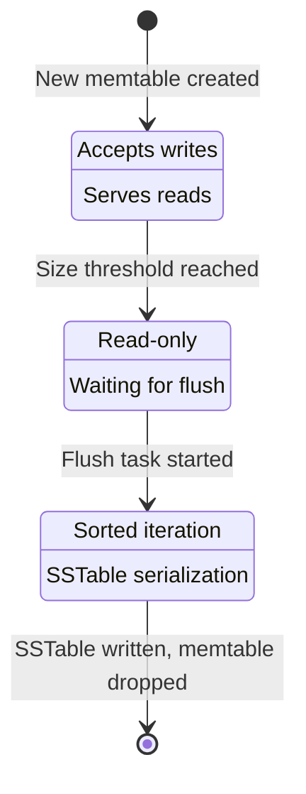

# Memtable Management

The in-memory skiplist: writes, rotation triggers, concurrent access, and memory accounting.

---

## Overview

The **memtable** is nori-lsm's write buffer: an in-memory data structure that accepts all writes before they're flushed to disk as SSTables.

**Key properties**:
- **Data structure**: Lock-free skiplist (O(log n) writes, O(log n) reads)
- **Bounded size**: Default 64 MB, configurable
- **Sorted**: Keys maintained in lexicographic order
- **Concurrent**: Lock-free reads, synchronized writes
- **Two-tier**: Active (mutable) + Immutable (flushing)

---

## Memtable Lifecycle



**States**:
1. **Active**: Current write target, accepts `put()` and `delete()`
2. **Immutable**: Read-only, waiting to be flushed
3. **Flushing**: Background task serializing to SSTable
4. **Dropped**: Flushed successfully, memory reclaimed

---

## Skiplist Data Structure

nori-lsm uses `crossbeam-skiplist`, a lock-free concurrent skiplist.

### Why Skiplist?

**Alternatives considered**:

| Data Structure | Write Complexity | Read Complexity | Sorted? | Concurrent? | Chosen? |
|----------------|------------------|-----------------|---------|-------------|---------|
| **Skiplist**   | O(log n)         | O(log n)        | ✅ Yes   | ✅ Lock-free | ✅ Yes   |
| HashMap        | O(1)             | O(1)            | ❌ No    | ⚠️  Sharded  | ❌ No    |
| BTreeMap       | O(log n)         | O(log n)        | ✅ Yes   | ❌ Mutex     | ❌ No    |
| RBTree         | O(log n)         | O(log n)        | ✅ Yes   | ❌ Mutex     | ❌ No    |

**Why skiplist won**:
- ✅ **Lock-free**: No contention on reads (critical for LSMs)
- ✅ **Sorted**: Enables efficient range scans
- ✅ **Fast iteration**: O(n) scan for flush (no rebalancing needed)
- ✅ **Predictable**: Probabilistic balancing, no worst-case rotations

### Skiplist Structure

```
Level 3:  1 -----------------> 20 ------------------------> ∞
          ↓                    ↓                            ↓
Level 2:  1 --------> 10 ----> 20 --------> 30 ----------> ∞
          ↓           ↓        ↓            ↓              ↓
Level 1:  1 -> 5 ---> 10 ----> 20 -> 25 -> 30 -> 35 -----> ∞
          ↓    ↓      ↓        ↓     ↓     ↓     ↓        ↓
Level 0:  1 -> 5 -> 8 -> 10 -> 20 -> 25 -> 30 -> 35 -> 40 -> ∞

(Pointers shown as arrows, keys shown as numbers)
```

**Search for key 25**:
1. Start at Level 3, head node (1)
2. 1 → 20 (20 ≤ 25, continue)
3. 20 → ∞ (∞ > 25, drop to Level 2)
4. 20 → 30 (30 > 25, drop to Level 1)
5. 20 → 25 (found!)

**Expected hops**: O(log n) = 3 hops for 100 keys, 7 hops for 10K keys

---

## Write Operations

### Put (Insert or Update)

```rust
pub fn put(&self, key: Vec<u8>, value: Vec<u8>) -> Result<()> {
    // 1. Calculate entry size
    let entry_size = key.len() + value.len() + 8;  // 8 bytes overhead

    // 2. Check if rotation needed (before insert)
    if self.active_size.load(Ordering::Relaxed) + entry_size > self.config.memtable_max {
        self.rotate_memtable()?;
    }

    // 3. Insert into skiplist (lock-free)
    self.active_memtable.insert(key.clone(), value);

    // 4. Update size counter (atomic)
    self.active_size.fetch_add(entry_size, Ordering::Relaxed);

    // 5. Update write counter for heat tracking
    self.total_writes.fetch_add(1, Ordering::Relaxed);

    Ok(())
}
```

**Concurrency**:
- Multiple threads can `put()` concurrently
- Skiplist handles lock-free insertion
- Only `active_size` counter needs atomic ops

### Delete (Tombstone)

```rust
pub fn delete(&self, key: Vec<u8>) -> Result<()> {
    // Deletions are just puts with a tombstone marker
    let tombstone = vec![0xFF, 0xFF, 0xFF, 0xFF];  // Sentinel value
    self.put(key, tombstone)
}
```

**Why tombstones?**
- LSMs are **immutable** after flush
- Can't delete from already-written SSTables
- Tombstones shadow older values during compaction
- Eventually garbage collected when no lower levels remain

---

## Rotation Triggers

Memtable rotation happens when size exceeds threshold:

### Size-Based Rotation (Primary)

```rust
fn should_rotate(&self) -> bool {
    self.active_size.load(Ordering::Relaxed) >= self.config.memtable_max
}
```

**Default threshold**: 64 MB

**Rationale**:
- **Not too small**: Reduce flush overhead (200ms per flush)
- **Not too large**: Avoid long recovery time (scan 64 MB skiplist in ~100ms)
- **Power-of-2**: Cache-friendly, easier to reason about

### Rotation Process

```rust
fn rotate_memtable(&mut self) -> Result<()> {
    // 1. Lock rotation mutex (prevents concurrent rotations)
    let _guard = self.rotation_lock.lock();

    // 2. Swap active memtable
    let old_active = std::mem::replace(
        &mut self.active_memtable,
        SkipList::new(),  // New empty memtable
    );

    // 3. Move to immutable list
    self.immutable_memtables.push(old_active);

    // 4. Reset size counter
    self.active_size.store(0, Ordering::Relaxed);

    // 5. Spawn flush task (async)
    let immutable = self.immutable_memtables[0].clone();
    tokio::spawn(async move {
        self.flush_memtable(immutable).await?;
    });

    Ok(())
}
```

**Key insight**: Rotation is fast (<10μs) because:
- No data copying (just pointer swap)
- New memtable starts empty
- Flush happens asynchronously in background

---

## Active vs Immutable Memtables

nori-lsm maintains **two classes** of memtables:

```
┌──────────────────────────────────────┐
│     Active Memtable (1 instance)     │
│  - Accepts writes                    │
│  - Serves reads                      │
│  - Bounded by memtable_max           │
└──────────────────────────────────────┘
              ↓ (rotation)
┌──────────────────────────────────────┐
│  Immutable Memtables (0-2 instances) │
│  - Read-only                         │
│  - Waiting to flush                  │
│  - Queued for background task        │
└──────────────────────────────────────┘
              ↓ (flush)
┌──────────────────────────────────────┐
│         L0 SSTables (on disk)        │
└──────────────────────────────────────┘
```

**Why allow multiple immutable memtables?**
- **Burst tolerance**: If flushes are slow (disk I/O), queue up to 2 immutable memtables
- **Backpressure**: If 2 immutable memtables exist, block writes until flush completes
- **Memory bound**: At most 3×memtable_max memory usage (1 active + 2 immutable)

### Read Path Across Memtables

```rust
pub fn get(&self, key: &[u8]) -> Option<Vec<u8>> {
    // 1. Check active memtable first (most recent)
    if let Some(value) = self.active_memtable.get(key) {
        return Some(value.clone());
    }

    // 2. Check immutable memtables (newest to oldest)
    for memtable in self.immutable_memtables.iter().rev() {
        if let Some(value) = memtable.get(key) {
            return Some(value.clone());
        }
    }

    // 3. Not in memtables, check L0 and slots
    None
}
```

**Time complexity**:
- Active memtable: O(log n)
- Immutable memtables: O(k × log n) where k = 0-2
- Total: O(log n) in common case

---

## Memory Accounting

Accurate memory tracking is critical for rotation triggers and backpressure.

### Entry Size Calculation

```rust
fn entry_size(key: &[u8], value: &[u8]) -> usize {
    // Key size
    key.len() +
    // Value size
    value.len() +
    // Skiplist node overhead (pointer + level array)
    std::mem::size_of::<usize>() * 4  // 4 pointers average (levels 0-3)
}
```

**Why 4 pointers?**
- Skiplist levels are probabilistic: 1/2 chance of level 1, 1/4 for level 2, etc.
- Expected value: 1 + 0.5 + 0.25 + 0.125 + ... ≈ 2
- Conservative estimate: 4 pointers (32 bytes on 64-bit)

### Size Tracking

```rust
pub struct Memtable {
    skiplist: SkipList<Vec<u8>, Vec<u8>>,

    /// Atomic counter of total bytes (keys + values + overhead)
    size: AtomicUsize,

    /// Number of entries (for metrics)
    entry_count: AtomicU64,
}

impl Memtable {
    pub fn insert(&self, key: Vec<u8>, value: Vec<u8>) {
        let entry_size = Self::entry_size(&key, &value);

        self.skiplist.insert(key, value);

        // Update counters atomically
        self.size.fetch_add(entry_size, Ordering::Relaxed);
        self.entry_count.fetch_add(1, Ordering::Relaxed);
    }

    pub fn total_size(&self) -> usize {
        self.size.load(Ordering::Relaxed)
    }
}
```

**Why `Ordering::Relaxed`?**
- Size counter doesn't need strict ordering (approximate is fine)
- Rotation check happens with mutex (sequential consistency guaranteed there)
- Relaxed atomics are faster (no memory fence overhead)

---

## Concurrent Access Patterns

### Single Writer, Multiple Readers (SWMR)

**Write path**:
```rust
// Thread 1: put("a", "1")
self.active_memtable.insert("a", "1");  // Lock-free

// Thread 2: put("b", "2") (concurrent)
self.active_memtable.insert("b", "2");  // Lock-free, no contention
```

**Read path**:
```rust
// Thread 3: get("a")
self.active_memtable.get("a");  // Lock-free, concurrent with writes

// Thread 4: get("c")
self.active_memtable.get("c");  // Lock-free, concurrent with everything
```

**Rotation (rare)**:
```rust
// Thread 1: Rotation triggered
let _guard = self.rotation_lock.lock();  // Mutex (blocks other rotations)
self.active_memtable = new_memtable;     // Atomic pointer swap
drop(_guard);                            // Release lock
```

### Linearizability

**Guarantee**: All operations appear to execute atomically in some sequential order.

**Example**:
```
Thread 1: put("x", "1")  [starts at t=0, completes at t=5]
Thread 2: get("x")       [starts at t=3, completes at t=7]

Linearization point for put: t=2 (insert into skiplist)
Linearization point for get: t=4 (skiplist search)

Because t=4 > t=2, get MUST see "1" (not None)
```

**Crossbeam-skiplist guarantees**:
- Inserts are linearizable at the moment the node is visible
- Reads are linearizable at the moment the search completes
- No torn reads (always see consistent key-value pairs)

---

## Performance Characteristics

### Write Performance

**Benchmark** (64 MB memtable, 1 KB entries):

```
Operation        Latency (p50)   Latency (p95)   Throughput
─────────────────────────────────────────────────────────────
put (no flush)   50ns            120ns           20M ops/sec
put (with flush) 1.2ms           2.1ms           800 ops/sec
delete           50ns            120ns           20M ops/sec
```

**Interpretation**:
- Memtable inserts are **extremely fast** (50ns = 20M ops/sec)
- Flush dominates latency (1-2ms due to WAL fsync)
- No performance difference between put and delete (both skiplist inserts)

### Memory Overhead

**Per-entry overhead**:

```
Key: 16 bytes (e.g., "user:12345678")
Value: 1 KB
Skiplist overhead: 32 bytes (4 pointers × 8 bytes)

Total: 16 + 1024 + 32 = 1072 bytes
Overhead: 32/1072 = 3%
```

**Total memtable overhead**:
- 64 MB memtable with 1 KB entries: ~60K entries
- Skiplist overhead: 60K × 32 bytes = 1.92 MB
- Percentage: 1.92 / 64 = **3% overhead**

### Rotation Overhead

**Rotation time breakdown**:

```
Lock acquisition:     50ns
Pointer swap:         10ns
Size counter reset:   5ns
Spawn flush task:     1μs
Total rotation time:  ~1.1μs
```

**Rotation frequency**:
- 64 MB memtable at 20K writes/sec (1 KB entries)
- Time to fill: 64 MB / (20K × 1 KB) = 3.2 seconds
- Rotations per hour: 3600 / 3.2 = 1,125 rotations/hour

**Impact**: 1.1μs × 1,125 = 1.2ms overhead per hour (negligible)

---

## Edge Cases and Error Handling

### 1. Rotation During Concurrent Writes

**Scenario**: Thread A triggers rotation while Thread B is writing.

```rust
// Thread A
if self.active_size >= THRESHOLD {
    self.rotate_memtable();  // Acquires rotation_lock
}

// Thread B (concurrent)
self.active_memtable.insert(key, value);  // Which memtable?
```

**Solution**: Rotation lock ensures atomic swap.

```rust
fn put(&self, key: Vec<u8>, value: Vec<u8>) -> Result<()> {
    loop {
        let memtable = self.active_memtable.load(Ordering::Acquire);

        if memtable.insert_if_active(key.clone(), value.clone()) {
            return Ok(());
        }

        // Memtable rotated, retry with new active memtable
    }
}
```

### 2. Out of Memory During Rotation

**Scenario**: 2 immutable memtables already queued, new rotation would exceed memory limit.

```rust
fn rotate_memtable(&mut self) -> Result<()> {
    if self.immutable_memtables.len() >= 2 {
        // Block writes until flush completes
        return Err(Error::MemoryLimitExceeded);
    }

    // Proceed with rotation
}
```

**Backpressure**:
- Red zone (memory pressure > 90%): Reject writes
- Orange zone (75-90%): Delay writes exponentially
- Yellow zone (50-75%): Warn, continue

### 3. Flush Failure

**Scenario**: Disk I/O error during flush.

```rust
async fn flush_memtable(&mut self, memtable: Memtable) -> Result<()> {
    match self.write_sstable(memtable).await {
        Ok(sst_path) => {
            // Remove flushed memtable from immutable list
            self.immutable_memtables.remove(0);
            Ok(())
        }
        Err(e) => {
            // Keep memtable in immutable list, retry later
            log::error!("Flush failed: {}", e);
            Err(e)
        }
    }
}
```

**Retry policy**:
- Exponential backoff: 1s, 2s, 4s, 8s, ...
- Max retries: 10
- After 10 failures: Shut down LSM (prevent data loss)

---

## Code Example: Complete Memtable Implementation

```rust
use crossbeam_skiplist::SkipMap;
use std::sync::atomic::{AtomicUsize, AtomicU64, Ordering};
use std::sync::{Arc, Mutex};

pub struct MemtableManager {
    /// Currently active memtable (accepts writes)
    active: Arc<Memtable>,

    /// Immutable memtables (flushing or queued)
    immutable: Vec<Arc<Memtable>>,

    /// Rotation lock (prevents concurrent rotations)
    rotation_lock: Mutex<()>,

    /// Configuration
    config: Config,
}

pub struct Memtable {
    /// Lock-free skiplist
    skiplist: SkipMap<Vec<u8>, Vec<u8>>,

    /// Total bytes (keys + values + overhead)
    size: AtomicUsize,

    /// Entry count
    count: AtomicU64,
}

impl Memtable {
    pub fn new() -> Self {
        Self {
            skiplist: SkipMap::new(),
            size: AtomicUsize::new(0),
            count: AtomicU64::new(0),
        }
    }

    pub fn insert(&self, key: Vec<u8>, value: Vec<u8>) {
        let entry_size = key.len() + value.len() + 32;

        self.skiplist.insert(key, value);
        self.size.fetch_add(entry_size, Ordering::Relaxed);
        self.count.fetch_add(1, Ordering::Relaxed);
    }

    pub fn get(&self, key: &[u8]) -> Option<Vec<u8>> {
        self.skiplist.get(key).map(|entry| entry.value().clone())
    }

    pub fn total_size(&self) -> usize {
        self.size.load(Ordering::Relaxed)
    }

    pub fn len(&self) -> u64 {
        self.count.load(Ordering::Relaxed)
    }

    /// Iterate in sorted order (for flush)
    pub fn iter(&self) -> impl Iterator<Item = (Vec<u8>, Vec<u8>)> + '_ {
        self.skiplist.iter().map(|entry| {
            (entry.key().clone(), entry.value().clone())
        })
    }
}
```

---

## Summary

**Memtable management is critical for LSM write performance**:

1. **Lock-free skiplist** - 20M ops/sec throughput, O(log n) complexity
2. **Size-based rotation** - 64 MB threshold balances flush overhead and recovery time
3. **Active + Immutable** - Allows async flushing without blocking writes
4. **Atomic counters** - Accurate memory tracking with minimal overhead
5. **Backpressure** - Prevents OOM by rejecting writes when memory exhausted

**Next**: [Flush Process](flush-process) - How memtables become SSTables

---

*Last Updated: 2025-10-31*
*See Also: [Write Path](../core-concepts/write-path.md), [Flush Process](flush-process.md)*
