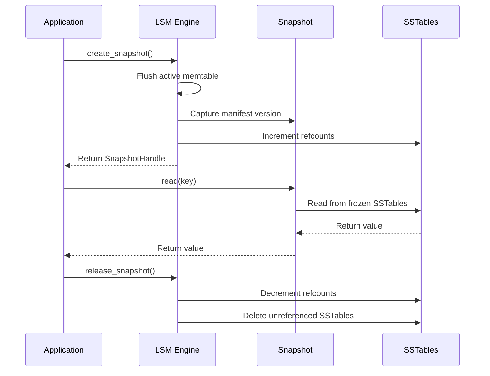

# Snapshot Process

Creating consistent point-in-time snapshots for backups, replication, and disaster recovery.

---

## Overview

A **snapshot** is a consistent point-in-time view of the LSM tree. Snapshots enable:
- **Backups**: Copy data to remote storage without blocking writes
- **Replication**: Send initial state to replicas
- **Disaster recovery**: Restore from known-good state
- **Long-running queries**: Prevent compaction from deleting files mid-query

**Key properties**:
- **Consistent**: All data visible as of snapshot time (no torn reads)
- **Non-blocking**: Writes continue during snapshot creation
- **Reference counting**: SSTables kept alive until snapshot released
- **Efficient**: No data copying, just metadata

---

## Snapshot Lifecycle



**Duration**: ~200ms to create snapshot (dominated by memtable flush).

---

## Snapshot Creation Algorithm

### Step 1: Flush Active Memtable

Ensure all in-memory data is persisted:

```rust
pub async fn create_snapshot(&mut self) -> Result<SnapshotHandle> {
    // 1. Flush active memtable to L0 (make durable)
    self.flush_memtable().await?;

    // 2. Capture current manifest version
    let manifest_version = self.manifest.version();

    // 3. Increment refcounts for all SSTables
    let sstable_ids = self.collect_all_sstables();
    for id in &sstable_ids {
        self.refcount.increment(*id);
    }

    // 4. Return snapshot handle
    Ok(SnapshotHandle {
        id: self.next_snapshot_id(),
        version: manifest_version,
        sstables: sstable_ids,
        created_at: Instant::now(),
    })
}
```

**Why flush first?**
- Snapshots only reference on-disk SSTables (not in-memory memtables)
- Flushing ensures no data is lost if snapshot is used for backup
- Snapshot is durable (survives crash)

### Step 2: Capture Manifest Version

Manifest tracks all SSTables and their metadata:

```rust
pub struct Manifest {
    /// Version counter (incremented on every update)
    version: u64,

    /// L0 SSTables
    l0_sstables: Vec<SSTableMetadata>,

    /// Slot metadata (runs per slot)
    slots: Vec<SlotMetadata>,
}

pub struct SnapshotHandle {
    /// Snapshot ID
    id: u64,

    /// Manifest version at snapshot time
    version: u64,

    /// All SSTable IDs referenced by this snapshot
    sstables: Vec<u64>,

    /// Creation timestamp
    created_at: Instant,
}
```

**Example**:

```
Manifest version 42:
  L0: [SST-001, SST-002, SST-003]
  Slot 0: [SST-010]
  Slot 1: [SST-011, SST-012]
  Slot 2: [SST-013]

Snapshot captures version 42:
  sstables: [001, 002, 003, 010, 011, 012, 013]

After snapshot:
  Compaction merges SST-001, SST-002 → SST-020
  Manifest version 43:
    L0: [SST-003]
    Slot 0: [SST-020]  (new merged run)
    Slot 1: [SST-011, SST-012]

Snapshot still references version 42:
  SST-001, SST-002 kept alive (refcount > 0)
  SST-020 not visible to snapshot
```

### Step 3: Reference Counting

Prevent deletion of SSTables referenced by snapshots:

```rust
pub struct ReferenceCounter {
    /// Refcount per SSTable
    refcounts: HashMap<u64, Arc<AtomicU32>>,
}

impl ReferenceCounter {
    pub fn increment(&mut self, sstable_id: u64) {
        let refcount = self.refcounts.entry(sstable_id)
            .or_insert_with(|| Arc::new(AtomicU32::new(0)));

        refcount.fetch_add(1, Ordering::Relaxed);
    }

    pub fn decrement(&mut self, sstable_id: u64) {
        if let Some(refcount) = self.refcounts.get(&sstable_id) {
            refcount.fetch_sub(1, Ordering::Relaxed);
        }
    }

    pub fn can_delete(&self, sstable_id: u64) -> bool {
        self.refcounts.get(&sstable_id)
            .map(|rc| rc.load(Ordering::Relaxed) == 0)
            .unwrap_or(true)  // No refcount → safe to delete
    }
}
```

**Example**:

```
Initial state:
  SST-001: refcount=1 (active in L0)
  SST-002: refcount=1 (active in Slot 0)

Snapshot created:
  SST-001: refcount=2 (active + snapshot)
  SST-002: refcount=2 (active + snapshot)

Compaction merges SST-001, SST-002 → SST-020:
  SST-001: refcount=1 (removed from L0, still in snapshot)
  SST-002: refcount=1 (removed from Slot 0, still in snapshot)
  SST-020: refcount=1 (new run in Slot 0)

Snapshot released:
  SST-001: refcount=0 → DELETE
  SST-002: refcount=0 → DELETE
```

---

## Snapshot Reads

Reads from snapshot use frozen manifest version:

```rust
pub async fn get(&self, snapshot: &SnapshotHandle, key: &[u8]) -> Option<Vec<u8>> {
    // 1. Load manifest version at snapshot time
    let manifest = self.manifest_at_version(snapshot.version).await?;

    // 2. Check L0 SSTables (from snapshot time)
    for sst_id in &manifest.l0_sstables {
        if snapshot.sstables.contains(sst_id) {
            if let Some(value) = self.read_sstable(*sst_id, key).await? {
                return Some(value);
            }
        }
    }

    // 3. Check slots (from snapshot time)
    for slot in &manifest.slots {
        for run_id in &slot.runs {
            if snapshot.sstables.contains(run_id) {
                if let Some(value) = self.read_sstable(*run_id, key).await? {
                    return Some(value);
                }
            }
        }
    }

    // 4. Not found
    None
}
```

**Isolation**: Snapshot sees only SSTables from its version, not newer compaction results.

**Example**:

```
Snapshot at version 42:
  Sees: SST-001, SST-002 (old L0 files)

Current state at version 45:
  SST-001, SST-002 deleted (compacted to SST-020)
  New data: SST-021, SST-022

get(snapshot, "key") → Only searches SST-001, SST-002 (not SST-020, SST-021, SST-022)
```

---

## Snapshot Release

Release snapshot and decrement refcounts:

```rust
pub async fn release_snapshot(&mut self, snapshot: SnapshotHandle) -> Result<()> {
    // 1. Decrement refcounts for all SSTables
    for sstable_id in &snapshot.sstables {
        self.refcount.decrement(*sstable_id);
    }

    // 2. Delete SSTables with refcount=0
    for sstable_id in &snapshot.sstables {
        if self.refcount.can_delete(*sstable_id) {
            self.delete_sstable(*sstable_id).await?;
        }
    }

    // 3. Remove snapshot from registry
    self.snapshots.remove(&snapshot.id);

    Ok(())
}
```

**Garbage collection**: SSTables deleted only when:
1. Removed from active manifest (compacted away)
2. Refcount = 0 (no snapshots reference them)

---

## Use Cases

### Use Case 1: Backup to S3

```rust
pub async fn backup_to_s3(&mut self, bucket: &str) -> Result<()> {
    // 1. Create snapshot
    let snapshot = self.lsm.create_snapshot().await?;

    // 2. Upload SSTables to S3
    for sstable_id in &snapshot.sstables {
        let local_path = self.lsm.sstable_path(*sstable_id);
        let s3_key = format!("backups/{}/{:06}.sst", snapshot.id, sstable_id);

        upload_file_to_s3(&local_path, bucket, &s3_key).await?;
    }

    // 3. Upload manifest
    let manifest = self.lsm.manifest_at_version(snapshot.version).await?;
    let manifest_json = serde_json::to_string(&manifest)?;
    upload_to_s3(&manifest_json, bucket, &format!("backups/{}/manifest.json", snapshot.id)).await?;

    // 4. Release snapshot
    self.lsm.release_snapshot(snapshot).await?;

    Ok(())
}
```

**Duration**: Minutes to hours (dominated by S3 upload, not snapshot creation).

### Use Case 2: Replication Initial Sync

```rust
pub async fn replicate_snapshot(&mut self, replica_addr: &str) -> Result<()> {
    // 1. Create snapshot
    let snapshot = self.lsm.create_snapshot().await?;

    // 2. Stream SSTables to replica
    for sstable_id in &snapshot.sstables {
        let data = self.lsm.read_sstable_data(*sstable_id).await?;
        send_to_replica(replica_addr, *sstable_id, data).await?;
    }

    // 3. Send manifest
    let manifest = self.lsm.manifest_at_version(snapshot.version).await?;
    send_manifest_to_replica(replica_addr, manifest).await?;

    // 4. Release snapshot
    self.lsm.release_snapshot(snapshot).await?;

    Ok(())
}
```

**Benefit**: Replica receives consistent snapshot while primary continues serving writes.

### Use Case 3: Long-Running Analytics Query

```rust
pub async fn run_analytics(&mut self, query: &str) -> Result<Vec<Row>> {
    // 1. Create snapshot (isolate from compaction)
    let snapshot = self.lsm.create_snapshot().await?;

    // 2. Run query (may take minutes)
    let results = self.execute_query_on_snapshot(&snapshot, query).await?;

    // 3. Release snapshot
    self.lsm.release_snapshot(snapshot).await?;

    Ok(results)
}
```

**Isolation**: Compaction can't delete SSTables mid-query, preventing "file not found" errors.

---

## Performance Characteristics

### Snapshot Creation Latency

**Benchmark** (64 MB memtable, 100 SSTables):

```
Phase                  Time      Percentage
─────────────────────────────────────────────
Flush memtable         200ms     99%
Capture manifest       100μs     <0.1%
Increment refcounts    50μs      <0.1%
─────────────────────────────────────────────
Total                  200ms     100%
```

**Key insight**: Memtable flush dominates (99% of time).

### Snapshot Read Performance

**Benchmark** (snapshot with 50 SSTables):

```
Operation              Latency (p50)   Latency (p95)
────────────────────────────────────────────────────
get (in memory cache)  500ns           1μs
get (SSD read)         50μs            100μs
scan (1K keys)         5ms             10ms
```

**Same as regular reads**: Snapshot reads use same SSTables, same bloom filters, same block cache.

### Snapshot Overhead

**Memory overhead**:
- SnapshotHandle: 128 bytes (ID, version, SSTable list)
- Refcount per SSTable: 4 bytes (AtomicU32)
- Total for 100 SSTables: 128 + 400 = **528 bytes per snapshot**

**Disk overhead**:
- No additional disk space (SSTables shared)
- Only overhead: Delayed deletion (until snapshot released)

---

## Edge Cases

### 1. Snapshot During Compaction

**Scenario**: Compaction starts, then snapshot created.

```rust
Timeline:
  t=0:   Compaction starts (merging SST-001, SST-002)
  t=50:  Snapshot created
  t=100: Compaction completes (SST-020 created)

Snapshot sees:
  SST-001, SST-002 (refcount incremented at t=50)

Compaction result:
  SST-001, SST-002 refcount decremented (removed from manifest)
  But refcount still > 0 (snapshot holds reference)
  SST-001, SST-002 not deleted (kept until snapshot released)
```

**Outcome**: Snapshot sees pre-compaction state (isolated).

### 2. Multiple Concurrent Snapshots

**Scenario**: 3 snapshots created at different times.

```rust
t=0:   Snapshot A created (version 42)
t=10:  Compaction (version 43)
t=20:  Snapshot B created (version 43)
t=30:  Compaction (version 44)
t=40:  Snapshot C created (version 44)

Refcounts:
  SST-001: refcount=2 (Snapshot A + B)
  SST-020: refcount=2 (Snapshot B + C)
  SST-030: refcount=1 (Snapshot C)

Release Snapshot A:
  SST-001: refcount=1 (still in Snapshot B)

Release Snapshot B:
  SST-001: refcount=0 → DELETE
  SST-020: refcount=1 (still in Snapshot C)
```

**Garbage collection**: SSTables deleted only when no snapshot references them.

### 3. Snapshot of Empty LSM

**Scenario**: No data written yet, snapshot created.

```rust
pub async fn create_snapshot(&mut self) -> Result<SnapshotHandle> {
    // Memtable is empty, no flush needed
    if self.active_memtable.is_empty() {
        return Ok(SnapshotHandle {
            id: self.next_snapshot_id(),
            version: self.manifest.version(),
            sstables: vec![],  // Empty snapshot
            created_at: Instant::now(),
        });
    }

    // Normal flush logic
}
```

**Benefit**: Fast snapshot creation (no flush overhead).

---

## Code Example: Complete Snapshot Implementation

```rust
use std::sync::Arc;
use std::sync::atomic::{AtomicU32, Ordering};
use tokio::time::Instant;

pub struct SnapshotManager {
    snapshots: HashMap<u64, SnapshotHandle>,
    refcounts: HashMap<u64, Arc<AtomicU32>>,
    next_id: AtomicU64,
}

pub struct SnapshotHandle {
    pub id: u64,
    pub version: u64,
    pub sstables: Vec<u64>,
    pub created_at: Instant,
}

impl SnapshotManager {
    pub async fn create_snapshot(&mut self, lsm: &mut LSM) -> Result<SnapshotHandle> {
        // 1. Flush memtable
        lsm.flush_memtable().await?;

        // 2. Capture manifest version
        let version = lsm.manifest.version();
        let sstables = lsm.collect_all_sstables();

        // 3. Increment refcounts
        for id in &sstables {
            let refcount = self.refcounts.entry(*id)
                .or_insert_with(|| Arc::new(AtomicU32::new(0)));
            refcount.fetch_add(1, Ordering::Relaxed);
        }

        // 4. Create snapshot handle
        let snapshot = SnapshotHandle {
            id: self.next_id.fetch_add(1, Ordering::Relaxed),
            version,
            sstables,
            created_at: Instant::now(),
        };

        self.snapshots.insert(snapshot.id, snapshot.clone());

        Ok(snapshot)
    }

    pub async fn release_snapshot(&mut self, snapshot: SnapshotHandle, lsm: &mut LSM) -> Result<()> {
        // 1. Decrement refcounts
        for id in &snapshot.sstables {
            if let Some(refcount) = self.refcounts.get(id) {
                refcount.fetch_sub(1, Ordering::Relaxed);
            }
        }

        // 2. Delete unreferenced SSTables
        for id in &snapshot.sstables {
            if self.can_delete(*id) {
                lsm.delete_sstable(*id).await?;
            }
        }

        // 3. Remove snapshot
        self.snapshots.remove(&snapshot.id);

        Ok(())
    }

    fn can_delete(&self, sstable_id: u64) -> bool {
        self.refcounts.get(&sstable_id)
            .map(|rc| rc.load(Ordering::Relaxed) == 0)
            .unwrap_or(true)
    }
}
```

---

## Summary

**Snapshot process creates consistent point-in-time views**:

1. **Flush memtable** - Ensure all data durable
2. **Capture manifest version** - Freeze SSTable list
3. **Reference counting** - Prevent deletion during snapshot lifetime
4. **Isolated reads** - Snapshot sees frozen manifest version
5. **Garbage collection** - Delete SSTables when refcount=0

**Performance**:
- Creation latency: ~200ms (dominated by flush)
- Read latency: Same as regular reads (shared SSTables)
- Memory overhead: ~500 bytes per snapshot

**Use cases**: Backups, replication, long-running queries, disaster recovery

---

*Last Updated: 2025-10-31*
*See Also: [Flush Process](flush-process.md), [Compaction Lifecycle](compaction-lifecycle.md)*
