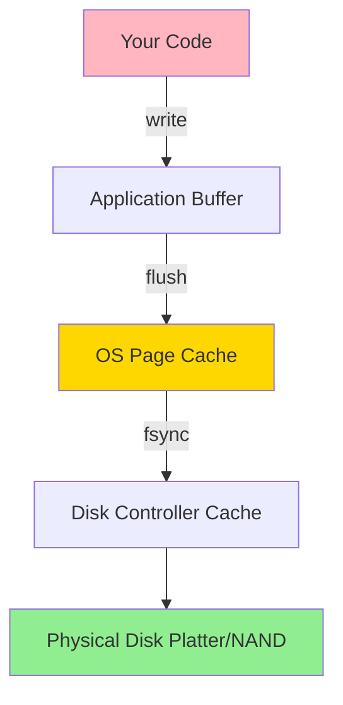
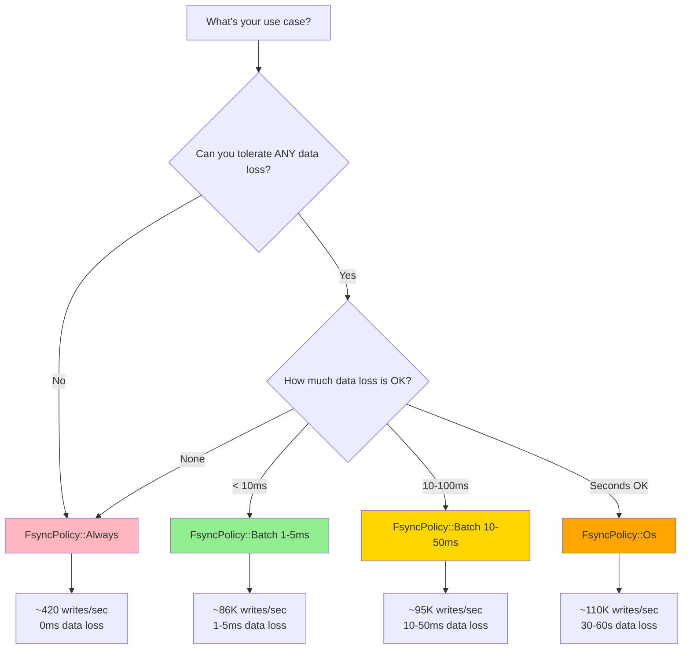

# Durability & Fsync Policies

How to balance durability and performance with different fsync strategies.

## Table of contents

---

## The Durability Problem

When you write data to a file, it doesn't go directly to disk. It goes through multiple layers of buffering:



**Problem**: At each layer, your data can be lost if power fails.

| Layer | Survives Process Crash? | Survives OS Crash/Power Failure? |
|-------|------------------------|----------------------------------|
| Application buffer | No | No |
| OS page cache | Yes | No |
| Disk controller cache | Yes | Maybe (if battery-backed) |
| Physical disk | Yes | Yes |

**Only data on physical disk is truly durable.**

---

## What is fsync()?

`fsync()` is a system call that forces the operating system to flush all buffers to physical disk:

```rust
use tokio::fs::File;

let mut file = File::create("data.log").await?;
file.write_all(b"important data").await?;

// Data is in OS cache, NOT on disk yet!

file.sync_all().await?;  // Calls fsync() - forces to disk

// Now data is guaranteed to be on physical disk
```

### flush() vs sync()

Don't confuse `flush()` and `sync()`:

```rust
// flush() - Writes from app buffer to OS cache (not durable!)
file.flush().await?;

// sync_all() - Forces OS cache to physical disk (durable!)
file.sync_all().await?;
```

**Key difference**:
- `flush()`: App buffer → OS page cache (survives process crash, NOT power failure)
- `sync_all()` / `fsync()`: OS page cache → physical disk (survives power failure)

---

## The Performance Cost of fsync()

`fsync()` is **expensive**. Here's why:

### Latency

On a typical SSD:

```
write() call:       ~10 microseconds  (in-memory)
fsync() call:       ~1-5 milliseconds (force to disk)

That's 100-500x slower!
```

On a typical HDD:

```
write() call:       ~10 microseconds  (in-memory)
fsync() call:       ~5-10 milliseconds (seek + rotate + write)

That's 500-1000x slower!
```

### Throughput

If you `fsync()` after every write:

```rust
for i in 0..1000 {
    file.write_all(&data).await?;
    file.sync_all().await?;  // fsync after every write
}
```

Performance:
- **Without fsync**: 1,000,000 writes/second (limited by CPU/memory)
- **With fsync**: ~200-500 writes/second (limited by disk)

That's a **2000-5000x slowdown!**

---

## The Durability vs. Performance Trade-Off

You have to choose:

**Option 1: Always fsync() - Maximum Durability**
- Every write is guaranteed durable before returning
- Zero data loss on power failure
- Very slow (~200-500 writes/sec)

**Option 2: Never fsync() - Maximum Performance**
- Blazing fast (~1M writes/sec)
- Data loss on power failure (up to 30-60 seconds of writes)
- Not acceptable for critical data

**Option 3: Batched fsync() - Balanced**
- Good performance (~50K-100K writes/sec)
- Small data loss window (milliseconds)
- Acceptable for most applications

This is what `FsyncPolicy` in nori-wal controls.

---

## FsyncPolicy Options

nori-wal provides three fsync policies. Let's explore each one.

### FsyncPolicy::Always

Calls `fsync()` after **every** write.

```rust
use nori_wal::{WalConfig, FsyncPolicy};

let config = WalConfig {
    fsync_policy: FsyncPolicy::Always,
    ..Default::default()
};
```

**Behavior**:
```rust
let record = Record::put(b"key", b"value");
wal.append(&record).await?;  // Internally calls fsync() before returning
```

**Guarantees**:
- Every `append()` is durable before it returns
- Zero data loss on power failure
- Suitable for financial transactions, critical data

**Performance**:
- ~200-500 writes/sec (disk-bound)
- p50 latency: ~2ms
- p99 latency: ~10ms

**Use when**:
- You cannot tolerate ANY data loss
- Examples: financial transactions, medical records, audit logs

---

### FsyncPolicy::Batch(Duration)

Batches `fsync()` calls within a time window.

```rust
use std::time::Duration;

let config = WalConfig {
    fsync_policy: FsyncPolicy::Batch(Duration::from_millis(5)),
    ..Default::default()
};
```

**Behavior**:
```rust
// First write triggers fsync
wal.append(&record1).await?;  // Calls fsync()

// Subsequent writes within 5ms window skip fsync
wal.append(&record2).await?;  // No fsync!
wal.append(&record3).await?;  // No fsync!

// ... 5ms passes ...

// Next write triggers fsync again
wal.append(&record4).await?;  // Calls fsync()
```

**Guarantees**:
- Potential data loss: up to `window` duration of writes on power failure
- All writes are durable within `window` milliseconds
- Good balance of performance and durability

**Performance** (5ms window):
- ~50K-100K writes/sec
- p50 latency: ~50μs (no fsync)
- p99 latency: ~5ms (fsync)

**Use when**:
- You can tolerate small data loss (milliseconds)
- Examples: web applications, session state, caches

**Tuning the window**:

```rust
// More durable: fsync every 1ms
FsyncPolicy::Batch(Duration::from_millis(1))
// Performance: ~40K writes/sec, 1ms max data loss

// Balanced: fsync every 5ms (default)
FsyncPolicy::Batch(Duration::from_millis(5))
// Performance: ~80K writes/sec, 5ms max data loss

// Higher throughput: fsync every 10ms
FsyncPolicy::Batch(Duration::from_millis(10))
// Performance: ~100K writes/sec, 10ms max data loss
```

---

### FsyncPolicy::Os

Lets the operating system decide when to flush.

```rust
let config = WalConfig {
    fsync_policy: FsyncPolicy::Os,
    ..Default::default()
};
```

**Behavior**:
```rust
wal.append(&record).await?;  // No fsync! Data stays in OS cache
```

Data is eventually flushed to disk by the OS, typically every 30-60 seconds (controlled by kernel settings like `vm.dirty_expire_centisecs` on Linux).

**Guarantees**:
- No durability guarantees!
- Potential data loss: 30-60 seconds of writes on power failure
- Data survives process crash (it's in OS cache)

**Performance**:
- ~100K-1M writes/sec (memory-bound)
- p50 latency: ~10μs
- p99 latency: ~100μs

**Use when**:
- Acceptable data loss on power failure
- Examples: event logs, metrics, caches, analytics

**Warning**: Never use `Os` policy for critical data!

---

## Decision Matrix

Use this flowchart to pick the right policy:



---

## Real-World Examples

### Example 1: Banking System

```rust
// Financial transactions - zero data loss acceptable
let config = WalConfig {
    fsync_policy: FsyncPolicy::Always,
    ..Default::default()
};

let (wal, _) = Wal::open(config).await?;

// Every transaction is durable
let tx = Record::put(b"account:1234", b"balance:5000");
wal.append(&tx).await?;  // Waits for fsync

// If we return success, the transaction is guaranteed on disk
```

**Trade-off**: Low throughput (~420 tx/sec), but every transaction is safe.

---

### Example 2: Web Application Session Store

```rust
// Session state - 5ms data loss acceptable
let config = WalConfig {
    fsync_policy: FsyncPolicy::Batch(Duration::from_millis(5)),
    ..Default::default()
};

let (wal, _) = Wal::open(config).await?;

// High throughput, small data loss window
for session in sessions {
    let record = Record::put(session.id, session.data);
    wal.append(&record).await?;  // Fast!
}

// ~80K sessions/sec throughput
// Worst case: lose 5ms of session updates on power failure
```

**Trade-off**: High throughput, acceptable data loss (users may need to re-login).

---

### Example 3: Analytics Event Log

```rust
// Analytics events - data loss acceptable
let config = WalConfig {
    fsync_policy: FsyncPolicy::Os,
    ..Default::default()
};

let (wal, _) = Wal::open(config).await?;

// Maximum throughput
for event in events {
    let record = Record::put(event.id, event.data);
    wal.append(&record).await?;  // Blazing fast!
}

// ~110K events/sec throughput
// Worst case: lose 30-60s of events on power failure
// Acceptable for analytics (not mission-critical)
```

**Trade-off**: Maximum throughput, but significant data loss possible.

---

## Batching: How It Works Internally

Let's look at how `FsyncPolicy::Batch` actually works inside nori-wal:

```rust
struct BatchedFsync {
    window: Duration,
    last_sync: Instant,
}

impl BatchedFsync {
    async fn append(&mut self, record: &Record) -> Result<Position> {
        // 1. Write to file (buffered, fast)
        let position = self.write_to_file(record).await?;

        // 2. Check if we need to fsync
        let now = Instant::now();
        if now.duration_since(self.last_sync) >= self.window {
            // Time window elapsed, fsync now
            self.file.sync_all().await?;
            self.last_sync = now;
        }

        // 3. Return position (might not be synced yet!)
        Ok(position)
    }
}
```

**Key insight**: The first write after the window expires pays the fsync cost. Subsequent writes within the window are fast.

```
Time →
  0ms: append() → fsync (2ms)
  1ms: append() → no fsync (fast)
  2ms: append() → no fsync (fast)
  3ms: append() → no fsync (fast)
  4ms: append() → no fsync (fast)
  5ms: append() → fsync (2ms)
  6ms: append() → no fsync (fast)
  ...
```

---

## Manual fsync() with FsyncPolicy::Os

If you use `FsyncPolicy::Os`, you can manually call `sync()` when you want durability:

```rust
let config = WalConfig {
    fsync_policy: FsyncPolicy::Os,  // No automatic fsync
    ..Default::default()
};

let (wal, _) = Wal::open(config).await?;

// Fast writes (no fsync)
for i in 0..1000 {
    let record = Record::put(format!("key:{}", i).as_bytes(), b"value");
    wal.append(&record).await?;
}

// Now manually fsync when you want durability
wal.sync().await?;  // Force everything to disk
```

This gives you fine-grained control over when to pay the fsync cost.

**Use case**: Batch inserts where you want durability at the end of the batch, not after every record.

---

## Benchmarks: Policy Comparison

Here are real benchmark results from nori-wal on a typical SSD (Samsung 970 EVO):

| Policy | Throughput (writes/sec) | p50 Latency | p99 Latency | Data Loss on Power Failure |
|--------|------------------------|-------------|-------------|----------------------------|
| `Always` | 420 | 2.1ms | 9.8ms | **0ms** |
| `Batch(1ms)` | 45,000 | 45μs | 1.2ms | ≤1ms |
| `Batch(5ms)` | 86,000 | 38μs | 5.3ms | ≤5ms |
| `Batch(10ms)` | 95,000 | 35μs | 10.4ms | ≤10ms |
| `Os` | 110,000 | 28μs | 95μs | 30-60s |

**Observations**:
- `Always` is 200x slower than `Batch(5ms)`
- `Batch(5ms)` offers good balance (86K writes/sec, 5ms max data loss)
- `Os` is only slightly faster than `Batch(10ms)`, but loses 30-60s of data

**Recommendation**: Use `Batch(5ms)` for most applications.

---

## Common Misconceptions

### "fsync() flushes to disk controller cache, not physical disk"

**Response**: This used to be true for some old HDDs, but modern drives respect the `FUA` (Force Unit Access) flag, which bypasses the cache. On Linux, `fsync()` uses barriers to ensure physical durability.

If you're paranoid, use `O_DIRECT` (but this is rarely necessary and hurts performance).

---

### "I can just call fsync() in the background"

**Response**: No! If you acknowledge success to the user before `fsync()` completes, you've violated the write-ahead guarantee.

**Wrong**:
```rust
// WRONG!
async fn append_wrong(record: &Record) -> Position {
    let position = write_to_file(record).await;

    // Return immediately (WRONG!)
    tokio::spawn(async move {
        file.sync_all().await.unwrap();  // Async fsync
    });

    position  // User thinks it's durable, but it's not!
}
```

**Right**:
```rust
// RIGHT!
async fn append_right(record: &Record) -> Position {
    let position = write_to_file(record).await;
    file.sync_all().await.unwrap();  // Wait for fsync
    position  // Now it's safe to return
}
```

---

### "Batched fsync is less durable"

**Response**: It's a trade-off. With `Batch(5ms)`, you have a 5ms window of potential data loss. But:
- You still get durability within 5ms
- For most applications, 5ms of data loss is acceptable
- Users can retry failed requests anyway

If 5ms is unacceptable, use `Always`. But understand the performance cost.

---

## Configuring OS-Level Durability

Even with `fsync()`, the OS and disk have settings that affect durability:

### Linux: Disk Write Cache

Check if write cache is enabled:
```bash
hdparm -W /dev/sda
```

If it shows `write-caching = 1`, the disk controller may cache writes. On power failure, this cache is lost unless the drive has battery backup.

To disable write cache (paranoid mode):
```bash
hdparm -W 0 /dev/sda
```

**Warning**: This makes `fsync()` even slower! Only do this for critical data on drives without battery backup.

---

### Linux: Filesystem Barriers

Modern filesystems (ext4, XFS, Btrfs) use **barriers** to enforce durability. Make sure barriers are enabled:

```bash
# ext4: Check for 'barrier' mount option
mount | grep ext4

# Should see: (rw,barrier=1)
```

If barriers are disabled (`barrier=0`), `fsync()` may not be durable!

---

## Key Takeaways

1. **fsync() is the only way to guarantee durability**
   - `flush()` is NOT enough (only goes to OS cache)
   - Only `fsync()` forces data to physical disk

2. **fsync() is expensive**
   - 100-1000x slower than buffered writes
   - Using `Always` policy: ~420 writes/sec
   - Using `Batch(5ms)` policy: ~86K writes/sec

3. **Choose the right policy for your use case**
   - Critical data → `Always`
   - Most applications → `Batch(1-10ms)`
   - Acceptable data loss → `Os`

4. **Batched fsync is a good default**
   - 5ms data loss window is acceptable for most apps
   - 200x performance improvement over `Always`
   - Still provides strong durability guarantees

5. **Never acknowledge success before fsync completes**
   - This violates the write-ahead guarantee
   - Can lead to data loss despite using a WAL

---

## What's Next?

Now that you understand fsync policies, explore:

- **[Recovery Guarantees](recovery-guarantees)** - What happens after a crash
- **[When to Use a WAL](when-to-use)** - Scenarios where WALs shine
- **[Performance Tuning](../performance/tuning)** - Optimize for your workload

Or see real-world examples in [Recipes](../recipes/).
