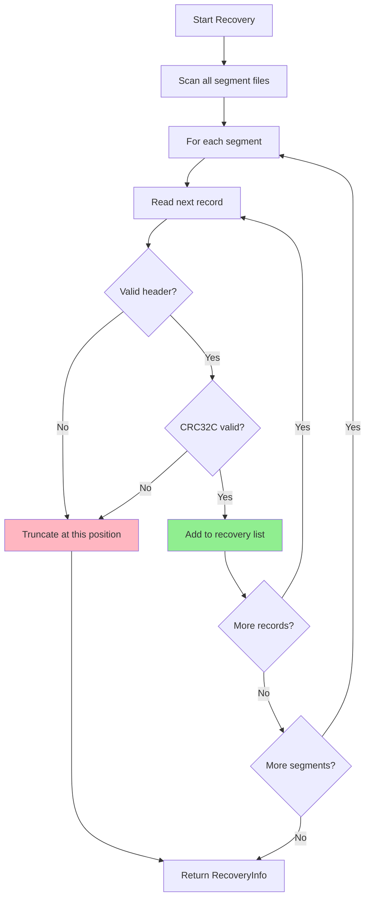

# Recovery Guarantees

What happens after a crash and what guarantees you can rely on.

## Table of contents

---

## The Recovery Promise

When your application crashes or the power goes out, nori-wal makes these guarantees:

> **All records that were successfully `sync()`'d are preserved.**
>
> **Partial writes are detected and truncated.**
>
> **The last committed version of each key is recoverable.**

This is called **prefix-valid recovery**: everything up to the point of corruption is valid.

---

## What Happens During a Crash

Let's walk through what happens when you crash mid-write.

### Scenario: Normal Write Sequence

```rust
// Write 5 records
for i in 1..=5 {
    let record = Record::put(format!("key:{}", i).as_bytes(), b"value");
    wal.append(&record).await?;
}

// Sync to disk
wal.sync().await?;  // All 5 records now durable

// Application continues...
```

**On disk after sync**:
```
Segment 000000.wal:
  [Record 1: key:1=value] Yes CRC valid
  [Record 2: key:2=value] Yes CRC valid
  [Record 3: key:3=value] Yes CRC valid
  [Record 4: key:4=value] Yes CRC valid
  [Record 5: key:5=value] Yes CRC valid
```

**After recovery**: All 5 records restored. 

---

### Scenario: Crash Before Sync

```rust
// Write 5 records
for i in 1..=5 {
    let record = Record::put(format!("key:{}", i).as_bytes(), b"value");
    wal.append(&record).await?;
}

// Crash here! (before sync)
std::process::abort();

// wal.sync().await?;  ← Never reached
```

**What's on disk?**

It depends on your `FsyncPolicy`:

**With `FsyncPolicy::Always`**:
```
[Record 1: key:1=value] Yes CRC valid (auto-synced)
[Record 2: key:2=value] Yes CRC valid (auto-synced)
[Record 3: key:3=value] Yes CRC valid (auto-synced)
[Record 4: key:4=value] Yes CRC valid (auto-synced)
[Record 5: key:5=value] Yes CRC valid (auto-synced)
```
**After recovery**: All 5 records restored. 

**With `FsyncPolicy::Batch(5ms)` or `FsyncPolicy::Os`**:
```
[Random garbage or empty space]
```
**After recovery**: 0 records restored. 

**Key insight**: Without `sync()`, you have no durability guarantee unless using `FsyncPolicy::Always`.

---

### Scenario: Crash Mid-Write

```rust
let record = Record::put(b"key:1", b"very long value...");
wal.append(&record).await?;

// Crash DURING the write!
// Maybe only half the record made it to disk
```

**On disk after crash**:
```
[Record header: CRC=0x12345678, length=100]
[Partial data: only 50 bytes written...]
[Garbage or zeros for remaining 50 bytes]
```

**During recovery**:
```rust
// nori-wal validates CRC
let computed_crc = crc32c::compute(&record_data);

if computed_crc != stored_crc {
    // CRC mismatch! Partial write detected.
    // Truncate everything from this point onward.
}
```

**After recovery**: Partial record discarded. 

---

### Scenario: Multiple Partial Writes

```rust
// Successfully write 3 records
wal.append(&record1).await?;
wal.append(&record2).await?;
wal.append(&record3).await?;
wal.sync().await?;  // These 3 are durable

// Write 2 more records
wal.append(&record4).await?;
wal.append(&record5).await?;

// Crash! Records 4 and 5 only partially written
```

**On disk**:
```
[Record 1] Yes CRC valid, synced
[Record 2] Yes CRC valid, synced
[Record 3] Yes CRC valid, synced
[Record 4] No CRC invalid (partial write)
[Record 5] No CRC invalid (partial write)
```

**During recovery**:
```
Scan record 1: CRC valid → Keep
Scan record 2: CRC valid → Keep
Scan record 3: CRC valid → Keep
Scan record 4: CRC INVALID → Truncate here
```

**After recovery**: Records 1-3 restored, records 4-5 discarded. 

---

## Recovery Algorithm

Here's how nori-wal recovers after a crash:



### Step-by-Step

1. **Scan all segment files** in the WAL directory
2. **For each segment**, read records sequentially
3. **Validate each record**:
   - Check header magic number
   - Verify CRC32C checksum
   - Ensure length is reasonable
4. **On first invalid record**:
   - Truncate the file at this position
   - Discard all data after this point
   - Stop scanning this segment
5. **Continue to next segment**
6. **Return recovery info** with counts and statistics

---

## RecoveryInfo Structure

When you open a WAL, you get back a `RecoveryInfo` struct:

```rust
let (wal, recovery_info) = Wal::open(config).await?;

println!("Recovered {} records", recovery_info.valid_records);
println!("Scanned {} segments", recovery_info.segments_scanned);
println!("Corruption detected: {}", recovery_info.corruption_detected);
println!("Bytes truncated: {}", recovery_info.bytes_truncated);
```

### Fields

| Field | Type | Meaning |
|-------|------|---------|
| `valid_records` | `u64` | Number of records successfully recovered |
| `segments_scanned` | `usize` | How many segment files were checked |
| `corruption_detected` | `bool` | Whether any corruption was found |
| `bytes_truncated` | `u64` | How much data was truncated due to corruption |

### Interpreting RecoveryInfo

**Example 1: Clean Recovery**
```rust
RecoveryInfo {
    valid_records: 10000,
    segments_scanned: 2,
    corruption_detected: false,
    bytes_truncated: 0,
}
```
**Meaning**: 10K records recovered cleanly from 2 segments. No corruption.

---

**Example 2: Partial Write Detected**
```rust
RecoveryInfo {
    valid_records: 9998,
    segments_scanned: 2,
    corruption_detected: true,
    bytes_truncated: 127,
}
```
**Meaning**: 9,998 records recovered, but 2 records (127 bytes) were truncated due to partial writes. This is normal if you crashed mid-write.

---

**Example 3: Empty WAL**
```rust
RecoveryInfo {
    valid_records: 0,
    segments_scanned: 0,
    corruption_detected: false,
    bytes_truncated: 0,
}
```
**Meaning**: New WAL, no existing data. Normal for first run.

---

## Recovery Guarantees by FsyncPolicy

Your recovery guarantees depend on your `FsyncPolicy`:

### FsyncPolicy::Always

```rust
let config = WalConfig {
    fsync_policy: FsyncPolicy::Always,
    ..Default::default()
};
```

**Guarantees**:
- Every `append()` is synced before returning
- If `append()` returns `Ok`, the record is durable
- Zero data loss on crash

**Example**:
```rust
wal.append(&record1).await?;  // Returns → record1 is durable
wal.append(&record2).await?;  // Returns → record2 is durable
// Crash here
```
**Recovery**: Both record1 and record2 are recovered. 

---

### FsyncPolicy::Batch(Duration)

```rust
let config = WalConfig {
    fsync_policy: FsyncPolicy::Batch(Duration::from_millis(5)),
    ..Default::default()
};
```

**Guarantees**:
- Records are synced within the time window
- Up to `window` worth of records may be lost on crash
- All records synced before the last fsync are durable

**Example**:
```rust
wal.append(&record1).await?;  // Triggers fsync
wal.append(&record2).await?;  // No fsync (within 5ms)
wal.append(&record3).await?;  // No fsync (within 5ms)
// Crash here
```
**Recovery**: Only record1 is guaranteed. Records 2-3 may be lost. 

---

### FsyncPolicy::Os

```rust
let config = WalConfig {
    fsync_policy: FsyncPolicy::Os,
    ..Default::default()
};
```

**Guarantees**:
- No durability guarantees!
- OS flushes to disk eventually (30-60 seconds)
- Data survives process crash (it's in OS cache)
- Data lost on power failure

**Example**:
```rust
for i in 1..=100 {
    wal.append(&record).await?;  // No fsync!
}
// Power failure here
```
**Recovery**: All 100 records likely lost. 

**But**:
```rust
for i in 1..=100 {
    wal.append(&record).await?;
}

// Manually sync
wal.sync().await?;

// Power failure here
```
**Recovery**: All 100 records recovered. 

---

## Common Recovery Scenarios

### Scenario 1: Clean Shutdown

```rust
// Write data
wal.append(&record1).await?;
wal.append(&record2).await?;
wal.sync().await?;

// Graceful shutdown
drop(wal);  // Implicitly syncs
```

**Recovery**: All records recovered. No corruption detected.

---

### Scenario 2: Ctrl-C Mid-Write

```bash
$ cargo run
Writing records...
^C  # User presses Ctrl-C
```

**What happens**:
- Signal handler (if any) triggers
- Rust drops the `Wal` struct
- `Drop` impl calls `sync()` (best effort)
- If signal is SIGKILL, no drop handlers run

**Recovery**:
- If drop handler ran: All synced records recovered
- If SIGKILL: Only records up to last explicit `sync()` recovered

**Lesson**: Don't rely on drop handlers for durability. Call `sync()` explicitly.

---

### Scenario 3: Power Failure

```rust
wal.append(&record1).await?;
wal.append(&record2).await?;

// Power fails here (no sync!)
```

**Recovery**:
- `FsyncPolicy::Always`: Both records recovered 
- `FsyncPolicy::Batch`: Maybe both, maybe neither 
- `FsyncPolicy::Os`: Both likely lost 

---

### Scenario 4: Disk Full

```rust
let record = Record::put(b"key", &[0u8; 1_000_000_000]);  // 1GB record

match wal.append(&record).await {
    Ok(_) => println!("Success"),
    Err(e) => {
        // Error: No space left on device
        println!("Disk full: {}", e);
    }
}
```

**With preallocation (default)**:
- Error happens when **creating a new segment**
- Existing segment writes succeed until segment is full
- No data corruption

**Without preallocation**:
- Error happens during **write**
- Partial record may be written
- Recovery truncates the partial record

**Lesson**: Preallocation provides early error detection.

---

### Scenario 5: Filesystem Corruption

Rare, but possible: the filesystem itself is corrupted (bad sectors, firmware bug, etc.).

**nori-wal behavior**:
- Scans all segments
- CRC validation detects corrupted records
- Truncates at first corrupted record
- Returns `corruption_detected: true`

**What you should do**:
```rust
let (wal, recovery_info) = Wal::open(config).await?;

if recovery_info.corruption_detected {
    log::warn!(
        "WAL corruption detected! {} bytes truncated",
        recovery_info.bytes_truncated
    );

    // Alert ops team, check filesystem health
    alert_ops_team("WAL corruption detected");
}
```

---

## Replaying the WAL

After recovery, you typically **replay** the WAL to reconstruct your in-memory state:

```rust
use std::collections::HashMap;

async fn replay_wal(wal: &Wal) -> Result<HashMap<Vec<u8>, Vec<u8>>> {
    let mut state = HashMap::new();
    let mut reader = wal.read_from(Position { segment_id: 0, offset: 0 }).await?;

    while let Some((record, position)) = reader.next_record().await? {
        if record.tombstone {
            // Delete
            state.remove(&record.key);
        } else {
            // Put (shadows any previous value)
            state.insert(record.key.clone(), record.value.clone());
        }

        log::debug!("Replayed record at {:?}: {:?}", position, record.key);
    }

    Ok(state)
}
```

**Key points**:
1. Replay in order (append-only guarantees this)
2. Later records shadow earlier ones (last write wins)
3. Tombstones delete keys from state

---

## Advanced: Idempotent Replay

If you replay the same WAL multiple times, you should get the same result. This is called **idempotent replay**.

nori-wal guarantees idempotent replay because:
- Records are immutable
- Append-only ordering is deterministic
- Last write wins

**Example**:
```rust
// First replay
let state1 = replay_wal(&wal).await?;

// Replay again (for testing or debugging)
let state2 = replay_wal(&wal).await?;

assert_eq!(state1, state2);  // Always passes
```

This is crucial for:
- **Testing**: Verify replay logic
- **Debugging**: Re-run replay to diagnose issues
- **Replication**: Followers replay leader's log and converge to same state

---

## Recovery Performance

How long does recovery take?

**It depends on**:
1. **Number of segments**: More segments → longer scan
2. **Segment size**: Larger segments → more data to read
3. **Disk speed**: SSD vs HDD makes a big difference
4. **Corruption location**: If corruption is at the end, scan is fast

**Typical performance**:

| Scenario | Recovery Time |
|----------|---------------|
| 1 segment (128MB), no corruption | ~100ms (SSD) |
| 10 segments (1.28GB), no corruption | ~1s (SSD) |
| 100 segments (12.8GB), no corruption | ~10s (SSD) |
| 1 segment (128MB), corruption at end | ~100ms (SSD) |
| 1 segment (128MB), corruption at start | ~1ms (SSD) |

**Optimization**: Delete old segments after compaction to reduce recovery time.

---

## Testing Recovery

You should test your recovery logic! Here's how:

### Test 1: Crash Mid-Write

```rust
#[tokio::test]
async fn test_crash_recovery() {
    let dir = tempfile::tempdir().unwrap();
    let config = WalConfig {
        dir: dir.path().to_path_buf(),
        ..Default::default()
    };

    // Write some records
    {
        let (wal, _) = Wal::open(config.clone()).await.unwrap();
        wal.append(&Record::put(b"key1", b"value1")).await.unwrap();
        wal.append(&Record::put(b"key2", b"value2")).await.unwrap();
        wal.sync().await.unwrap();

        // Simulate crash: drop WAL without syncing
        wal.append(&Record::put(b"key3", b"value3")).await.unwrap();
        // Drop here (no sync)
    }

    // Reopen and verify recovery
    let (wal, recovery_info) = Wal::open(config).await.unwrap();
    assert_eq!(recovery_info.valid_records, 2);  // key1, key2

    let state = replay_wal(&wal).await.unwrap();
    assert_eq!(state.get(b"key1".as_slice()), Some(&b"value1".to_vec()));
    assert_eq!(state.get(b"key2".as_slice()), Some(&b"value2".to_vec()));
    assert_eq!(state.get(b"key3".as_slice()), None);  // Lost!
}
```

---

### Test 2: Corrupted Data

```rust
#[tokio::test]
async fn test_corruption_recovery() {
    let dir = tempfile::tempdir().unwrap();
    let config = WalConfig {
        dir: dir.path().to_path_buf(),
        ..Default::default()
    };

    // Write and sync
    {
        let (wal, _) = Wal::open(config.clone()).await.unwrap();
        wal.append(&Record::put(b"key1", b"value1")).await.unwrap();
        wal.sync().await.unwrap();
    }

    // Corrupt the segment file
    let segment_path = dir.path().join("000000.wal");
    let mut file = std::fs::OpenOptions::new()
        .write(true)
        .open(&segment_path)
        .unwrap();
    file.seek(std::io::SeekFrom::Start(20)).unwrap();
    file.write_all(b"CORRUPT DATA").unwrap();

    // Reopen and verify truncation
    let (wal, recovery_info) = Wal::open(config).await.unwrap();
    assert!(recovery_info.corruption_detected);
    assert!(recovery_info.bytes_truncated > 0);
}
```

---

## Key Takeaways

1. **nori-wal uses prefix-valid recovery**
   - All valid records up to the first corruption are preserved
   - Partial writes are detected via CRC32C and truncated

2. **Recovery guarantees depend on FsyncPolicy**
   - `Always`: Every record is durable after `append()` returns
   - `Batch`: Records are durable within the time window
   - `Os`: No guarantees; manual `sync()` required

3. **RecoveryInfo tells you what happened**
   - Check `corruption_detected` and `bytes_truncated`
   - Log warnings if corruption is detected

4. **Replay the WAL to reconstruct state**
   - Scan records in order
   - Last write wins for each key
   - Tombstones delete keys

5. **Test your recovery logic**
   - Simulate crashes and corrupted data
   - Verify your state is correctly reconstructed

---

## What's Next?

Now that you understand recovery, explore:

- **[When to Use a WAL](when-to-use.md)** - Scenarios where WALs shine
- **[How Recovery Works Internally](../how-it-works/recovery.md)** - Deep dive into the algorithm
- **[Recipes: Crash Testing](../recipes/crash-testing.md)** - Property-based testing for recovery

Or jump to [Performance Tuning](../performance/tuning.md) to optimize your WAL.
