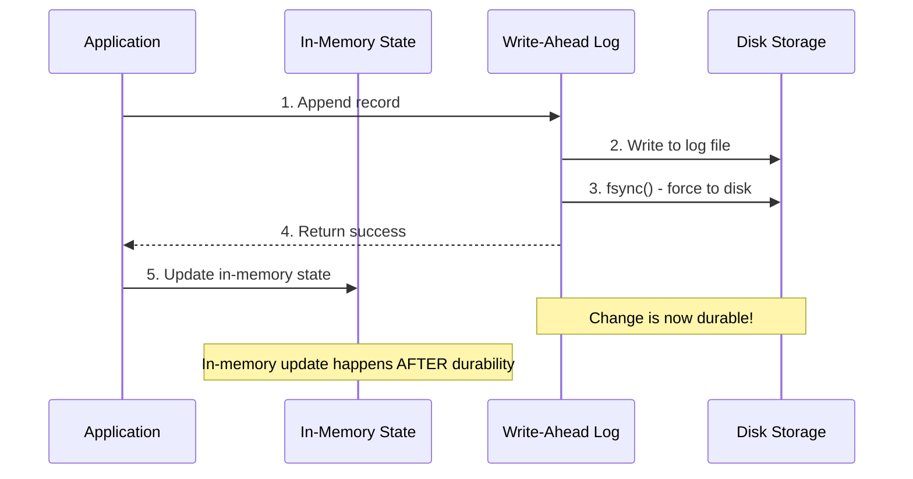

# What is a Write-Ahead Log?

The fundamental concept behind WALs, why they exist, and how they power modern systems.

## Table of contents

---

## The Core Idea

A **write-ahead log** (WAL) is a simple but powerful concept:

> **Write changes to a durable log *before* modifying your main data structures.**

That's it. That's the entire concept.

But this simple idea solves one of the hardest problems in computing: **making changes durable without sacrificing performance**.

---

## Why WALs Exist

Imagine you're building a database. You have a nice in-memory data structure (maybe a B-tree or hash table) that's blazingly fast. But there's a problem:

**What happens when the power goes out?**

Your in-memory structure is gone. All data lost.

### The Naive Solution: Sync After Every Change

```rust
// Don't do this!
fn set(key: &str, value: &str) {
    data_structure.insert(key, value);

    // Write the ENTIRE data structure to disk
    write_entire_tree_to_disk(&data_structure);
    fsync();  // Force to physical disk
}
```

**Problems:**
- Slow: Writing a 10GB B-tree to disk for a 10-byte update is absurd
- Complex: How do you write a tree to disk atomically? What if you crash mid-write?
- Fragmented: Random updates → random disk writes → terrible performance

### The Better Solution: Write-Ahead Logging

```rust
// Much better!
fn set(key: &str, value: &str) {
    // 1. Append change to log (sequential, fast)
    wal.append(Record::put(key, value));
    wal.sync();  // Just sync the log (cheap!)

    // 2. Update in-memory structure (fast)
    data_structure.insert(key, value);

    // Done! If we crash, we can replay the log to rebuild the data structure.
}
```

**Benefits:**
- **Fast**: Appending to a log is sequential I/O (the fastest kind)
- **Simple**: No complex tree serialization
- **Durable**: After `sync()`, the change is on disk, guaranteed
- **Recoverable**: Replay the log after a crash to rebuild state

This is the insight that powers virtually every database you've ever used.

---

## Historical Context

The write-ahead log is one of the oldest ideas in database systems. It dates back to the 1970s when researchers were figuring out how to make databases reliable.

### Key Milestones

**1976** - IBM System R introduces WAL for ARIES (Algorithm for Recovery and Isolation Exploiting Semantics)
- First formal recovery algorithm using WAL
- Still the foundation for many modern databases

**1980s** - WAL becomes standard in ACID databases
- PostgreSQL, Oracle, DB2 all adopt WAL-based recovery
- "Write-ahead" becomes a fundamental durability guarantee

**1990s-2000s** - WAL spreads beyond traditional databases
- Journaling filesystems (ext3, NTFS) use WAL concepts
- Message queues (Kafka) built entirely on logs

**2010s-Present** - "Log is the database"
- Event sourcing: the log *is* the primary data structure
- Distributed consensus (Raft, Multi-Paxos) built on replicated logs
- Modern KV stores (RocksDB, LevelDB) use WAL + LSM trees

---

## How WALs Work (High Level)

Here's the lifecycle of a write in a WAL-based system:



### The Key Invariant

At all times, one of these is true:

1. **Change is in the log on disk** → Can recover it
2. **Change hasn't been acknowledged to the user** → User will retry

This is how WALs provide **durability** while keeping writes fast.

---

## WAL in Different Systems

The WAL pattern appears everywhere, but with different flavors:

### Traditional Databases (PostgreSQL, MySQL)

```
[WAL Segment 1] [WAL Segment 2] [WAL Segment 3]
      ↓
On checkpoint: Flush pages to main database files
After flush: Delete old WAL segments
```

**Purpose**: Recover in-memory page cache after crash

**Key operations**:
- `INSERT/UPDATE/DELETE` → Write to WAL first, then modify pages
- Crash → Replay WAL to reconstruct page cache
- Checkpoint → Flush dirty pages, truncate old WAL

---

### Log-Structured Storage (RocksDB, Cassandra, nori-wal)

```
[WAL] → [Memtable] → flush → [SSTable L0]
                              [SSTable L1]
                              [SSTable L2]
```

**Purpose**: Durability for in-memory write buffer (memtable)

**Key operations**:
- Write → Append to WAL + insert to memtable
- Memtable full → Flush to SSTable on disk
- Crash → Replay WAL to reconstruct memtable

---

### Message Queues (Kafka)

```
[Log Segment 0] [Log Segment 1] [Log Segment 2] ...
     ↓               ↓               ↓
Consumers read from offsets (positions in log)
```

**Purpose**: The log *is* the primary data structure

**Key operations**:
- Produce → Append to log
- Consume → Read from offset, advance offset
- Retention → Delete old segments after time/size threshold

---

### Distributed Consensus (Raft, Multi-Paxos)

```
Leader: [Entry 1] [Entry 2] [Entry 3] [Entry 4]
          ✓         ✓         ✓        (uncommitted)

Replicate entries to followers →
When majority has entry → Commit it
```

**Purpose**: Replicate state machine transitions

**Key operations**:
- Command → Leader appends to log
- Replicate → Send to followers
- Commit → When majority has it
- Apply → Execute against state machine

---

## The "Write-Ahead" Guarantee

The term "write-ahead" is crucial. It means:

> **The log must be written to durable storage BEFORE acknowledging the operation.**

### Example: Bank Transfer

```rust
// CORRECT: Write-ahead
async fn transfer(from: u64, to: u64, amount: u64) -> Result<()> {
    // 1. Log the operation FIRST
    let record = Record::put(
        b"transfer",
        format!("{}→{}: ${}", from, to, amount).as_bytes()
    );
    wal.append(&record).await?;
    wal.sync().await?;  // CRITICAL: Must sync before continuing!

    // 2. Now update in-memory balances
    balances.get_mut(&from).unwrap() -= amount;
    balances.get_mut(&to).unwrap() += amount;

    // 3. Acknowledge to user
    Ok(())
}
```

If we crash after step 1 (log sync) but before step 2 (in-memory update), **that's fine!** We can replay the log on recovery and redo the transfer.

### Violation: Write-Behind (WRONG)

```rust
// WRONG: Write-behind (don't do this!)
async fn transfer_wrong(from: u64, to: u64, amount: u64) -> Result<()> {
    // 1. Update in-memory first
    balances.get_mut(&from).unwrap() -= amount;
    balances.get_mut(&to).unwrap() += amount;

    // 2. Acknowledge to user
    println!("Transfer complete!");

    // 3. Log it later (WRONG!)
    wal.append(&record).await?;

    // If we crash here, the transfer is LOST!
    // But we already told the user it succeeded!
}
```

**Never do this.** Always write to the log before acknowledging success.

---

## What WALs Are NOT

It's helpful to clarify what WALs are *not*:

### NOT a Replacement for Your Main Data Structure

The WAL is not where you read from during normal operation. It's a recovery mechanism.

```rust
// BAD: Scanning the entire WAL to find a key
async fn get_bad(key: &[u8]) -> Option<Vec<u8>> {
    let mut reader = wal.read_from(Position::start()).await?;
    let mut latest = None;

    // This is O(log size) - terrible!
    while let Some((record, _)) = reader.next_record().await? {
        if record.key == key {
            latest = Some(record.value);
        }
    }

    latest
}
```

```rust
// GOOD: Use an index (memtable, SSTable, B-tree, etc.)
async fn get_good(key: &[u8]) -> Option<Vec<u8>> {
    // O(log n) or O(1) lookup
    memtable.get(key).or_else(|| sstables.get(key))
}
```

**Use the WAL for**:
- Durability
- Recovery
- Replication

**Don't use the WAL for**:
- Point reads
- Range queries
- Indexes

---

### NOT Always the Fastest Storage

For some workloads, a WAL might be slower than direct writes:

**WAL is fast when:**
- Sequential writes (appending)
- Small writes (kilobytes)
- Need durability guarantees

**WAL might be slower when:**
- Need random reads (use an index)
- Large batch writes (direct file write might be faster)
- Don't care about durability (can skip fsync)

---

### NOT a Silver Bullet

WALs solve durability, but they don't solve:

- **Concurrency control** (you need locks, MVCC, or STM)
- **Query optimization** (you need indexes)
- **Distributed consensus** (you need Raft/Paxos on top of WAL)
- **Schema migrations** (you need application-level logic)

A WAL is one tool in your toolbox, not a complete database.

---

## Why nori-wal Exists

There are many WAL implementations out there. Why build another one?

### Existing Options

**RocksDB WAL**: Great, but tightly coupled to RocksDB. Can't use it standalone.

**Kafka**: Designed for message queues, not general-purpose storage.

**PostgreSQL WAL**: Internal to PostgreSQL, not reusable.

**Custom implementation**: Most projects roll their own, often poorly.

### What nori-wal Provides

**Standalone**: Use it in any Rust project, no dependencies on a larger system

**Production-ready**: Comprehensive error handling, recovery, observability

**Flexible**: Choose your durability vs. performance trade-off (fsync policies)

**Well-documented**: You're reading it!

**Tested**: 37 tests including property tests for crash scenarios

**Fast**: 110K writes/sec with batched fsync (see [benchmarks](../performance/benchmarks))

---

## Real-World Use Cases

Here's where you'd actually use a WAL:

### 1. Building a Key-Value Store

```rust
struct KvStore {
    memtable: BTreeMap<Vec<u8>, Vec<u8>>,
    wal: Wal,
}

impl KvStore {
    async fn put(&mut self, key: &[u8], value: &[u8]) -> Result<()> {
        // Write-ahead: log first
        let record = Record::put(key, value);
        self.wal.append(&record).await?;
        self.wal.sync().await?;

        // Then update memtable
        self.memtable.insert(key.to_vec(), value.to_vec());

        Ok(())
    }

    async fn recover(&mut self) -> Result<()> {
        // Replay WAL to reconstruct memtable
        let mut reader = self.wal.read_from(Position::start()).await?;
        while let Some((record, _)) = reader.next_record().await? {
            if record.tombstone {
                self.memtable.remove(&record.key);
            } else {
                self.memtable.insert(record.key, record.value);
            }
        }
        Ok(())
    }
}
```

See [Recipes: Key-Value Store](../recipes/key-value-store) for a complete example.

---

### 2. Event Sourcing

```rust
struct EventStore {
    wal: Wal,
}

impl EventStore {
    async fn append_event(&self, event: &Event) -> Result<Position> {
        let record = Record::put(
            event.aggregate_id.as_bytes(),
            serde_json::to_vec(event)?
        );
        let pos = self.wal.append(&record).await?;
        Ok(pos)
    }

    async fn replay(&self, aggregate_id: &str) -> Result<Vec<Event>> {
        let mut events = vec![];
        let mut reader = self.wal.read_from(Position::start()).await?;

        while let Some((record, _)) = reader.next_record().await? {
            if record.key == aggregate_id.as_bytes() {
                let event: Event = serde_json::from_slice(&record.value)?;
                events.push(event);
            }
        }

        Ok(events)
    }
}
```

See [Recipes: Event Sourcing](../recipes/event-sourcing) for details.

---

### 3. Replication

```rust
struct ReplicatedLog {
    wal: Wal,
}

impl ReplicatedLog {
    async fn replicate_to_follower(&self, follower: &mut TcpStream) -> Result<()> {
        let mut reader = self.wal.read_from(Position::start()).await?;

        // Stream entire log to follower
        while let Some((record, position)) = reader.next_record().await? {
            follower.write_all(&serialize(&record)?).await?;
        }

        Ok(())
    }
}
```

This is how Raft and other consensus protocols work under the hood!

---

## Key Takeaways

Before moving on, make sure you understand these core points:

1. **WALs provide durability without sacrificing write performance**
   - Sequential appends are fast
   - Only need to sync the log, not the entire data structure

2. **Write-ahead means log BEFORE acknowledgment**
   - Never acknowledge success until the log is synced
   - If you crash after logging, you can recover

3. **The log is not your primary data structure**
   - Use it for recovery, not for reads
   - Build indexes (memtables, B-trees, hash tables) for queries

4. **WALs are everywhere**
   - Databases, filesystems, message queues, consensus protocols
   - Understanding WALs helps you understand modern distributed systems

5. **nori-wal is a production-ready, standalone WAL implementation**
   - Use it to add durability to your Rust projects
   - Flexible, tested, documented

---

## What's Next?

Now that you understand *what* a WAL is, let's explore the key design decisions:

- **[Append-Only Architecture](append-only)** - Why WALs are append-only and what that means
- **[Fsync Policies](fsync-policies)** - How to balance durability and performance
- **[Recovery Guarantees](recovery-guarantees)** - What happens after a crash
- **[When to Use a WAL](when-to-use)** - Scenarios where WALs shine

Or jump ahead to see how nori-wal works internally in [How It Works](../how-it-works/).
