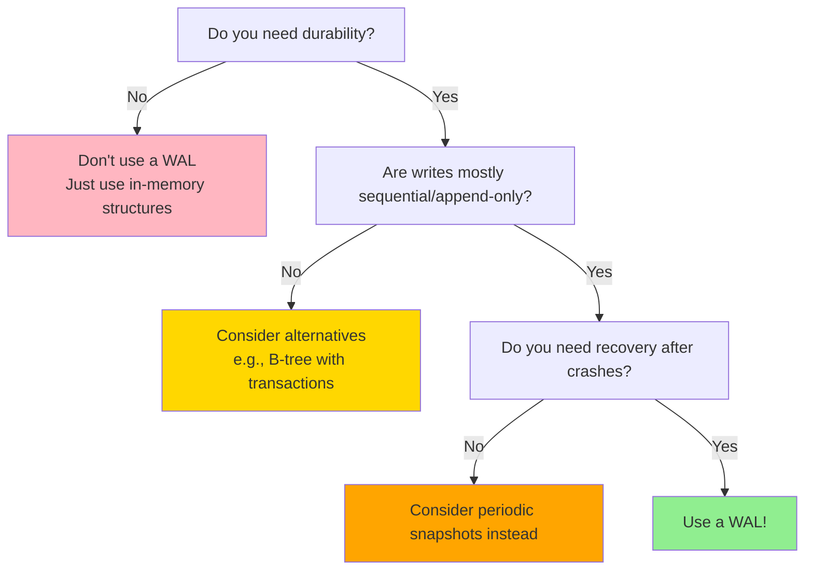

# When to Use a WAL

Scenarios where WALs shine and where they don't.

## Table of contents

---

## The Decision Framework

Use a WAL when you need **both** durability **and** performance for sequential writes.



---

## Perfect Use Cases

### 1. Building a Key-Value Store

**Why WAL?**
- Need durability for writes
- Writes are append-only
- Recovery after crash is critical

**Example**: LevelDB, RocksDB, nori-lsm

```rust
struct KvStore {
    memtable: BTreeMap<Vec<u8>, Vec<u8>>,
    wal: Wal,
}

impl KvStore {
    async fn put(&mut self, key: &[u8], value: &[u8]) -> Result<()> {
        // Write to WAL first (durability)
        let record = Record::put(key, value);
        self.wal.append(&record).await?;
        self.wal.sync().await?;

        // Then update memtable (performance)
        self.memtable.insert(key.to_vec(), value.to_vec());
        Ok(())
    }

    async fn recover(&mut self) -> Result<()> {
        // Replay WAL to rebuild memtable
        let mut reader = self.wal.read_from(Position::start()).await?;
        while let Some((record, _)) = reader.next_record().await? {
            if record.tombstone {
                self.memtable.remove(&record.key);
            } else {
                self.memtable.insert(record.key, record.value);
            }
        }
        Ok(())
    }
}
```

**Benefits**:
- Fast writes (sequential I/O to WAL)
- Fast reads (from in-memory memtable)
- Durable (WAL survives crashes)
- Simple recovery (replay WAL)

See [Recipes: Key-Value Store](../recipes/key-value-store.md) for a complete implementation.

---

### 2. Event Sourcing

**Why WAL?**
- Events are append-only by definition
- Need to replay events to reconstruct state
- Durability is critical (events are source of truth)

**Example**: Order processing system

```rust
struct OrderService {
    events: Wal,
}

#[derive(Serialize, Deserialize)]
enum OrderEvent {
    Created { order_id: u64, customer: String },
    ItemAdded { order_id: u64, item: String, price: u64 },
    Submitted { order_id: u64 },
    Paid { order_id: u64, amount: u64 },
}

impl OrderService {
    async fn create_order(&self, customer: &str) -> Result<u64> {
        let order_id = generate_id();
        let event = OrderEvent::Created {
            order_id,
            customer: customer.to_string(),
        };

        // Append event to WAL
        let record = Record::put(
            order_id.to_string().as_bytes(),
            serde_json::to_vec(&event)?
        );
        self.events.append(&record).await?;
        self.events.sync().await?;

        Ok(order_id)
    }

    async fn replay_order(&self, order_id: u64) -> Result<Order> {
        let mut order = Order::default();
        let mut reader = self.events.read_from(Position::start()).await?;

        while let Some((record, _)) = reader.next_record().await? {
            if record.key == order_id.to_string().as_bytes() {
                let event: OrderEvent = serde_json::from_slice(&record.value)?;
                order.apply(event);  // Rebuild state from events
            }
        }

        Ok(order)
    }
}
```

**Benefits**:
- Complete audit trail (all events preserved)
- Time-travel debugging (replay to any point)
- Easy to add new projections (replay events differently)

See [Recipes: Event Sourcing](../recipes/event-sourcing.md) for details.

---

### 3. Message Queue / Job Queue

**Why WAL?**
- Messages/jobs are append-only
- Need durability (can't lose jobs)
- Consumers read sequentially

**Example**: Kafka-like message log

```rust
struct MessageQueue {
    log: Wal,
}

impl MessageQueue {
    async fn publish(&self, topic: &str, message: &[u8]) -> Result<Position> {
        let record = Record::put(topic.as_bytes(), message);
        let position = self.log.append(&record).await?;
        self.log.sync().await?;
        Ok(position)
    }

    async fn consume_from(&self, position: Position) -> Result<Vec<Message>> {
        let mut messages = vec![];
        let mut reader = self.log.read_from(position).await?;

        while let Some((record, pos)) = reader.next_record().await? {
            messages.push(Message {
                topic: String::from_utf8_lossy(&record.key).to_string(),
                data: record.value,
                position: pos,
            });
        }

        Ok(messages)
    }
}
```

**Benefits**:
- Durable message delivery
- Consumers can replay from any position
- High write throughput (append-only)

---

### 4. Database Transaction Log

**Why WAL?**
- Redo log for ARIES-style recovery
- Guarantees atomicity and durability (the AD in ACID)
- Standard in all major databases

**Example**: PostgreSQL, MySQL, SQLite

```rust
struct Database {
    pages: HashMap<PageId, Page>,
    wal: Wal,
}

impl Database {
    async fn begin_transaction(&mut self) -> Transaction {
        Transaction {
            wal_start: self.wal.current_position(),
            changes: vec![],
        }
    }

    async fn commit(&mut self, tx: Transaction) -> Result<()> {
        // Write all changes to WAL
        for change in &tx.changes {
            let record = Record::put(
                change.page_id.to_bytes(),
                change.new_data.clone()
            );
            self.wal.append(&record).await?;
        }

        // Commit record
        let commit_record = Record::put(b"COMMIT", tx.id.to_bytes());
        self.wal.append(&commit_record).await?;
        self.wal.sync().await?;  // Force to disk

        // Now apply changes to in-memory pages
        for change in &tx.changes {
            self.pages.insert(change.page_id, change.new_data.clone());
        }

        Ok(())
    }
}
```

**Benefits**:
- Atomic commits (all or nothing)
- Crash recovery via redo log
- Write-ahead guarantee

---

### 5. Distributed Consensus (Raft/Paxos)

**Why WAL?**
- Consensus protocols are fundamentally about replicating a log
- Leader appends entries, followers replicate them
- Log is the source of truth

**Example**: Raft log

```rust
struct RaftLog {
    entries: Wal,
}

impl RaftLog {
    async fn append_entry(&self, term: u64, command: &[u8]) -> Result<LogIndex> {
        let entry = LogEntry {
            term,
            index: self.last_index() + 1,
            command: command.to_vec(),
        };

        let record = Record::put(
            entry.index.to_bytes(),
            bincode::serialize(&entry)?
        );

        let position = self.entries.append(&record).await?;
        self.entries.sync().await?;

        Ok(entry.index)
    }

    async fn replicate_to(&self, follower: &mut Connection, from: LogIndex) -> Result<()> {
        let mut reader = self.entries.read_from(Position::from_index(from)).await?;

        while let Some((record, _)) = reader.next_record().await? {
            follower.send_entry(record).await?;
        }

        Ok(())
    }
}
```

**Benefits**:
- Durable log for consensus
- Sequential replication (leader → followers)
- Idempotent replay (followers converge to same state)

---

## Good Use Cases (with caveats)

### 6. Session Store

**Why WAL?**
- Sessions need some durability
- Append-only writes for session updates

**Caveat**: Session data is ephemeral. Use `FsyncPolicy::Batch` or `Os` for better performance.

```rust
let config = WalConfig {
    fsync_policy: FsyncPolicy::Batch(Duration::from_millis(10)),  // 10ms data loss OK
    ..Default::default()
};

let (wal, _) = Wal::open(config).await?;

// Fast session updates
wal.append(&Record::put(session_id, session_data)).await?;
// No explicit sync - batch policy handles it
```

---

### 7. Cache with Persistence

**Why WAL?**
- Want cache to survive restarts
- But don't need strict durability (it's a cache!)

**Caveat**: Use `FsyncPolicy::Os` and periodic snapshots.

```rust
let config = WalConfig {
    fsync_policy: FsyncPolicy::Os,  // Max performance
    ..Default::default()
};

let (wal, _) = Wal::open(config).await?;

// High-throughput cache writes
for (key, value) in cache_entries {
    wal.append(&Record::put(key, value)).await?;
}

// Periodically compact
tokio::spawn(async move {
    loop {
        tokio::time::sleep(Duration::from_secs(3600)).await;
        snapshot_and_compact(&wal).await;
    }
});
```

---

### 8. Metrics/Analytics

**Why WAL?**
- High write throughput for events
- Append-only

**Caveat**: Data loss is acceptable, so use `FsyncPolicy::Os`.

```rust
struct MetricsLog {
    wal: Wal,  // FsyncPolicy::Os
}

impl MetricsLog {
    async fn record_metric(&self, metric: &Metric) -> Result<()> {
        let record = Record::put(
            metric.name.as_bytes(),
            serde_json::to_vec(metric)?
        );
        self.wal.append(&record).await?;
        // No sync - let OS handle it
        Ok(())
    }

    async fn batch_insert(&self, metrics: &[Metric]) -> Result<()> {
        for metric in metrics {
            self.record_metric(metric).await?;
        }
        // Optional: sync after batch
        self.wal.sync().await?;
        Ok(())
    }
}
```

---

## Not Recommended Use Cases

### Random Access Workloads

**Why not?**
- WALs are optimized for sequential writes and reads
- Random access requires scanning the entire log (slow)

**Example**: Updating random records in a large dataset

```rust
// BAD: Random access in WAL
async fn update_user_bad(user_id: u64, field: &str, value: &[u8]) -> Result<()> {
    // Have to scan entire WAL to find user
    let mut reader = wal.read_from(Position::start()).await?;
    let mut found = false;

    while let Some((record, _)) = reader.next_record().await? {
        if record.key == user_id.to_bytes() {
            found = true;
            break;
        }
    }

    // Then append update (this part is fine)
    wal.append(&Record::put(user_id.to_bytes(), value)).await?;

    Ok(())
}
```

**Better alternative**: Use a B-tree or hash table for random access, backed by WAL for durability.

```rust
// GOOD: B-tree for random access, WAL for durability
struct Database {
    index: BTreeMap<u64, Vec<u8>>,
    wal: Wal,
}

async fn update_user_good(&mut self, user_id: u64, value: &[u8]) -> Result<()> {
    // Fast lookup in B-tree
    self.index.insert(user_id, value.to_vec());

    // Durable append to WAL
    wal.append(&Record::put(user_id.to_bytes(), value)).await?;

    Ok(())
}
```

---

### Read-Heavy Workloads

**Why not?**
- WALs are write-optimized
- Reading requires scanning or replaying the log

**Example**: Analytics dashboard querying historical data

```rust
// BAD: Querying WAL directly
async fn get_user_events(user_id: u64) -> Result<Vec<Event>> {
    let mut events = vec![];
    let mut reader = wal.read_from(Position::start()).await?;

    // Scan entire log - O(n) where n = total records
    while let Some((record, _)) = reader.next_record().await? {
        if record.key == user_id.to_bytes() {
            events.push(deserialize(&record.value)?);
        }
    }

    Ok(events)
}
```

**Better alternative**: Build an index or materialized view from the WAL.

```rust
// GOOD: Index for fast queries
struct EventStore {
    wal: Wal,
    index: HashMap<u64, Vec<Event>>,  // User ID → Events
}

impl EventStore {
    async fn rebuild_index(&mut self) -> Result<()> {
        let mut reader = self.wal.read_from(Position::start()).await?;

        while let Some((record, _)) = reader.next_record().await? {
            let user_id = u64::from_bytes(&record.key);
            let event: Event = deserialize(&record.value)?;

            self.index.entry(user_id).or_default().push(event);
        }

        Ok(())
    }

    fn get_user_events(&self, user_id: u64) -> Option<&[Event]> {
        self.index.get(&user_id).map(|v| v.as_slice())  // O(1)
    }
}
```

---

### Large Binary Blobs

**Why not?**
- WALs are optimized for small records (bytes to kilobytes)
- Large blobs (megabytes) hurt performance and recovery

**Example**: Storing 100MB video files in WAL

```rust
// BAD: Large blobs in WAL
async fn store_video_bad(video_id: &str, data: &[u8]) -> Result<()> {
    // data is 100MB!
    let record = Record::put(video_id.as_bytes(), data);
    wal.append(&record).await?;  // Slow!
    wal.sync().await?;  // Very slow!
    Ok(())
}
```

**Problems**:
- Slow writes (100MB sequential write + fsync)
- Slow recovery (have to scan 100MB per record)
- Memory usage (entire record loaded during recovery)

**Better alternative**: Store blobs separately, reference them in WAL.

```rust
// GOOD: Store blob separately, reference in WAL
async fn store_video_good(video_id: &str, data: &[u8]) -> Result<()> {
    // 1. Write blob to object storage (S3, filesystem, etc.)
    let blob_path = format!("/blobs/{}.mp4", video_id);
    tokio::fs::write(&blob_path, data).await?;

    // 2. Store reference in WAL (small!)
    let metadata = VideoMetadata {
        id: video_id.to_string(),
        path: blob_path,
        size: data.len(),
    };
    let record = Record::put(
        video_id.as_bytes(),
        serde_json::to_vec(&metadata)?  // Only ~100 bytes
    );
    wal.append(&record).await?;

    Ok(())
}
```

---

### In-Place Updates Required

**Why not?**
- WALs are append-only
- Can't modify existing records

**Example**: Updating a single field in a large document

```rust
// BAD: Updating one field requires rewriting entire document
struct Document {
    id: u64,
    title: String,
    body: String,  // 10KB
    metadata: HashMap<String, String>,
}

async fn update_title_bad(doc_id: u64, new_title: &str) -> Result<()> {
    // 1. Read entire document from WAL (slow)
    let mut doc = read_document_from_wal(doc_id).await?;

    // 2. Update one field
    doc.title = new_title.to_string();

    // 3. Rewrite entire document (slow, wastes space)
    let record = Record::put(doc_id.to_bytes(), serialize(&doc)?);
    wal.append(&record).await?;

    Ok(())
}
```

**Better alternative**: Use a database with in-place updates (B-tree), or decompose document into smaller records.

---

## When to Use Alternatives

| Use Case | Alternative | Why? |
|----------|-------------|------|
| Random reads/writes | **SQLite, PostgreSQL** | Optimized B-tree indexes |
| Large binary blobs | **S3, Object Storage** | Designed for large objects |
| In-memory cache (no durability) | **Redis (in-memory mode)** | No disk overhead |
| Complex queries | **PostgreSQL, MySQL** | Full SQL support |
| Graph traversals | **Neo4j, Graph DB** | Optimized for relationships |
| Full-text search | **Elasticsearch, Meilisearch** | Inverted indexes |

---

## Hybrid Approaches

Often, the best solution combines a WAL with other structures:

### WAL + Memtable + SSTables (LSM-Tree)

This is what LevelDB, RocksDB, and nori-lsm do:

```
Writes → WAL (durability) + Memtable (fast writes)
         ↓
      Memtable full
         ↓
      Flush to SSTable (sorted, immutable)
         ↓
      Compact SSTables (merge, remove old versions)
```

**Benefits**:
- Fast writes (WAL + in-memory memtable)
- Fast reads (in-memory memtable + sorted SSTables)
- Durable (WAL)
- Compact (SSTables deduplicate versions)

See [Recipes: LSM-Tree](../recipes/lsm-tree.md) for implementation.

---

### WAL + Snapshot

Periodically snapshot your state, then truncate the WAL:

```
Time 0: WAL is empty
Time 1: Append 1000 records to WAL
Time 2: Snapshot state to disk
Time 3: Truncate WAL (keep only records after snapshot)
```

**Benefits**:
- Fast recovery (load snapshot + replay small WAL)
- Bounded disk usage (old WAL segments deleted)

See [Recipes: Snapshotting](../recipes/snapshotting.md) for details.

---

### WAL + Replication

Replicate the WAL to followers for high availability:

```
Leader:   WAL [Entry 1][Entry 2][Entry 3]
           ↓       ↓       ↓
Follower: WAL [Entry 1][Entry 2][Entry 3]

If leader fails, follower takes over with complete log.
```

This is the foundation of Raft, Multi-Paxos, and other consensus protocols.

---

## Quick Decision Checklist

Use a WAL if you answer **Yes** to all:

- [ ] Do you need durability (survive crashes)?
- [ ] Are writes mostly sequential/append-only?
- [ ] Do you need recovery after crashes?
- [ ] Are records small to medium size (< 1MB)?
- [ ] Is write performance important?

Consider alternatives if you answer **Yes** to any:

- [ ] Do you need random reads/writes?
- [ ] Are records very large (> 10MB)?
- [ ] Is read performance more important than write performance?
- [ ] Do you need complex queries (joins, aggregations, full-text search)?

---

## Key Takeaways

1. **WALs excel at durable, sequential writes**
   - Key-value stores, event sourcing, message queues, databases

2. **WALs are not for random access**
   - Use B-trees or hash tables for random reads/writes

3. **WALs are not for large blobs**
   - Store blobs separately, reference them in the WAL

4. **Combine WAL with other structures for best results**
   - WAL + memtable + SSTables (LSM-tree)
   - WAL + snapshots (bounded recovery time)
   - WAL + replication (high availability)

5. **Choose the right FsyncPolicy for your use case**
   - Critical data → `Always`
   - Most apps → `Batch(1-10ms)`
   - Acceptable data loss → `Os`

---

## What's Next?

Now that you know when to use a WAL, dive deeper:

- **[How It Works](../how-it-works/index.md)** - Understand the internals
- **[Recipes](../recipes/index.md)** - Build real applications
- **[Performance Tuning](../performance/tuning.md)** - Optimize for your workload

Or start coding with the [Quickstart Guide](../getting-started/quickstart.md)!
