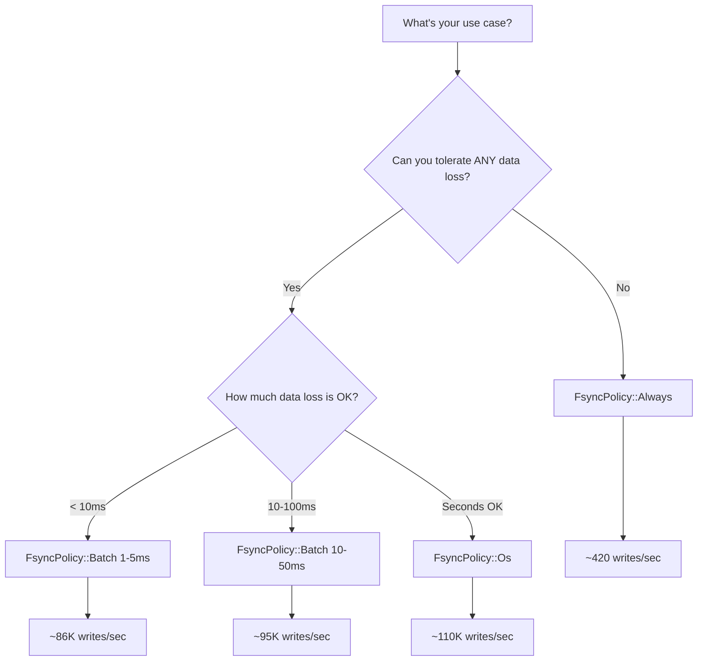

# Configuration Guide

Complete guide to configuring nori-wal for your workload.

## Table of contents

---

## WalConfig Overview

The `WalConfig` struct controls all aspects of WAL behavior:

```rust
use nori_wal::{WalConfig, FsyncPolicy};
use std::path::PathBuf;
use std::time::Duration;

let config = WalConfig {
    dir: PathBuf::from("/var/lib/myapp/wal"),
    max_segment_size: 256 * 1024 * 1024, // 256MB
    fsync_policy: FsyncPolicy::Batch(Duration::from_millis(10)),
    preallocate: true,
    node_id: 42,
};

let (wal, recovery_info) = Wal::open(config).await?;
```

---

## Configuration Fields

### `dir: PathBuf`

**Purpose:** Where to store WAL segment files

**Default:** `"wal"` (in current working directory)

**Recommendations:**
- Use an absolute path in production
- Make sure parent directory exists
- Consider using a dedicated disk/volume for I/O isolation
- Ensure sufficient disk space (at least `max_segment_size * 2`)

**Examples:**

```rust
// Development: relative path
dir: PathBuf::from("wal"),

// Production: absolute path
dir: PathBuf::from("/var/lib/myapp/wal"),

// Docker: mounted volume
dir: PathBuf::from("/data/wal"),

// Testing: temporary directory
dir: temp_dir.path().to_path_buf(),
```

---

### `max_segment_size: u64`

**Purpose:** Maximum size of a single segment file before rotation

**Default:** `134,217,728` bytes (128 MiB)

**Valid range:** 1 MiB to unlimited

**Trade-offs:**

| Size | Pros | Cons |
|------|------|------|
| **Small (1-32 MB)** | Faster rotation, smaller files | More segments to manage, higher overhead |
| **Medium (128 MB)** ⭐ | Good balance | Default, works for most cases |
| **Large (512 MB - 1 GB)** | Fewer segments | Slower rotation, larger files to manage |

**When to use small segments:**
- Frequent checkpointing/compaction
- Limited disk space
- Need quick garbage collection

**When to use large segments:**
- High write throughput
- Infrequent compaction
- Want to minimize segment rotation overhead

**Examples:**

```rust
// Small: 32MB (rotate frequently)
max_segment_size: 32 * 1024 * 1024,

// Default: 128MB (recommended)
max_segment_size: 128 * 1024 * 1024,

// Large: 512MB (high throughput)
max_segment_size: 512 * 1024 * 1024,
```

{: .warning }
Segments smaller than 1MB will be rejected with an `InvalidConfig` error. This prevents pathological behavior.

---

### `fsync_policy: FsyncPolicy`

**Purpose:** Controls when data is synced to disk (durability vs. performance)

**Default:** `FsyncPolicy::Batch(Duration::from_millis(5))`

**Options:**

#### `FsyncPolicy::Always`

Calls `fsync()` after every write.

**Durability:** ⭐⭐⭐⭐⭐ Maximum
**Performance:** ⭐ ~420 writes/sec
**Use when:** Critical data, financial transactions, strict ACID compliance

```rust
fsync_policy: FsyncPolicy::Always,
```

**Characteristics:**
- Every `append()` calls `fsync()`
- Data guaranteed on disk before returning
- Slowest, but most durable
- Disk-bound performance

---

#### `FsyncPolicy::Batch(Duration)`

Batches `fsync()` calls within a time window.

**Durability:** ⭐⭐⭐⭐ High
**Performance:** ⭐⭐⭐⭐ ~86K writes/sec
**Use when:** Most applications (recommended default)

```rust
// Fsync at most once every 5ms
fsync_policy: FsyncPolicy::Batch(Duration::from_millis(5)),

// More durable: fsync every 1ms
fsync_policy: FsyncPolicy::Batch(Duration::from_millis(1)),

// Higher throughput: fsync every 10ms
fsync_policy: FsyncPolicy::Batch(Duration::from_millis(10)),
```

**Characteristics:**
- First write triggers fsync
- Subsequent writes within window skip fsync
- Good balance of durability and performance
- Potential data loss: up to `window` duration of writes

{: .important }
With a 5ms window, you could lose up to 5ms worth of writes if you crash. For most applications, this is acceptable. Adjust based on your requirements.

---

#### `FsyncPolicy::Os`

Lets the operating system decide when to flush.

**Durability:** ⭐⭐ OS-dependent (typically 30-60 seconds)
**Performance:** ⭐⭐⭐⭐⭐ ~110K writes/sec
**Use when:** Event logs, metrics, caches, acceptable data loss

```rust
fsync_policy: FsyncPolicy::Os,
```

**Characteristics:**
- No explicit `fsync()` calls
- Relies on OS page cache
- Maximum throughput
- Potential data loss: 30-60 seconds of writes on crash

{: .warning }
**Never use `Os` policy for critical data!** On power failure or kernel panic, you could lose significant amounts of data.

---

#### Decision Matrix

Use this to pick the right policy:



---

### `preallocate: bool`

**Purpose:** Whether to pre-allocate segment files

**Default:** `true`

**When enabled:**
- New segments are pre-allocated to `max_segment_size` using platform-specific APIs
- Linux: Uses `fallocate()` syscall
- macOS: Uses `F_PREALLOCATE` fcntl
- Windows/Others: Uses `set_len()`

**Benefits:**
- **Early error detection**: Out-of-space errors happen at segment creation, not mid-write
- **Reduced fragmentation**: OS allocates contiguous disk space
- **Better performance**: Some filesystems optimize for pre-allocated files

**Drawbacks:**
- Small latency increase (~1-2ms) when creating segments
- Disk space shows as "used" even if not written (this is correct behavior)

**When to disable:**
- Testing (faster test runs)
- Environments with tight disk quotas
- When segment size >> actual usage

```rust
// Enable (recommended for production)
preallocate: true,

// Disable (testing, development)
preallocate: false,
```

---

### `node_id: u32`

**Purpose:** Identifier for observability events

**Default:** `0`

**Use when:**
- Running multiple WAL instances
- Distributed systems
- Want to correlate metrics/events to specific nodes

```rust
// Single instance
node_id: 0,

// Multi-node cluster
node_id: server_config.node_id,

// Per-shard WALs
node_id: shard_id as u32,
```

This field is included in all `VizEvent` emissions, allowing you to differentiate logs from multiple WAL instances in your metrics system.

---

## Configuration Validation

`WalConfig` is validated when you call `Wal::open()`. Invalid configurations return `SegmentError::InvalidConfig`:

```rust
// Too small!
let config = WalConfig {
    max_segment_size: 512,  // Less than 1MB
    ..Default::default()
};

match Wal::open(config).await {
    Err(SegmentError::InvalidConfig(msg)) => {
        println!("Config error: {}", msg);
        // "max_segment_size should be at least 1MB..."
    }
    _ => unreachable!(),
}
```

**Validation rules:**

| Rule | Check |
|------|-------|
| `max_segment_size > 0` | Must be non-zero |
| `max_segment_size >= 1 MiB` | Must be at least 1MB |
| Batch window < 1 second | Batch fsync window must be reasonable |
| Batch window > 0 | Batch fsync window cannot be zero |

---

## Common Configuration Patterns

### High-Throughput Event Logging

```rust
let config = WalConfig {
    dir: PathBuf::from("/fast-ssd/events"),
    max_segment_size: 512 * 1024 * 1024,  // 512MB
    fsync_policy: FsyncPolicy::Os,         // Max throughput
    preallocate: true,
    node_id: 0,
};
```

**Characteristics:**
- Large segments reduce rotation overhead
- OS fsync for maximum throughput
- Accept 30-60s data loss on crash

---

### Financial Transactions

```rust
let config = WalConfig {
    dir: PathBuf::from("/reliable-disk/transactions"),
    max_segment_size: 128 * 1024 * 1024,  // 128MB
    fsync_policy: FsyncPolicy::Always,     // Max durability
    preallocate: true,
    node_id: server_id,
};
```

**Characteristics:**
- Every write is durable
- No data loss on crash
- Lower throughput is acceptable

---

### Web Application State

```rust
let config = WalConfig {
    dir: PathBuf::from("/var/lib/webapp/wal"),
    max_segment_size: 128 * 1024 * 1024,   // 128MB
    fsync_policy: FsyncPolicy::Batch(Duration::from_millis(5)),  // Balanced
    preallocate: true,
    node_id: 0,
};
```

**Characteristics:**
- Good balance of durability and performance
- 5ms worst-case data loss
- Suitable for session state, caches, etc.

---

### Development/Testing

```rust
let config = WalConfig {
    dir: temp_dir.path().to_path_buf(),
    max_segment_size: 1 * 1024 * 1024,     // 1MB (small)
    fsync_policy: FsyncPolicy::Os,          // Fast
    preallocate: false,                     // Skip prealloc
    node_id: 0,
};
```

**Characteristics:**
- Small segments for quick tests
- No durability guarantees needed
- Fast test execution

---

## Environment-Specific Configuration

### Reading from Environment Variables

```rust
use std::env;

let wal_dir = env::var("WAL_DIR")
    .unwrap_or_else(|_| "wal".to_string());

let node_id = env::var("NODE_ID")
    .unwrap_or_else(|_| "0".to_string())
    .parse::<u32>()
    .unwrap_or(0);

let config = WalConfig {
    dir: PathBuf::from(wal_dir),
    node_id,
    ..Default::default()
};
```

### Configuration File (TOML example)

```toml
# config.toml
[wal]
dir = "/var/lib/myapp/wal"
max_segment_size_mb = 256
fsync_policy = "batch"
fsync_batch_ms = 10
preallocate = true
node_id = 42
```

```rust
use serde::Deserialize;

#[derive(Deserialize)]
struct AppConfig {
    wal: WalConfigToml,
}

#[derive(Deserialize)]
struct WalConfigToml {
    dir: String,
    max_segment_size_mb: u64,
    fsync_policy: String,
    fsync_batch_ms: Option<u64>,
    preallocate: bool,
    node_id: u32,
}

impl From<WalConfigToml> for WalConfig {
    fn from(config: WalConfigToml) -> Self {
        let fsync_policy = match config.fsync_policy.as_str() {
            "always" => FsyncPolicy::Always,
            "batch" => FsyncPolicy::Batch(
                Duration::from_millis(config.fsync_batch_ms.unwrap_or(5))
            ),
            "os" => FsyncPolicy::Os,
            _ => FsyncPolicy::default(),
        };

        WalConfig {
            dir: PathBuf::from(config.dir),
            max_segment_size: config.max_segment_size_mb * 1024 * 1024,
            fsync_policy,
            preallocate: config.preallocate,
            node_id: config.node_id,
        }
    }
}
```

---

## Monitoring Configuration

Once your WAL is running, monitor these metrics to see if your configuration is appropriate:

| Metric | What to Watch | Action if Problem |
|--------|---------------|-------------------|
| **Fsync latency** | Should be < 5ms on SSD | Use faster disk or increase batch window |
| **Segment rotation frequency** | Not too often (< 1/minute) | Increase `max_segment_size` |
| **Disk usage** | Growing without bound | Implement garbage collection |
| **Write throughput** | Meeting your SLAs | Adjust `fsync_policy` if needed |

---

## Next Steps

Now that you understand configuration:

- **[Learn about Fsync Policies](../core-concepts/fsync-policies)** in depth
- **[Understand Performance Trade-offs](../performance/tuning)**
- **[See Real-World Examples](../recipes/)** using different configurations

---

## Quick Reference

```rust
// Maximum Durability
WalConfig {
    fsync_policy: FsyncPolicy::Always,
    ..Default::default()
}

// Balanced (Recommended)
WalConfig::default()  // Uses Batch(5ms)

// Maximum Performance
WalConfig {
    fsync_policy: FsyncPolicy::Os,
    preallocate: false,
    ..Default::default()
}

// Large Segments (High Throughput)
WalConfig {
    max_segment_size: 512 * 1024 * 1024,
    ..Default::default()
}

// Small Segments (Frequent Compaction)
WalConfig {
    max_segment_size: 32 * 1024 * 1024,
    ..Default::default()
}
```
