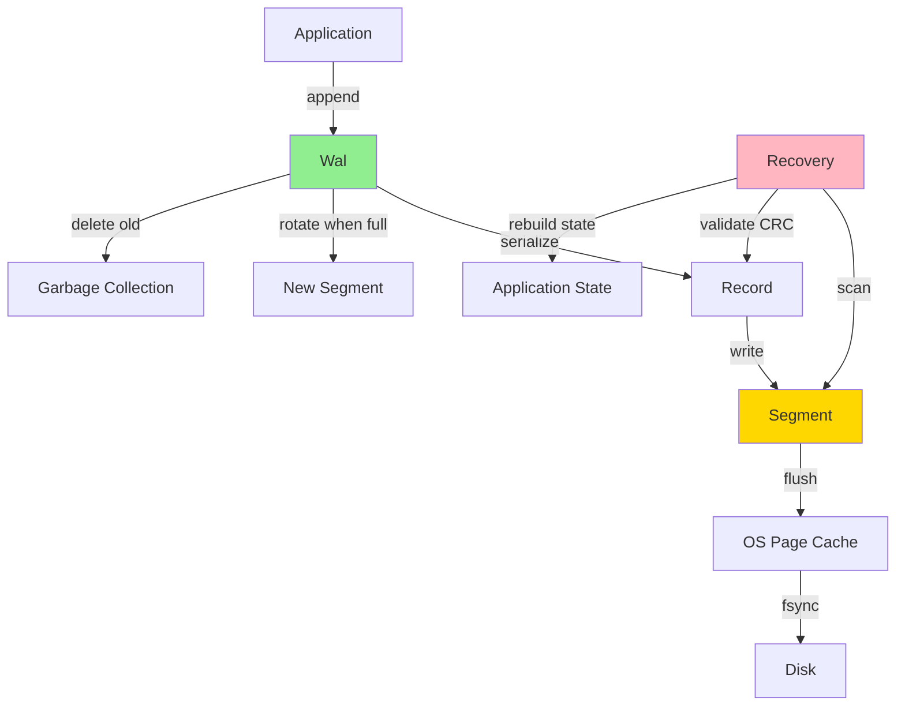

# How It Works

Deep dive into nori-wal's internals: record format, segment lifecycle, recovery, and concurrency.

---

## What You'll Learn

This section explains the technical implementation details of nori-wal. If you want to understand:

- How records are structured on disk
- How segments are created, rotated, and managed
- How recovery works after a crash
- How concurrent operations are handled
- How file preallocation works on different platforms

...then you're in the right place.

---

## Navigation

### [Record Format](record-format.md)
The on-disk structure of WAL records: header, CRC32C, compression, flags, and layout.

### [Segment Lifecycle](segment-lifecycle.md)
How segments are created, rotated, and deleted. Pre-allocation strategies across platforms.

### [Recovery Process](recovery.md)
Detailed walkthrough of the recovery algorithm: scanning, validation, truncation, and rebuild.

### [Concurrency Model](concurrency.md)
How nori-wal handles concurrent reads and writes. Lock-free reading, write serialization.

---

## Who Should Read This

**You should read this section if**:
- You're implementing your own WAL
- You're debugging nori-wal behavior
- You're contributing to nori-wal
- You want deep technical understanding

**You can skip this section if**:
- You just want to use nori-wal (see [Getting Started](../getting-started/index.md))
- You want high-level concepts (see [Core Concepts](../core-concepts/index.md))
- You want recipes and examples (see [Recipes](../recipes/index.md))

---

## Prerequisites

Before diving in, make sure you understand:

- **[What is a WAL](../core-concepts/what-is-wal.md)** - The fundamental concept
- **[Append-Only Architecture](../core-concepts/append-only.md)** - Why WALs are append-only
- **[Fsync Policies](../core-concepts/fsync-policies.md)** - Durability vs performance trade-offs

If you haven't read those yet, start there first!

---

## Architecture Overview

Here's a quick overview of how nori-wal components fit together:



**Key components**:
- **Wal**: Top-level API, manages segments
- **Segment**: Single file on disk (e.g., `000000.wal`)
- **Record**: Individual entry in the log
- **Recovery**: Scans segments, validates records, rebuilds state

---

## Code Organization

nori-wal is organized into modules:

```
nori-wal/
  src/
    lib.rs           - Public API (Wal, WalConfig, Record)
    segment.rs       - Segment management (create, rotate, delete)
    record.rs        - Record serialization/deserialization
    recovery.rs      - Recovery algorithm
    reader.rs        - Sequential record reading
    fsync.rs         - Fsync policy implementations
    error.rs         - Error types
    observe.rs       - Observability (metrics, events)
```

Each "How It Works" page corresponds to one or more of these modules.

---

## Reading Order

We recommend reading in this order:

1. **[Record Format](record-format.md)** - Start here to understand the on-disk format
2. **[Segment Lifecycle](segment-lifecycle.md)** - How segments are managed
3. **[Recovery Process](recovery.md)** - How we recover from crashes
4. **[Concurrency Model](concurrency.md)** - How concurrent operations work

You can read them independently, but they build on each other.

---

## Visual Learning

Each page includes:

- **Mermaid diagrams** - Flowcharts and sequence diagrams
- **Byte layout diagrams** - Visual representation of on-disk format
- **Code snippets** - Actual implementation from nori-wal
- **Examples** - Concrete scenarios and edge cases

If you're a visual learner, you'll love this section!

---

## Next Steps

Ready to dive in? Start with:

- **[Record Format](record-format.md)** - Learn how data is structured on disk
- Or jump to a specific topic that interests you

If you're looking for something else:
- **[API Reference](../api-reference/index.md)** - Documentation for all public types
- **[Recipes](../recipes/index.md)** - Build real applications with nori-wal
