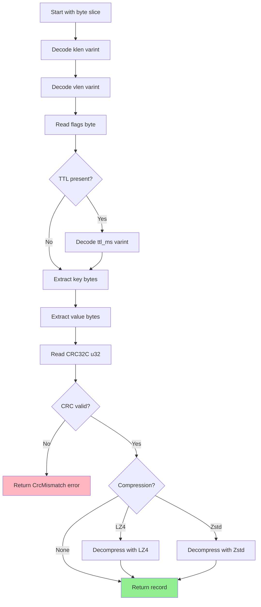

# Record Format

The on-disk structure of WAL records: header, CRC32C, compression, flags, and byte layout.

## Table of contents

---

## Overview

Every record in nori-wal has a well-defined binary format optimized for:

- **Space efficiency**: Variable-length encoding (varints) for lengths
- **Data integrity**: CRC32C checksum to detect corruption
- **Flexibility**: Flags for tombstones, TTL, and compression
- **Performance**: Fixed-size CRC at the end for fast validation

---

## Byte Layout

Here's the complete on-disk format of a record:

```
┌─────────────────────────────────────────────────────────────┐
│                        Record Format                         │
├─────────────────────────────────────────────────────────────┤
│ klen:        varint (key length)                            │
│ vlen:        varint (value length, compressed if applicable)│
│ flags:       u8 (1 byte)                                    │
│   bit 0:     tombstone (1 = delete, 0 = put)               │
│   bit 1:     ttl_present (1 = has TTL, 0 = no TTL)         │
│   bit 2-3:   compression (00=None, 01=LZ4, 10=Zstd)        │
│   bit 4-7:   reserved (must be 0)                          │
│ ttl_ms:      varint (milliseconds, only if ttl_present=1)  │
│ key:         bytes[klen]                                    │
│ value:       bytes[vlen] (compressed if compression != None)│
│ crc32c:      u32 (little-endian)                           │
└─────────────────────────────────────────────────────────────┘
```

### Size Calculation

Minimum record size:
```
klen=1 (for key length 0) +
vlen=1 (for value length 0) +
flags=1 +
key=0 +
value=0 +
crc32c=4
= 7 bytes
```

Typical record size (key="user:123", value="alice@example.com"):
```
klen=1 (8 < 128) +
vlen=1 (17 < 128) +
flags=1 +
key=8 +
value=17 +
crc32c=4
= 32 bytes
```

---

## Varint Encoding

nori-wal uses **LEB128** (Little Endian Base 128) for variable-length integers. This encodes small numbers in fewer bytes:

| Value | Bytes | Encoding |
|-------|-------|----------|
| 0 | 1 | `0x00` |
| 127 | 1 | `0x7F` |
| 128 | 2 | `0x80 0x01` |
| 255 | 2 | `0xFF 0x01` |
| 16,383 | 2 | `0xFF 0x7F` |
| 16,384 | 3 | `0x80 0x80 0x01` |

### Varint Algorithm

**Encoding**:
```rust
fn encode_varint(buf: &mut BytesMut, mut value: u64) {
    loop {
        let mut byte = (value & 0x7F) as u8;  // Take lower 7 bits
        value >>= 7;                           // Shift right 7 bits
        if value != 0 {
            byte |= 0x80;                      // Set continuation bit
        }
        buf.put_u8(byte);
        if value == 0 {
            break;
        }
    }
}
```

**Decoding**:
```rust
fn decode_varint(data: &mut &[u8]) -> Result<u64, RecordError> {
    let mut result = 0u64;
    let mut shift = 0;

    loop {
        if data.is_empty() {
            return Err(RecordError::Incomplete);
        }

        let byte = data[0];
        data.advance(1);

        result |= ((byte & 0x7F) as u64) << shift;

        if byte & 0x80 == 0 {  // No continuation bit
            break;
        }

        shift += 7;
    }

    Ok(result)
}
```

**Why varints?**
- Most keys and values are small (< 128 bytes) → Only 1 byte overhead
- Large keys/values (> 16KB) → Only 3-4 bytes overhead
- More efficient than fixed u32 (4 bytes for all sizes)

---

## Flags Byte

The flags byte packs multiple boolean and enum fields into a single byte:

```
┌───────────────────────────────────────┐
│         Flags Byte (1 byte)           │
├───┬───┬───┬───┬───┬───┬───┬───────┐
│ 7 │ 6 │ 5 │ 4 │ 3 │ 2 │ 1 │   0   │
├───┴───┴───┴───┼───┴───┼───┼───────┤
│   Reserved    │ Comp  │TTL│  Tomb │
│   (must be 0) │ ression│   │ stone │
└───────────────┴───────┴───┴───────┘
```

### Bit Meanings

| Bit(s) | Name | Meaning |
|--------|------|---------|
| 0 | `TOMBSTONE` | 1 = DELETE record, 0 = PUT record |
| 1 | `TTL_PRESENT` | 1 = TTL field follows, 0 = no TTL |
| 2-3 | `COMPRESSION` | `00` = None, `01` = LZ4, `10` = Zstd, `11` = reserved |
| 4-7 | Reserved | Must be 0 (reserved for future use) |

### Examples

```rust
// PUT record, no TTL, no compression
flags = 0b0000_0000  // 0x00

// DELETE record (tombstone)
flags = 0b0000_0001  // 0x01

// PUT record with TTL
flags = 0b0000_0010  // 0x02

// PUT record with LZ4 compression
flags = 0b0000_0100  // 0x04

// PUT record with TTL and Zstd compression
flags = 0b0000_1010  // 0x0A
```

---

## CRC32C Checksum

nori-wal uses **CRC32C** (Castagnoli) for data integrity:

### Why CRC32C?

- **Fast**: Hardware-accelerated on modern CPUs (SSE4.2 instruction)
- **Strong**: Detects all 1-bit and 2-bit errors
- **Standard**: Used by ext4, Btrfs, iSCSI, etc.

### CRC Calculation

The CRC covers **everything except the CRC itself**:

```
Data for CRC = klen + vlen + flags + [ttl_ms] + key + value

CRC32C = crc32c(data)
```

**Example**:
```
Record bytes: [0x08, 0x11, 0x00, ...key..., ...value..., 0xAB, 0xCD, 0xEF, 0x12]
                                                           \_________________/
                                                                  CRC32C
CRC is calculated over:  [0x08, 0x11, 0x00, ...key..., ...value...]
```

### CRC Validation on Read

```rust
fn verify_crc(data: &[u8], bytes_consumed: usize, cursor: &mut &[u8])
    -> Result<(), RecordError>
{
    if cursor.len() < 4 {
        return Err(RecordError::Incomplete);
    }

    let stored_crc = cursor.get_u32_le();
    let data_for_crc = &data[..bytes_consumed - 4];
    let calculated_crc = crc32c::crc32c(data_for_crc);

    if stored_crc != calculated_crc {
        return Err(RecordError::CrcMismatch {
            expected: stored_crc,
            actual: calculated_crc,
        });
    }

    Ok(())
}
```

---

## Compression

nori-wal supports three compression modes:

| Mode | Flag Bits | Use Case |
|------|-----------|----------|
| **None** | `00` | Small values, already compressed data |
| **LZ4** | `01` | Fast compression, good for text/JSON |
| **Zstd** | `10` | Higher compression ratio, slightly slower |

### LZ4 Compression

LZ4 is optimized for **speed** with decent compression ratios.

**Compressed value format**:
```
┌──────────────────────────────────┐
│ original_size: varint            │
│ compressed_data: bytes           │
└──────────────────────────────────┘
```

**Why prepend original size?**
- LZ4 decompression requires knowing the output buffer size
- Varint is more efficient than fixed u32

**Example**:
```rust
let record = Record::put(b"key", b"value".repeat(100))
    .with_compression(Compression::Lz4);

// Original value: 500 bytes
// Compressed: ~20 bytes + 2 bytes for original size = 22 bytes
// Savings: 96%
```

---

### Zstd Compression

Zstd provides better compression ratios at the cost of slightly more CPU.

**Compressed value format**:
```
┌──────────────────────────────────┐
│ compressed_data: bytes           │
└──────────────────────────────────┘
```

Zstd doesn't need the original size prepended because it's embedded in the compressed stream.

**Example**:
```rust
let record = Record::put(b"key", b"the quick brown fox".repeat(50))
    .with_compression(Compression::Zstd);

// Original value: 950 bytes
// Compressed: ~30 bytes
// Savings: 97%
```

---

### Compression Trade-offs

| Aspect | None | LZ4 | Zstd |
|--------|------|-----|------|
| **Speed (encode)** | Instant | ~500 MB/s | ~400 MB/s |
| **Speed (decode)** | Instant | ~2000 MB/s | ~600 MB/s |
| **Ratio (text)** | 1.0x | 3-4x | 4-5x |
| **Ratio (JSON)** | 1.0x | 4-6x | 6-8x |
| **Ratio (random)** | 1.0x | 1.0x | 1.0x |
| **CPU overhead** | None | Low | Medium |

**Recommendations**:
- **None**: Small values (<100 bytes), binary data, pre-compressed
- **LZ4**: Text, JSON, logs (default for most use cases)
- **Zstd**: Archival, cold storage, maximum compression

---

## Examples: Complete Records

### Example 1: Simple PUT

```rust
let record = Record::put(b"user:1", b"alice");
```

**Encoded bytes**:
```
klen:    0x06                    (varint: 6)
vlen:    0x05                    (varint: 5)
flags:   0x00                    (no tombstone, no TTL, no compression)
key:     75 73 65 72 3A 31       ("user:1")
value:   61 6C 69 63 65          ("alice")
crc32c:  AB CD EF 12             (little-endian u32)
```

**Total size**: 1 + 1 + 1 + 6 + 5 + 4 = **18 bytes**

---

### Example 2: DELETE (Tombstone)

```rust
let record = Record::delete(b"user:1");
```

**Encoded bytes**:
```
klen:    0x06                    (varint: 6)
vlen:    0x00                    (varint: 0, no value)
flags:   0x01                    (tombstone bit set)
key:     75 73 65 72 3A 31       ("user:1")
value:   (empty)
crc32c:  12 34 56 78
```

**Total size**: 1 + 1 + 1 + 6 + 0 + 4 = **13 bytes**

---

### Example 3: PUT with TTL

```rust
let record = Record::put_with_ttl(
    b"session:abc",
    b"data",
    Duration::from_millis(3600000)  // 1 hour
);
```

**Encoded bytes**:
```
klen:    0x0B                    (varint: 11)
vlen:    0x04                    (varint: 4)
flags:   0x02                    (TTL bit set)
ttl_ms:  80 8D 36                (varint: 3600000)
key:     73 65 73 73 69 6F 6E... ("session:abc")
value:   64 61 74 61             ("data")
crc32c:  AB CD EF 12
```

**Total size**: 1 + 1 + 1 + 3 + 11 + 4 + 4 = **25 bytes**

---

### Example 4: PUT with LZ4 Compression

```rust
let record = Record::put(b"log", b"ERROR: ".repeat(20))
    .with_compression(Compression::Lz4);
```

**Encoded bytes**:
```
klen:           0x03             (varint: 3)
vlen:           0x10             (varint: 16, compressed size)
flags:          0x04             (compression = 01 << 2)
key:            6C 6F 67          ("log")
value (comp):   78 00 00 00 ...   (original_size=120, then compressed)
crc32c:         AB CD EF 12
```

**Sizes**:
- Original value: 120 bytes
- Compressed value: 16 bytes (13% of original)
- Total record: 1 + 1 + 1 + 3 + 16 + 4 = **26 bytes**

---

## Decoding Algorithm

Here's how nori-wal decodes a record from bytes:



---

## Error Handling

### RecordError Types

| Error | Cause | Recovery |
|-------|-------|----------|
| `Incomplete` | Not enough bytes to read | Wait for more data or truncate |
| `CrcMismatch` | Corrupted data | Truncate at this position |
| `InvalidCompression` | Unknown compression type | Truncate (forward compatibility issue) |
| `CompressionFailed` | Compression library error | Log and skip record |
| `DecompressionFailed` | Corrupted compressed data | Truncate at this position |

### Handling Corruption

```rust
match Record::decode(data) {
    Ok((record, size)) => {
        // Valid record, process it
    }
    Err(RecordError::CrcMismatch { expected, actual }) => {
        // Corruption detected, truncate here
        log::warn!("CRC mismatch at position {}: expected {:#x}, got {:#x}",
                   position, expected, actual);
        truncate_at(position)?;
    }
    Err(RecordError::Incomplete) => {
        // Partial write at end of log, truncate
        truncate_at(position)?;
    }
    Err(e) => {
        // Other errors: log and skip or truncate
        log::error!("Failed to decode record: {}", e);
    }
}
```

---

## Performance Characteristics

### Encoding Performance

```
Operation: record.encode()
Size: 1KB key + value
Time: ~2μs (no compression)
Time: ~15μs (LZ4 compression)
Time: ~30μs (Zstd compression)
```

### Decoding Performance

```
Operation: Record::decode(&bytes)
Size: 1KB key + value
Time: ~1μs (no compression)
Time: ~0.5μs (LZ4 decompression)
Time: ~2μs (Zstd decompression)
```

**Why is LZ4 decompression faster than no compression?**
- Less data to copy from disk/memory
- LZ4 decompression is extremely fast (~2 GB/s)
- For large values, the I/O savings outweigh decompression cost

---

## Design Decisions

### Why CRC32C instead of CRC32?

- **Hardware acceleration**: SSE4.2 on x86, CRC32 instruction on ARM
- **10-100x faster** than software CRC32
- **Better error detection** than CRC32 for certain patterns

### Why CRC at the end, not the beginning?

**Pros of CRC at end**:
- Can stream-encode without buffering entire record
- Can calculate CRC incrementally while writing
- Simpler code

**Cons**:
- Must read entire record before validating CRC

For WAL use case (sequential reads), the trade-off favors simplicity.

### Why varints instead of fixed-size lengths?

**Space savings**:
- Most records have small keys/values (< 128 bytes)
- Varint: 1 byte for lengths < 128
- Fixed u32: 4 bytes always
- Savings: 75% for typical workloads

**Performance**:
- Varint encoding: ~10ns
- Varint decoding: ~8ns
- Negligible compared to I/O cost

### Why not use protobuf/flatbuffers?

- **Overkill**: WAL records are simple, don't need schema evolution
- **Overhead**: Protobuf adds ~20-30% size overhead for small messages
- **Performance**: Custom format is 2-3x faster for this use case
- **Simplicity**: 200 lines of code vs dependency on large library

---

## Forward Compatibility

The format is designed for forward compatibility:

### Reserved Flag Bits

Bits 4-7 are reserved. Future versions can use them for:
- Encryption
- Different checksum algorithms
- Record versioning
- Replication metadata

### Unknown Compression Types

If a newer version writes compression type `11` (reserved), older versions will return `InvalidCompression` and truncate. This is safe:
- Newer records are always at the end (append-only)
- Truncating at first unknown record preserves all older data

### Reading Older Formats

Current format can read all records written by older versions (there are none yet, but the design supports it).

---

## Key Takeaways

1. **Compact format**: Varints save space for small keys/values
2. **Strong integrity**: CRC32C detects all corruption
3. **Flexible**: Flags support tombstones, TTL, compression
4. **Fast**: Hardware-accelerated CRC, efficient encoding/decoding
5. **Forward-compatible**: Reserved bits for future features

---

## What's Next?

Now that you understand the record format, explore:

- **[Segment Lifecycle](segment-lifecycle)** - How segments manage records
- **[Recovery Process](recovery)** - How records are validated during recovery
- **[Concurrency Model](concurrency)** - How concurrent writes are handled

Or dive into the actual implementation in `crates/nori-wal/src/record.rs` on GitHub.
