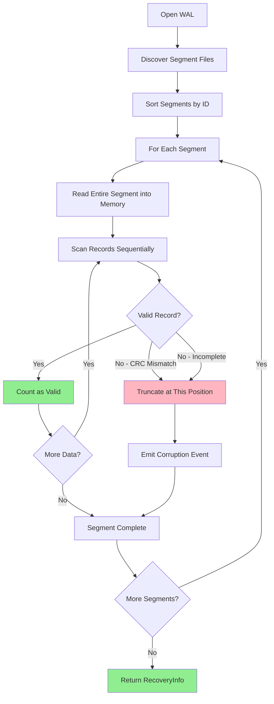

# Recovery Process

Detailed walkthrough of the recovery algorithm: scanning, validation, truncation, and rebuild.

## Table of contents

---

## Recovery Overview

When you open a WAL, nori-wal automatically **recovers** by scanning all segment files, validating records, and truncating any corruption.

This process implements a **prefix-valid recovery** strategy:

> **Keep all valid records from the beginning until corruption is detected, then truncate.**



---

## RecoveryInfo Structure

Recovery returns comprehensive information about what was found:

```rust
pub struct RecoveryInfo {
    /// Total number of valid records recovered.
    pub valid_records: u64,

    /// Number of segments scanned.
    pub segments_scanned: u64,

    /// Total bytes truncated due to corruption.
    pub bytes_truncated: u64,

    /// Position of the last valid record.
    pub last_valid_position: Option<Position>,

    /// Whether any corruption was detected and truncated.
    pub corruption_detected: bool,
}
```

**Example**:
```rust
let (wal, recovery_info) = Wal::open(config).await?;

println!("Recovered {} records from {} segments",
         recovery_info.valid_records,
         recovery_info.segments_scanned);

if recovery_info.corruption_detected {
    log::warn!("Corruption detected! Truncated {} bytes",
               recovery_info.bytes_truncated);
}
```

---

## Step-by-Step Recovery Algorithm

### Step 1: Discover Segment Files

Scan the WAL directory for `.wal` files:

```rust
async fn find_all_segments(dir: &Path) -> Result<Vec<u64>, SegmentError> {
    let mut entries = tokio::fs::read_dir(dir).await?;
    let mut segment_ids = Vec::new();

    while let Some(entry) = entries.next_entry().await? {
        if let Some(id) = parse_segment_id_from_path(&entry.path()) {
            segment_ids.push(id);
        }
    }

    Ok(segment_ids)
}

fn parse_segment_id_from_path(path: &Path) -> Option<u64> {
    // Check extension is "wal"
    if path.extension()?.to_str()? != "wal" {
        return None;
    }

    // Parse filename stem as u64
    let stem_str = path.file_stem()?.to_str()?;
    stem_str.parse::<u64>().ok()
}
```

**Example**:
```
wal/
  000000.wal  → segment_id = 0
  000001.wal  → segment_id = 1
  000005.wal  → segment_id = 5
  temp.txt    → Ignored (not .wal)
  README.md   → Ignored

Discovered segments: [0, 1, 5]
```

---

### Step 2: Sort Segments by ID

Process segments in order (oldest to newest):

```rust
segments.sort_unstable();
// [0, 1, 5] → already sorted
```

**Why sort?**
- Records must be replayed in order (append-only guarantee)
- Later records shadow earlier ones (last write wins)
- Recovery must preserve this ordering

---

### Step 3: Recover Each Segment

For each segment, validate all records and truncate corruption:

```rust
async fn recover_segment(
    wal_dir: &Path,
    segment_id: u64,
    meter: Arc<dyn Meter>,
    node_id: u32,
) -> Result<SegmentRecoveryInfo, SegmentError> {
    let path = segment_path(wal_dir, segment_id);
    let mut file = File::open(&path).await?;

    // Read entire segment into memory for fast validation
    let file_size = file.metadata().await?.len();
    let mut buffer = vec![0u8; file_size as usize];
    file.read_exact(&mut buffer).await?;

    // Scan for valid records
    let (valid_records, last_valid_offset) = scan_valid_records(&buffer, file_size);

    let bytes_truncated = file_size - last_valid_offset;

    // Truncate if needed
    if bytes_truncated > 0 {
        truncate_segment_atomically(&path, &buffer, last_valid_offset).await?;

        // Emit observability event
        meter.emit(VizEvent::Wal(WalEvt {
            node: node_id,
            seg: segment_id,
            kind: WalKind::CorruptionTruncated,
        }));
    }

    Ok(SegmentRecoveryInfo {
        valid_records,
        bytes_truncated,
        last_valid_position: if valid_records > 0 {
            Some(Position { segment_id, offset: last_valid_offset })
        } else {
            None
        },
    })
}
```

---

### Step 4: Scan and Validate Records

Read records sequentially, validating CRC32C for each:

```rust
fn scan_valid_records(buffer: &[u8], file_size: u64) -> (u64, u64) {
    let mut offset = 0u64;
    let mut valid_records = 0u64;
    let mut last_valid_offset = 0u64;

    while offset < file_size {
        let remaining = &buffer[offset as usize..];

        match Record::decode(remaining) {
            Ok((_record, size)) => {
                // Valid record - keep going
                valid_records += 1;
                offset += size as u64;
                last_valid_offset = offset;
            }
            Err(RecordError::Incomplete) => {
                // Partial record at tail - expected during crash
                break;
            }
            Err(RecordError::CrcMismatch { .. }) | Err(_) => {
                // Corruption detected - truncate here
                break;
            }
        }
    }

    (valid_records, last_valid_offset)
}
```

**Example**:
```
Segment buffer (100 bytes):
  [0..20]    Record 1 (CRC valid)   → valid_records = 1, last_valid_offset = 20
  [20..45]   Record 2 (CRC valid)   → valid_records = 2, last_valid_offset = 45
  [45..70]   Record 3 (CRC valid)   → valid_records = 3, last_valid_offset = 70
  [70..85]   Record 4 (CRC INVALID) → STOP, truncate at offset 70
  [85..100]  Garbage                → Discarded

Result: (valid_records=3, last_valid_offset=70)
Bytes truncated: 100 - 70 = 30 bytes
```

---

### Step 5: Atomic Truncation

If corruption is detected, truncate the segment atomically:

```rust
async fn truncate_segment_atomically(
    path: &PathBuf,
    buffer: &[u8],
    last_valid_offset: u64,
) -> Result<(), SegmentError> {
    let temp_path = path.with_extension("wal.tmp");

    // 1. Write valid data to temp file
    let mut temp_file = OpenOptions::new()
        .create(true)
        .write(true)
        .truncate(true)
        .open(&temp_path)
        .await?;

    temp_file.write_all(&buffer[..last_valid_offset as usize]).await?;
    temp_file.sync_all().await?;
    drop(temp_file);

    // 2. Atomic rename (replaces original file)
    tokio::fs::rename(&temp_path, path).await?;

    Ok(())
}
```

**Why atomic?**

If we crash during truncation:
- **Without atomic rename**: Original file may be partially overwritten (corrupted)
- **With atomic rename**: Either old file survives (untouched) or new file is complete

**Implementation**:
1. Write valid data to `000000.wal.tmp`
2. Sync temp file to disk
3. Rename `000000.wal.tmp` → `000000.wal` (atomic on all platforms)

---

## Recovery Scenarios

### Scenario 1: Clean Recovery (No Corruption)

```rust
// Before crash: wrote 10 records, synced all
[Record 1][Record 2]...[Record 10]

// On recovery:
Scan: All 10 records have valid CRCs
Result: RecoveryInfo {
    valid_records: 10,
    segments_scanned: 1,
    bytes_truncated: 0,
    corruption_detected: false,
}
```

**All data recovered**

---

### Scenario 2: Partial Write at Tail

```rust
// Before crash: wrote 10 records, synced 9, writing 10th
[R1][R2]...[R9][R10: partial, only 15 of 30 bytes]

// On recovery:
Scan records 1-9: Valid CRCs → Keep
Scan record 10: RecordError::Incomplete → Truncate here

Result: RecoveryInfo {
    valid_records: 9,
    bytes_truncated: 15,
    corruption_detected: true,
}
```

**Lost record 10 (was never fully written)**

---

### Scenario 3: Corrupted Data (CRC Mismatch)

```rust
// Before crash: corruption in the middle of a record
[R1][R2][R3: corrupted data, CRC mismatch][R4][R5]

// On recovery:
Scan R1-R2: Valid → Keep
Scan R3: CrcMismatch → Truncate here
R4-R5: Never scanned (truncated)

Result: RecoveryInfo {
    valid_records: 2,
    bytes_truncated: size_of(R3 + R4 + R5),
    corruption_detected: true,
}
```

**Lost R3, R4, R5 (everything from first corruption onward)**

---

### Scenario 4: Empty Segment

```rust
// Segment file exists but contains no data
File size: 0 bytes

// On recovery:
No records to scan

Result: RecoveryInfo {
    valid_records: 0,
    bytes_truncated: 0,
    corruption_detected: false,
}
```

**Valid (no data lost, segment is just empty)**

---

### Scenario 5: Multiple Segments with Mixed Corruption

```
Segment 0: [R1][R2][R3] (all valid)
Segment 1: [R4][R5: partial]
Segment 2: [R6][R7] (never scanned, segment 1 stopped at R5)

Recovery:
  Segment 0: 3 valid records, 0 bytes truncated
  Segment 1: 1 valid record (R4), truncate at R5
  Segment 2: 2 valid records, 0 bytes truncated

Result: RecoveryInfo {
    valid_records: 6 (R1-R4 from seg 0-1, R6-R7 from seg 2),
    segments_scanned: 3,
    bytes_truncated: size_of(partial R5),
    corruption_detected: true,
}
```

**Recovered 6 out of 7 records**

---

## Error Handling

### RecordError Types

During recovery, `Record::decode()` may return:

| Error | Meaning | Action |
|-------|---------|--------|
| `Ok((record, size))` | Valid record | Keep scanning |
| `Err(Incomplete)` | Not enough bytes (partial write) | Truncate here |
| `Err(CrcMismatch)` | Data corruption | Truncate here |
| `Err(InvalidCompression)` | Unknown compression type | Truncate here |
| `Err(DecompressionFailed)` | Corrupted compressed data | Truncate here |

**All errors result in truncation** (prefix-valid recovery).

---

### I/O Errors

```rust
match File::open(&path).await {
    Ok(file) => { /* proceed */ }
    Err(e) if e.kind() == ErrorKind::NotFound => {
        // Segment was deleted - skip it
    }
    Err(e) => {
        // Other I/O error - fail recovery
        return Err(SegmentError::Io(e));
    }
}
```

Common I/O errors:
- **NotFound**: Segment was deleted (skip it)
- **PermissionDenied**: No read access (fail)
- **IOError**: Disk failure (fail)

---

## Performance Characteristics

### Recovery Time

Recovery speed depends on:
1. **Number of segments**
2. **Total data size**
3. **Disk speed**

**Typical performance (SSD)**:

| Scenario | Segments | Data Size | Recovery Time |
|----------|----------|-----------|---------------|
| Small | 1 | 1 MB | ~5 ms |
| Medium | 10 | 100 MB | ~150 ms |
| Large | 100 | 10 GB | ~15 s |
| Very Large | 1000 | 100 GB | ~150 s |

**Bottleneck**: Reading data from disk (I/O bound)

---

### Memory Usage

Recovery reads entire segments into memory:

```
Memory usage = max(segment_size)

Default: 128 MB per segment (one at a time)
```

**Why read entire segment?**
- Faster than multiple small reads
- Simplifies code (no buffering complexity)
- 128 MB is acceptable for modern systems

**Alternative**: Streaming validation (not implemented)
- Would use less memory (~1 MB buffer)
- Would require more complex code
- Would be slower (more syscalls)

---

## Optimization: Parallel Segment Validation

**Current**: Segments validated sequentially

**Possible optimization**: Validate segments in parallel

```rust
// Hypothetical parallel recovery
let tasks: Vec<_> = segments.into_iter()
    .map(|id| tokio::spawn(recover_segment(dir, id, meter, node_id)))
    .collect();

let results = futures::future::join_all(tasks).await;
```

**Benefits**:
- 2-4x faster for many segments
- Better utilization of I/O bandwidth

**Trade-offs**:
- More complex code
- Higher memory usage (multiple segments in RAM)
- Not needed for most use cases (recovery is already fast)

---

## Testing Recovery

### Test 1: Clean Recovery

```rust
#[tokio::test]
async fn test_recovery_clean() {
    // Write 10 records, sync all
    let (wal, _) = Wal::open(config).await?;
    for i in 0..10 {
        wal.append(&Record::put(format!("key{}", i), b"value")).await?;
    }
    wal.sync().await?;
    drop(wal);

    // Reopen and verify recovery
    let (wal, info) = Wal::open(config).await?;
    assert_eq!(info.valid_records, 10);
    assert_eq!(info.bytes_truncated, 0);
    assert!(!info.corruption_detected);
}
```

---

### Test 2: Partial Write

```rust
#[tokio::test]
async fn test_recovery_partial_write() {
    // Write 5 records, sync
    let (wal, _) = Wal::open(config).await?;
    for i in 0..5 {
        wal.append(&Record::put(format!("key{}", i), b"value")).await?;
    }
    wal.sync().await?;
    drop(wal);

    // Append garbage (simulate crash mid-write)
    let seg_path = dir.join("000000.wal");
    let mut file = OpenOptions::new().append(true).open(&seg_path).await?;
    file.write_all(b"PARTIAL_GARBAGE").await?;
    file.sync_all().await?;

    // Recover - should truncate garbage
    let (wal, info) = Wal::open(config).await?;
    assert_eq!(info.valid_records, 5);
    assert!(info.bytes_truncated > 0);
    assert!(info.corruption_detected);
}
```

---

### Test 3: CRC Mismatch

```rust
#[tokio::test]
async fn test_recovery_crc_mismatch() {
    // Write and sync 5 records
    // ... (same as above)

    // Corrupt data in last record
    let seg_path = dir.join("000000.wal");
    let mut data = tokio::fs::read(&seg_path).await?;
    data[data.len() - 15] ^= 0xFF;  // Flip bits in value
    tokio::fs::write(&seg_path, &data).await?;

    // Recover - should detect corruption and truncate
    let (wal, info) = Wal::open(config).await?;
    assert!(info.valid_records < 5);  // Lost corrupted record
    assert!(info.bytes_truncated > 0);
    assert!(info.corruption_detected);
}
```

---

## Observability

Recovery emits events for monitoring:

```rust
// Corruption detected and truncated
VizEvent::Wal(WalEvt {
    node: node_id,
    seg: segment_id,
    kind: WalKind::CorruptionTruncated,
})
```

**What to monitor**:
- **Frequency of corruption events**: Should be rare (only after crashes)
- **Bytes truncated**: Large truncations indicate serious issues
- **Recovery time**: Should be fast (< 1s for most workloads)

**Alert on**:
- Corruption events during normal operation (not after restart)
- Large amounts of truncated data (> 1% of total)
- Slow recovery (> 10s)

---

## Design Decisions

### Why Prefix-Valid Recovery?

**Alternatives**:
1. **Reject all if any corruption**: Too strict (lose all data on single bad record)
2. **Try to skip corrupted records**: Unsafe (may violate ordering guarantees)
3. **Prefix-valid**: Keep all good data, truncate from first corruption

**Prefix-valid is the right trade-off**:
- Maximizes data recovery
- Simple to implement and reason about
- Preserves ordering guarantees
- Standard approach (used by PostgreSQL, MySQL, etc.)

---

### Why Read Entire Segment?

**Alternatives**:
1. **Stream validation (buffer 1 MB at a time)**
   - Less memory
   - More complex code
   - Slower (more syscalls)

2. **Read entire segment**
   - Simple code
   - Fast (one large read)
   - Higher memory (128 MB)

**Current choice**: Read entire segment
- 128 MB is acceptable on modern systems
- Simplicity > micro-optimization
- Can change later if needed (not a breaking change)

---

### Why Atomic Truncation?

**Without atomic rename**:
```
1. Open segment for writing
2. Truncate to valid offset
3. CRASH HERE → File may be corrupted or empty
4. Sync
```

**With atomic rename**:
```
1. Write valid data to temp file
2. Sync temp file
3. CRASH HERE → Original file untouched
4. Rename temp → original (atomic)
5. CRASH HERE → New file is complete
```

Atomic rename ensures **either old file or new file exists**, never a partial state.

---

## Key Takeaways

1. **Recovery is automatic on WAL open**
   - No manual intervention required
   - Scans all segments, validates all records

2. **Prefix-valid recovery strategy**
   - Keep all valid records from the beginning
   - Truncate from first corruption/incompleteness

3. **CRC32C provides strong validation**
   - Detects all corruption during recovery
   - Hardware-accelerated for speed

4. **Truncation is atomic**
   - Temp file + rename pattern
   - Safe even if crash during recovery

5. **RecoveryInfo tells you what happened**
   - Check `corruption_detected` and `bytes_truncated`
   - Log warnings if corruption found

6. **Recovery is fast**
   - ~150ms for 100 MB
   - ~15s for 10 GB
   - I/O bound, not CPU bound

---

## What's Next?

Now that you understand recovery, explore:

- **[Concurrency Model](concurrency.md)** - How concurrent access is handled
- **[Recovery Guarantees](../core-concepts/recovery-guarantees.md)** - High-level guarantees

Or dive into the implementation in `crates/nori-wal/src/recovery.rs` on GitHub.
